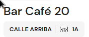
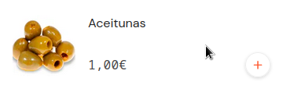
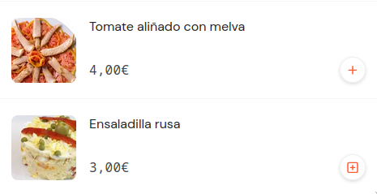
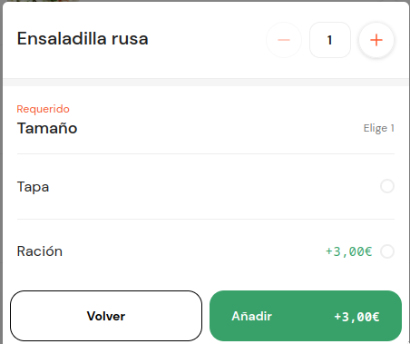
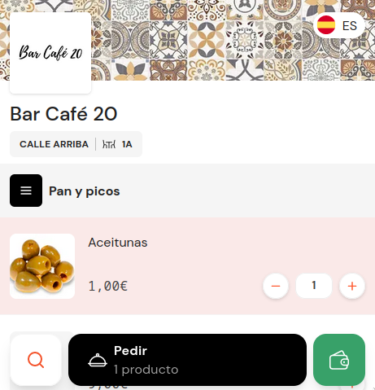
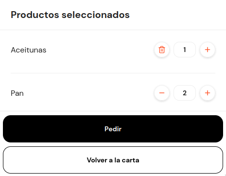
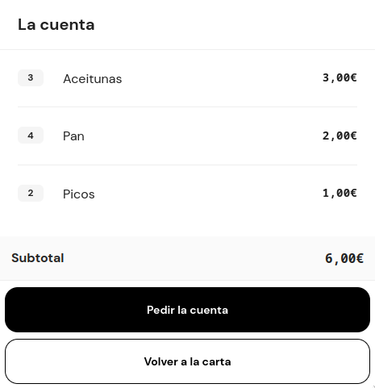
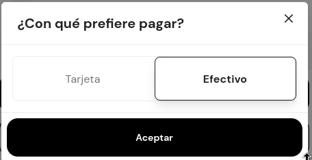

# Análisis Qamarero

Web: [https://www.qamarero.com/](https://www.qamarero.com/)  

Menu: [Ejemplo menu](https://user.qamarero.com/mesa/mrm0URDET0K3ua7_u9LFKA) 

Inicio: Febrero de 2023

## Fortalezas

- Tienen una web muy profesional
- Cuentan con financiación de programas Españoles y Europeos
- Tienen precios muy competitivos. Su tarifa más baja es de 50€ al mes + 1% de las comandas. Es decir menos de 100€ al mes. 
- Cuentan con muchos restaurantes implementados.
- El nombre es muy bueno. 
- Tienen soporte para distintos idiomas.

## Debilidades

- Tiene el error de que los QR son estáticos en las mesas y he podido hacer un pedido a una mesa desde [Aquí](https://user.qamarero.com/mesa/mrm0URDET0K3ua7_u9LFKA) sin estar en el restaurante. Es un fallo de seguridad importante. 
- Solo es el sistema de gestión de comandas. Es decir, no se pueden hacer pedidos online, reservas en el restaurante, etc. 
- Usan muchos frameworks de desarrollo lo que lo carga con mucho JS: FullStory, Next.js, Emotion, React, HSTS, Open Graph, PWA, LottieFiles, Webpack. 
- ¿Qué pasa si mueves las mesas? Si unes dos mesas a través de qué QR piden? ¿Se unen los pedidos?

## Diseño

- Guardan tanto información de la mesa como de la zona. Ejemplo: Terraza | Mesa 1:

- Tiene el diseño horizontal en vez de vertical: 

- Usan distintos iconos cuando un elemento tiene más opciones:

- Usa un modal para añadir pedido:

- Usa subsecciones, además modifica el navbar en fución de cada subsección. Las secciones no las tiene en ventanas diferentes, sino que se carga con scroll:

- Tiene para consultar el pedido en una navbar flotante y para pargar la cuenta:

- En el pedido tienen la opción de añadir y eliminar unidades de un pedido, nótese que cuando queda una unidad cambia el icono. Además de confirmar el pedido y volver a la carta:

- La cuenta:

- Para pagar te da dos opciones, tarjeta o efectivo.

 

