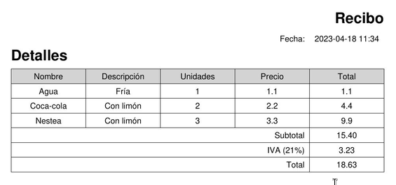
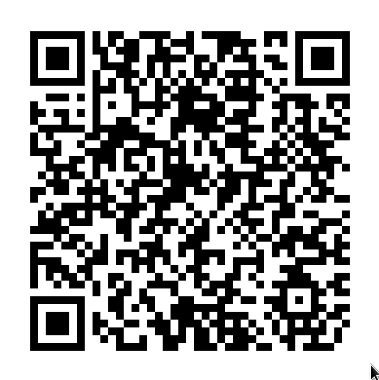
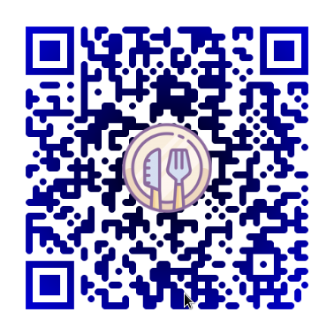

# Tecnología subsistemas

## Generación de recibos

Hay dos opciones, usar un generador de recibos PDF o bien hacerlo en formato web.

### Generación de recibos PDF

Para la generación de recibos se puede usar las librería [https://pypi.org/project/PyInvoice/](https://pypi.org/project/PyInvoice/). 

Genera un recibo en inglés, no deja cambiar el idioma, pero se pude modificar el archivo `pyinvoice/templates.py` para modificarlo manualmente. Tras modificarlo he conseguido el siguiente resultado: 

La librería es pequeña y usa internamente [https://pypi.org/project/reportlab/](https://pypi.org/project/reportlab/), que es un editor de PDF para python. 

Se podría generar un código propio para la generación de facturas o modificar la librería [https://pypi.org/project/PyInvoice/](https://pypi.org/project/PyInvoice/). 

### Recibos web

Otra opción es hacerlo directamente en web. Para ello se pueden usar las [tablas de Bulma](https://bulma.io/documentation/elements/table/). 

### Ambas opciones

También se podría hacer web y  si quiere imprimir un recibo usar [https://pypi.org/project/PyInvoice/](https://pypi.org/project/PyInvoice/) modificado. 

### Descargar archivos

Para descargar archivos con FastApi se puede usar [FileResponse](https://fastapi.tiangolo.com/advanced/additional-responses/?h=filer#additional-media-types-for-the-main-response).

### Visualizar PDF 

Fuente: [https://stackoverflow.com/questions/17784037/how-to-display-pdf-file-in-html](https://stackoverflow.com/questions/17784037/how-to-display-pdf-file-in-html) 

Para visualizar un PDF en html hay dos opciones embebido, con un iframe o con de Google Docs.

Embebido: `<embed src="file_name.pdf"/>` ó `<embed src="URL"/>`

Iframe: `<iframe src="file_name.pdf"/>` ó `<iframe src="URL"/>`

Google Docs: `<iframe src="https://docs.google.com/gview?url=PDF_URL&embedded=true"/>` 

## Generación de QR

Para la generación de QR se podría usar [https://pypi.org/project/qrcode/](https://pypi.org/project/qrcode/). Es una librería muy simple.

He podido generar un QR básico:

Y otro con estilo:

## Sugerencias a clientes

Podríamos tener dos tipo de sujerencias, sujerencias personalizadas y generales.

### Sugerencias personalizadas

Las personalizadas se podrían implementar guardando Cookies con FastAPI: [https://fastapi.tiangolo.com/advanced/response-cookies](https://fastapi.tiangolo.com/advanced/response-cookies)   [https://fastapi.tiangolo.com/tutorial/cookie-params/](https://fastapi.tiangolo.com/tutorial/cookie-params/)  

### Sugerencias genéricas

Se podrían implementar guardando métricas, por ejemplo, de los platos más populares. Y en base a eso hacer una consulta para recomendar. 

Se podría destacar con un icono de estrella ⭐ o cambiando el color, mostrando un [mensaje de Bulma](https://bulma.io/documentation/components/message/), etc.

### Cruzado

Investigar cómo dejar los datos personales en el movil, estilo Cookies locales. Couchbase Lite.

[https://en.wikipedia.org/wiki/HTML5_File_API](https://en.wikipedia.org/wiki/HTML5_File_API)  

## Sincronización del pedido

Para la sincronización del pedido se podrían usar WebSockets de FastAPI: [https://fastapi.tiangolo.com/advanced/websockets](https://fastapi.tiangolo.com/advanced/websockets)  

## Configuración del restaurante

Para la configuración del restaurante habría que autenticar al un autorizado. Para ello lo más conveniente es usar Google Oauth. Para ello se puede usar la librería [https://pypi.org/project/fastapi-sso/](https://pypi.org/project/fastapi-sso/)  que facilita dicha funcionalidad en FastAPI.

## Guardar archivos

Hay varias opciones. Para fotos se puede usar Cloudinary [https://cloudinary.com/](https://cloudinary.com/)  con su librería [https://pypi.org/project/cloudinary/](https://pypi.org/project/cloudinary/); hay más opciones parecidas, pero si se quieren guardar otro tipo de archivos como puede ser PDF no sirve. MongoDB tiene una funcionalidad para subir cualquier tipo archivo [https://pymongo.readthedocs.io/en/stable/examples/gridfs.html](https://pymongo.readthedocs.io/en/stable/examples/gridfs.html). 

Si solo queremos usar imágenes en la aplicación Cloudinary puede ser una buena opción, pero si queremos guardar otro tipos de archivos usaremos MongoDB con la funcionalidad de GridFS.

Explorar Heroku, Dropbox y Drive como alternativas. Si son estáticos. 

## Pasarela de pagos

Google Pay, Paypal o Stripe son buenas opciones [https://stripe.com/en-es/payments/link](https://stripe.com/en-es/payments/link)  

## Identificación de la mesa

Hay 3 opciones: QR fijo en la mesa, QR generado para cada cliente, ubicación.

### QR fijo

#### Ventajas

- Es la opción más sencilla, es la que usa Qamarero.
- Más fácil para los camareros.
- No necesita nada maś que imprimir una vez el QR.

**Desventajas**

- Gran fallo de seguridad: Un cliente anterior puede hacer pedidos sin estar en el restaurante.
- ¿Qué pasa con las mesas móviles?

### QR generado

#### Ventajas

- Soluciona el fallo de seguridad de los QR fijos en las mesas. 
- Soluciona el problema de unir mesas, ya que los QR no van asociados necesariamente a una mesa concreta. 
- Cada pedido es independiente.

**Desventajas**

- Necesitas imprimir un nuevo QR cada vez que llega un cliente. **Nota**: Se pueden imprimir al principio del día, no cada vez que entre un cliente. 

### Ubicación

Es como funciona el Burger King del Atabal. Hay que ir a inversigarlo.

