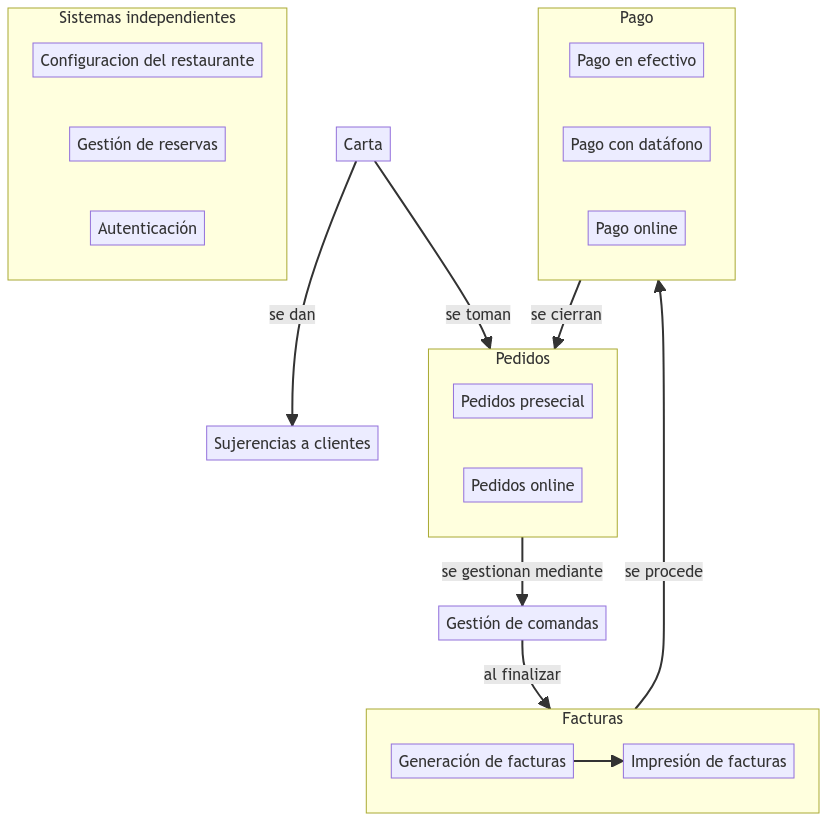

# Entorno de desarrollo | 18 de Febrero al 23 de Febrero

## 📋 Resumen

Se 

## ?? Estado del proyecto

> ### Logros
- Modelo conceptual del sistema 

- Definir paquetes de trabajo del sistema
- Definir Sprints:
- Calcular número de semanas
- Agrupar en Sprints de 2 semanas
- Instalar Conda
- Crear entorno para QRest
- Probar una aplicación FastAPI.
- Despliegue Heroku.
- Crear base de datos [MongoDB Cloud](https://cloud.mongodb.com/v2/640f21962ac6cb63d2872a44#/metrics/replicaSet/640f21f4f9467f66381f66b7/explorer).
> ### Incidencias del proyecto y riesgos
- El sistema es muy grande
