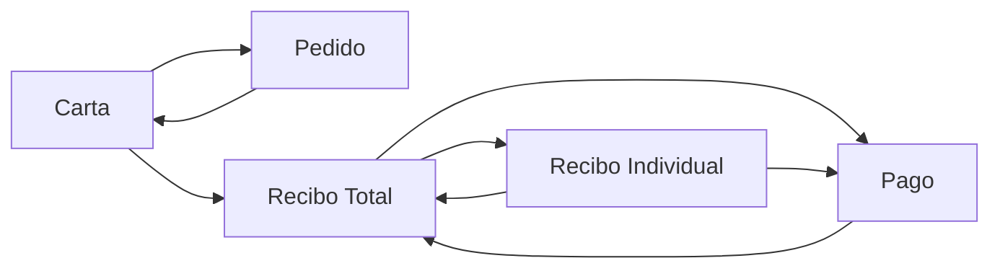
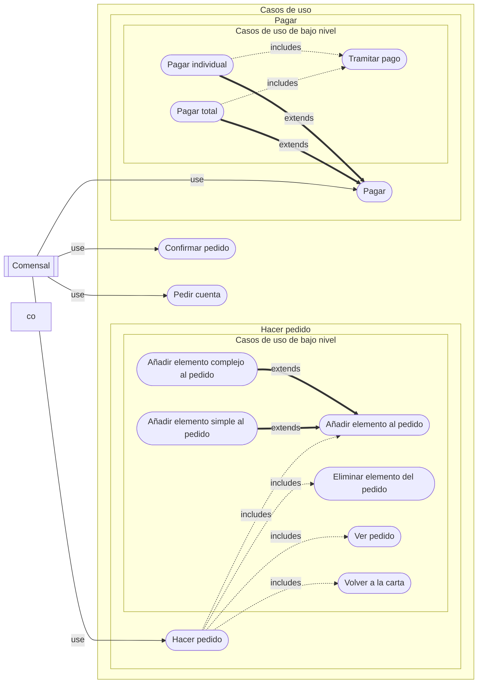
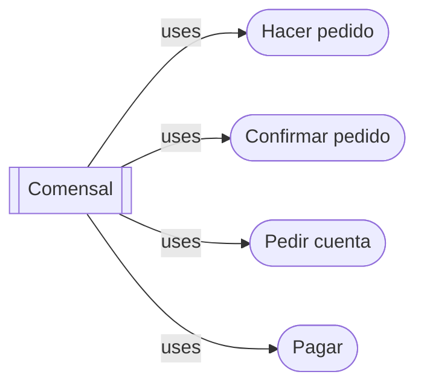
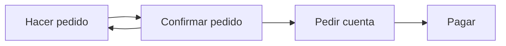
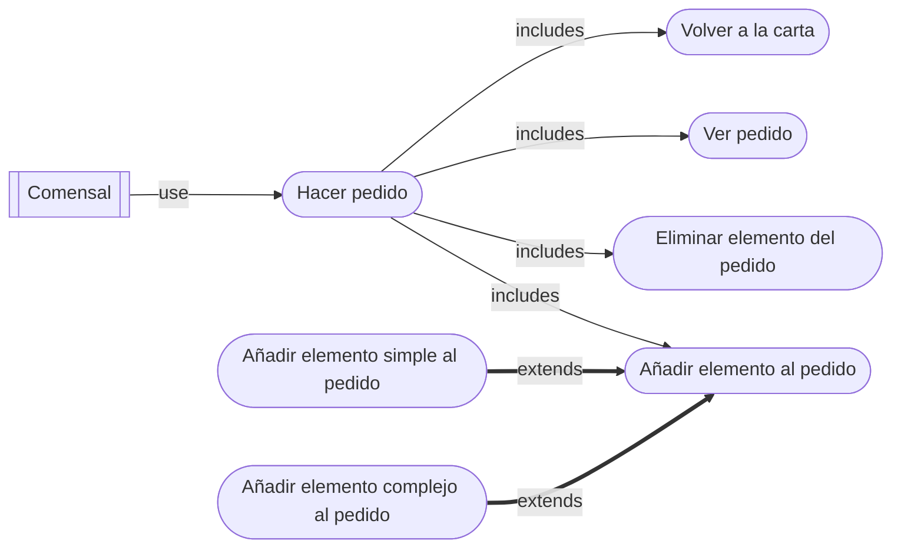
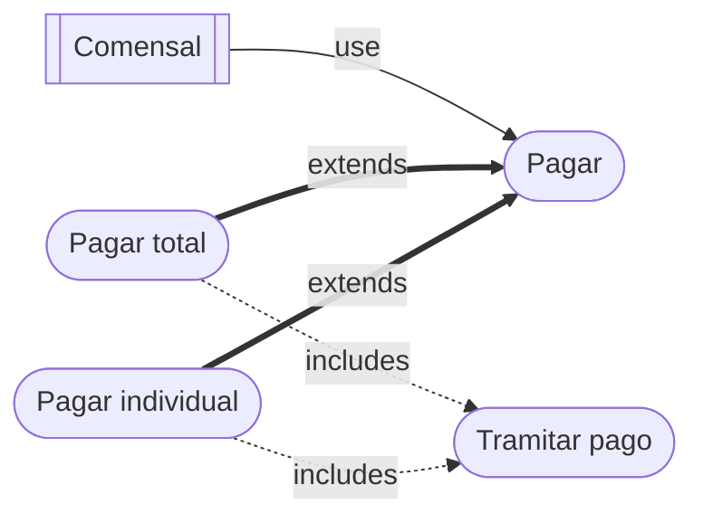

# Casos de Uso

Este documento recoge los casos de uso que contempla QRest en sus distintos ámbitos, desde el punto de vista de los usuarios desde la vista de la aplicación. 

Diferenciamos en dos catergorías de casos de uso, de alto y bajo nivel:

- **Casos de uso de alto nivel**: Aquellos del alto nivel de abstracción que se compone de otros casos de uso de bajo nivel.
- **Casos de uso de bajo nivel**: Aquellas acciones concretas que puede hacer un usuario en la aplicación.

## Glosario

## Sintaxis

- **(-> Pantalla _)**: Accede a la pantalla indicada.

### Actores

- **Empleado**: Entendido como una persona que opera el restaurante.
- **Comensal**: Dicho de un cliente que está sentado en la mesa que. Comparte pedido con los comensales de la misma mesa.

### Pantallas

- **Entrada**: Métodos para acceder a la pantalla en cuestión. Puede ser otra pantalla u otro método.
- **Salida**: Pantallas a las que se puede acceder desde la pantalla en cuestión.
- **Ruta**: Punto de acceso en la API.

## Pantallas

### Carta

Es la **pantalla inicial**. Se ven los elementos de la carta del restaurante y pueden añadir o eliminar unidades de cualquier elemento de la carta. Todos los comensales de una misma mesa están asociados al mismo pedido y ven en tiempo real cualquer actualización (añadir o eliminar unidades de algún elemento) que haga cualquier otro comensal de la misma mesa.

- **Ruta**: mesa/{Identificador de la mesa}
- **Entrada**: QR, Pantalla Pedido.
- **Salidas**: Pantalla Pedido, Pantalla Recibo Total.

### Pedido

Se ven todos los elementos que han pedido los comensales de la mesa. Esto incluye el elemento concreto; con sus variantes, extras, e ingredientes eliminados, en caso de elementos complejos; y la cantidad.

- **Ruta**: mesa/{Identificador de la mesa}/pedido
- **Entrada**: Pantalla Carta.
- **Salidas**:
  - Carta.
  - Pedido Confirmado.

### Recibo Total

En esta pantalla se ve el recibo del pedido de toda la mesa en todas las comandas. Además del estdo de pago de cada elemento y quíen lo ha pedido.

- **Ruta**: mesa/{Identificador de la mesa}/recibo
- **Entrada**: Pantalla Carta.
- **Salidas**:
  - Recibo Individual.
  - Pago.

### Recibo Recibo Individual

En esta pantalla se ve el recibo del total del comensal en todas las comandas. Además del estdo de pago de cada elemento y quíen lo ha pedido.

- **Ruta**: mesa/{Identificador de la mesa}/recibo/{comensal}
- **Entrada**: Pantalla Recibo total.
- **Salidas**:
  - Recibo Total.
  - Pago.

### Pago

En esta pantalla se tramita el pago.

- **Ruta**: mesa/{Identificador de la mesa}/pago/{comensal}
- **Entrada**: Pantalla Recibo total.
- **Salida**: Recibo Total.

## Casos de uso

### Alto nivel

Los casos de uso de alto nivel son:

Que se representan en el siguiente diagrama de flujo:

#### Hacer pedido

#### Pagar

### 
