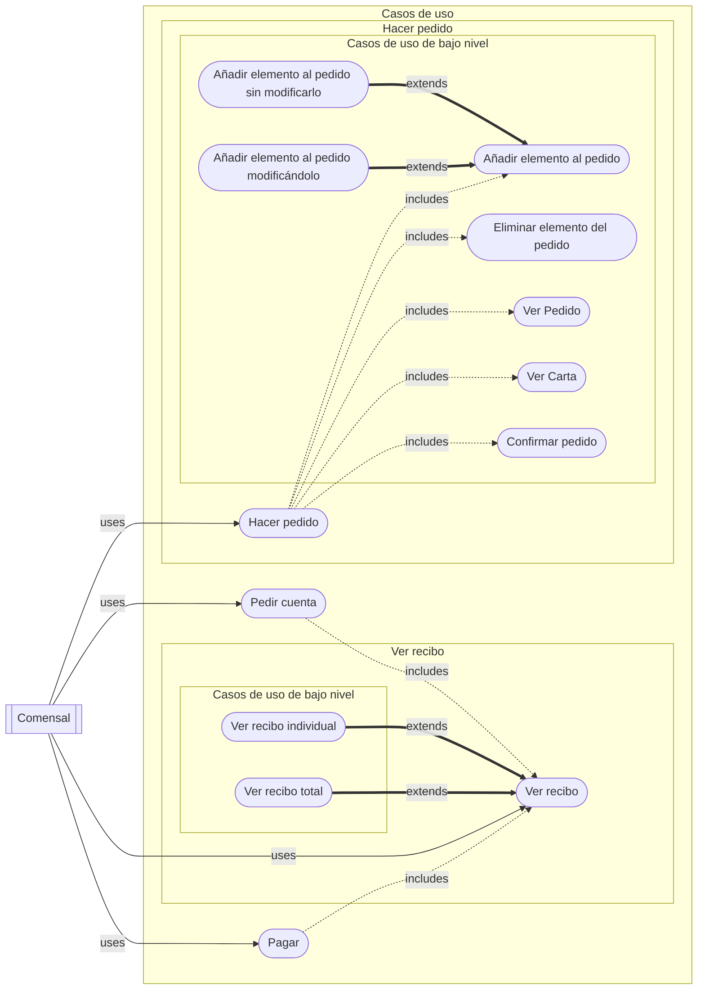
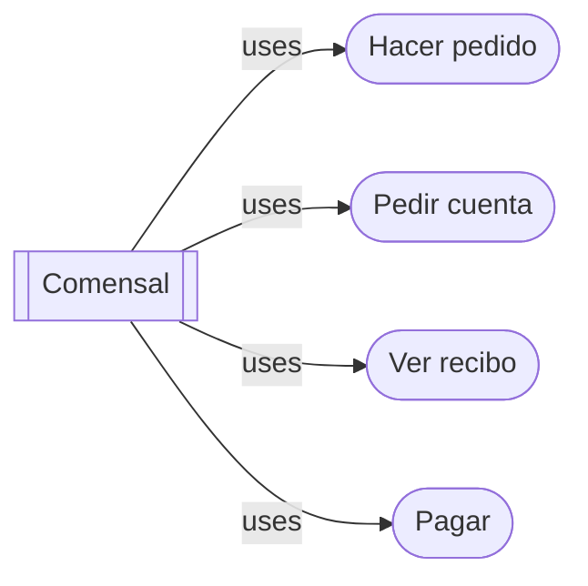
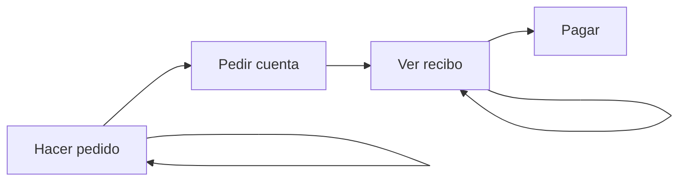
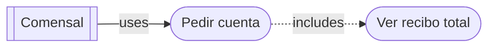
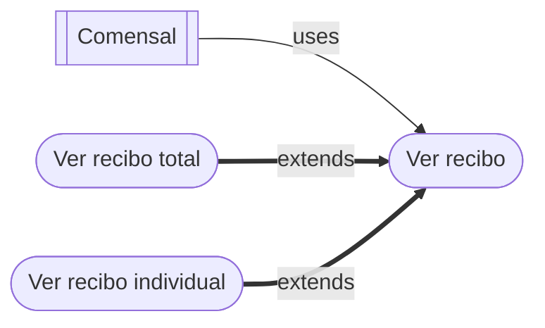
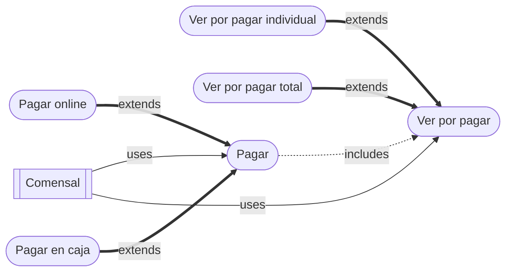

# Casos de Uso

Este documento recoge los casos de uso que contempla QRest en sus distintos ámbitos, desde el punto de vista de los usuarios desde la vista de la aplicación. 

Diferenciamos en dos catergorías de casos de uso, de alto y bajo nivel:

- **Casos de uso de alto nivel**: Aquellos del alto nivel de abstracción que se compone de otros casos de uso de bajo nivel.
- **Casos de uso de bajo nivel**: Aquellas acciones concretas que puede hacer un usuario en la aplicación.

Se representan en el siguiente diagrama:

## Glosario

### Actores

- **Empleado**: Entendido como una persona que opera el restaurante.
- **Comensal**: Dicho de un cliente que está sentado en la mesa que. Comparte pedido con los comensales de la misma mesa.

### Pantallas

- **Entrada**: Métodos para acceder a la pantalla en cuestión. Puede ser otra pantalla u otro método.
- **Salida**: Pantallas a las que se puede acceder desde la pantalla en cuestión.
- **Ruta**: Punto de acceso en la API.

### Carta

**Elemento**: Cualquier bebida, entrante, plato, postre, etc. de la carta que puede añadirse al pedido.

**Elemento simple**: Aquel que no hay que elegir nada. Es decir, no tiene variantes, ni extras opcionales, ni se le pueden quitar ingradientes. Ejemplo: Nestea.

**Elemento complejo**: Aquel para el que hay que elegir algo. Tiene variantes o extras o se pueden eliminar ingredientes.

## Pantallas

### Carta

Se ven los elementos de la carta del restaurante y pueden añadir o eliminar unidades de cualquier elemento de la carta. Todos los comensales de una misma mesa están asociados al mismo pedido y ven en tiempo real cualquer actualización (añadir o eliminar unidades de algún elemento) que haga cualquier otro comensal de la misma mesa.

- **Ruta**: /mesa/{Identificador de la mesa}/carta.
- **Entrada**: QR, Pantalla Pedido.
- **Salidas**: Pantalla Pedido, Pantalla Recibo Total.

### Pedido

Se ven todos los elementos que han pedido los comensales de la mesa. Esto incluye el elemento concreto; con sus variantes, extras, e ingredientes eliminados, en caso de elementos complejos; y la cantidad.

- **Ruta**: /mesa/{Identificador de la mesa}/pedido
- **Entrada**: Pantalla Carta.
- **Salidas**:
  - Carta.
  - Pedido Confirmado.

### Recibo Total

En esta pantalla se ve el recibo del pedido de toda la mesa en todas las comandas. Además del estdo de pago de cada elemento y quíen lo ha pedido.

- **Ruta**: /mesa/{Identificador de la mesa}/recibo/total
- **Entrada**: Pantalla Carta.
- **Salidas**:
  - Recibo Individual.
  - Por Pagar Total

### Recibo Individual

En esta pantalla se ve el recibo del total del comensal en todas las comandas. Además del estdo de pago de cada elemento y quíen lo ha pedido.

- **Ruta**: /mesa/{Identificador de la mesa}/recibo/individual
- **Entradas**: Pantalla Recibo total.
- **Salidas**:
  - Recibo Total.
  - Por Pagar Total.

### Por Pagar Total

En esta pantall se ve lo que queda por pagar de todo el pedido de todos los comensales en todas las comandas.

- **Ruta**: /mesa/{Identificador de la mesa}/por_pagar/total
- **Entradas**: 
  - Pantalla Recibo Total.
  - Pantalla Por Pagar Individual.
  - Carta.
- **Salida**: Por Pagar Individual

### Por Pagar Individual

En esta pantall se ve lo que queda por pagar de todo el pedido de todos los comensales en todas las comandas.

- **Ruta**: /mesa/{Identificador de la mesa}/por_pagar/individual
- **Entrada**: Pantalla Por Pagar Total.
- **Salidas**: Por Pagar Total.

### Pago Caja

En esta pantalla es en el que el restaurante ve los pagos que se han solicitado pagar en caja. Se puede marcar como pagado un pedido.

- **Ruta**: /mesa/{Identificador de la mesa}/caja
- **Entrada**: Web del restaurante.
- **Salida**: Recibo Total.

## Casos de uso

Los casos de uso de alto nivel son:

Que se representan en el siguiente diagrama de flujo:

### Casos de uso de _Hacer pedido_

El caso de uso de alto nivel _Hacer pedido_ se representa en el siguiente diagrama:

#### Hacer pedido

- **Precondición**: Pantalla Carta.
- **Postcondición de éxito**: 

**Escenario Principal**:

1. El comensal navega por la carta.
2. El comensal ejecuta _Añadir un elemento al pedido_ o _Eliminar un elemento del pedido_.
3. El comensal ejecuta _Ver pedido_.
4. El comensal ejecuta _Confirmar pedido_ de forma satisfactioria.

**Escenarios Alternativos**:

3a. El comensal vuelve a modificar el peiddo:

1. Vuelve al paso 2.

4a. El comensal vuelve a la carta:
  
1. El comensal selecciona _Volver a la carta_.
2. El sitema ejecuta _Ver Carta_.
3. Vuelve al paso 1.

4b. El comensal modifica el peido.

1. El comensal ejecuta _Añadir un elemento sin modificar_ o _Eliminar un elemento del pedido_.
2. Vuelve al paso 4.

#### Ver Pedido

- **Precondición**: Pantalla Carta.
- **Postcondición**: Pantalla Pedido.

**Escenario principal**:

1. El comensal selecciona _Ver pedido_.
2. El sistema redirige a la pantalla _Pedido_.
3. El sistema hace una llamada a la _API_ para recoger los datos del _Pedido_.
4. El sistema genera el HTML de la pantalla _Pedido_.
5. El JS del HTML resalta los elementos que han sido pedidos por el comensal.
6. El sistema muestra al comensal la pantalla de _Pedidos_.  

#### Ver Carta

- **Precondición**: Ninguna.
- **Postcondición**: Pantalla Carta.

**Escenario principal**:

1. El sistema redirige a la pantalla _Carta_.
2. El sistema hace una llamada a la _API_ para recoger los datos de la _Carta_.
3. El sistema hace una llamada a la _API_ para recoger los datos del _Pedido_.
4. El sistema genera el HTML de la pantalla _Carta_.
5. El JS del HTML filtra segun alérgenos del comensal y resalta las sugerencias.
6. El sistema muestra al comensal la pantalla de _Carta_.  

#### Confirmar Pedido

- **Precondición**: Pantalla Pedido.
- **Postcondición de éxito**: Pantalla Carta.

**Escenario principal**:

1. El comensal selecciona _Confirmar pedido_.
2. El sistema muestra un modal para pedirle al usuario que confirme la decisión.
3. El comensal selecciona _Aceptar_.
4. El sistema llama a la _API_ para confirmar el pedido.
5. El sistema ejecuta _Ver Carta_.

**Escenario alternativo**:

3a. El comensal cancela la confirmación del pedido.

1. El comensal selecciona _Cancelar_.
2. El sistema cierra el modal. (Sigue en la pantalla _Pedido_).

#### Añadir elemento al pedido sin modificar

- **Precondición**: Pantalla Carta ó Pedido.
- **Postcondicines**: 
  - Se ha añadido una unidad del elemento al pedido.
  - Se ha incrementado una unidad de ese elemento en las vistas de los comensales.

**Escenario principal**:

1. El comensal selecciona '+' sobre el elemento a añadir.
2. El sistema llama a la API para añadir el elemento al pedido con la información del elemento y el identificador del cliente. 
3. El JS incrementa en 1 la cantidad de ese elemento.
4. El sistema retransmite al JS del resto de comensales la petición para que incrementen en 1 ese elemento.

#### Añadir elemento al pedido modificándolo

- **Precondición**: Pantalla Carta.
- **Postcondicines de éxito**: 
  - Se ha añadido `cantidad` unidades del elemento al pedido.
  - Se ha incrementado en `cantidad` unidades de ese elemento en las vistas de los comensales.

**Escenario principal**:

1. El comensal selecciona '+' sobre el elemento a añadir.
2. El sistema muestra un modal para seleccionar las variantes, extras e ingredientes.
3. El comensal selecciona las variantes que quiera (si las hay), selecciona los extras que quiera (si los hay) y deselecciona los ingredientes no deseados (si los hay).
4. El comensal introduce la cantidad.
5. El comensal selecciona _Aceptar_. 
6. El sistema llama a la API para añadir el elemento al pedido con la información del elemento, la cantidad y el identificador del cliente. 
7. El JS incrementa en `cantidad` la cantidad de ese elemento.
8. El sistema retransmite al JS del resto de comensales la petición para que incrementen en `cantidad` ese elemento.

**Escenario alternativo**:

[3-5]a. El comensal cierra el modal.

1. El comensal selecciona _Cancelar_.
2. El sistema cierra el modal. (Sigue en la pantalla Carta).

#### Eliminar elemento del pedido

- **Precondición**: Pantalla Carta ó Pedido.
- **Postcondicines**: 
  - Se ha eliminado una unidad del elemento del pedido.
  - Se ha decrementado en una unidad ese elemento en las vistas de los comensales.

**Escenario principal**:

1. El comensal selecciona '-' sobre el elemento a eliminar.
2. El sistema llama a la API para eliminar el elemento al pedido con la información del elemento y el identificador del cliente. 
3. El JS decrementa en 1 la cantidad de ese elemento.
4. El sistema retransmite al JS del resto de comensales la petición para que decrementen en 1 ese elemento.

### Casos de uso de _Pedir cuenta_

El caso de uso de alto nivel _Pedir cuenta se representa en el siguiente diagrama:

#### Pedir cuenta

- **Precondiciones**: 
  - Pantalla Carta.
  - Al menos una comanda (pedido) confirmado.
- **Postcondiciones de éxito**: Se ha generado el recibo.

**Escenario principal**:

1. El comensal selecciona _Pedir Cuenta_.
2. El sistema comprueba que hay al menos un pedido realizado.
3. El sistema muestra un modal para confirmar la decisión.
4. El comensal selecciona _Aceptar_.
4. El sistema llama a la _API_ para generar el recibo.
6. El sistema ejecuta _Ver recibo total_.

**Escenarios alternativos**:

2a. Se muestra un error de que no se ha pedido nada aún:

1. El sistema detecta que no hay ningún pedido realizado
2. El sistema muestra un mensaje de error avisando de que no se ha hecho ningún pedido aún.

4a. El comensal no pide la cuenta.

1. El comensal selecciona _Cancelar_.
2. El sistema cierra el modal. (Sigue en la pantalla Carta).

### Casos de uso de Ver recibo

El caso de uso de alto nivel _Ver recibo_ se representa en el siguiente diagrama:

#### Ver recibo total

**Precondición**: Se ha ejecutado _Generar recibo_.
**Postcondición**: Pantalla Recibo total.

**Escenario principal**:

1. El sistema llama a la _API_ para obtener la información del recibo.
2. El sistema genera el HTML de la pantalla _Recibo total_.
3. El JS del HTML resalta los elementos pagados.
4. El sistema muestra al comensal la pantalla _Recibo total_.

#### Ver recibo total

**Precondición**: Se ha ejecutado _Generar recibo_.
**Postcondición**: Pantalla Recibo individual.

**Escenario principal**:

1. El sistema llama a la _API_ para obtener la información del recibo del comensal.
2. El sistema genera el HTML de la pantalla _Recibo individual.
3. El sistema muestra al comensal la pantalla _Recibo inidividual.

### Casos de uso de _Pagar_

#### Pagar online

**Precondición**: Pantalla _Por pagar total o individual_.
**Postcondición de éxito**: Se han pagado los elementos correspondientes.

**Escenario principal**:

1. El comensal selecciona _Pagar_. 
2. El comensal introduce los datos de pago.
3. La pasarela de pago comprueba que los datos sean correctos.
4. Los bancarios son correctos y se puede realizar el pago.
5. La pasarela de pago tramita el pago.
6. El sistema marca los elemento correspondientes como pagado.
7. El sistema ejecuta _Ver por pagar_.

**Escenario alternativo**:

2a. Se cancela el pago.

1. El comensal cancela el pago.
2. El sistema ejecuta _Ver por pagar_.

3a. Los datos bancarios no son correctos.

1. Los datos bancarios introducidos no son correctos.
2. La pasarela de pago informa de los errores.
3. Se vuelve al paso 2.

#### Pagar en caja

**Precondición**: Pantalla _Por pagar total o individual_.
**Postcondición de éxito**: Se han pagado los elementos correspondientes.

**Escenario principal**:

1. El comensal selecciona _Pagar_.
2. El sistema informa al restaurante que se quiere pagar en caja.
3. El sistema redirige al la pantalla de _Esperando pago_.
4. El comensal paga en caja.
5. El camarero marca el pedido como pagado.
6. El sistema marca los elemento correspondientes como pagado.
10. El sistema ejecuta _Ver por pagar_.

**Escenario alternativo**:

[3-4] Se cancela el pago.

1. El comensal cancela el pago.
2. El sistema ejecuta _Ver por pagar_.