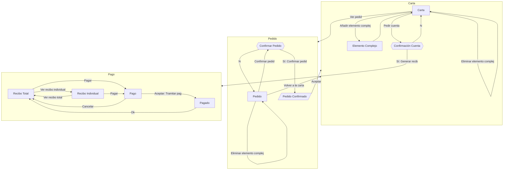

# Diagramas de flujo

```mermaid
flowchart TD
    subgraph g_carta[Carta]
        carta[Carta]
        elemento_complejo[Elemento Complejo]
        confirmacion_cuenta{{Confirmación Cuenta}}
    end
    subgraph g_pedido[Pedido]
        confirmar_pedido{{Confirmar Pedido}}
        pedido[Pedido]
        pedido_confirmado[/Pedido Confirmado/]
    end
    subgraph g_pago[Pago]
        recibo_total[Recibo Total]
        recibo_individual[Recibo Individual]
        pago[Pago]
        pagado[Pagado]
    end
    carta --Añadir elemento simple--> carta
    carta --Eliminar elemento simple--> carta
    carta --Eliminar elemento complejo--> carta
    carta --Añadir elemento complejo--> elemento_complejo
    elemento_complejo --> carta
    carta --Ver pedido--> g_pedido
    pedido --Añadir elemento simple--> pedido
    pedido --Eliminar elemento simple--> pedido
    pedido --Añadir elemento complejo--> pedido
    pedido --Eliminar elemento complejo--> pedido
    pedido --Volver a la carta--> g_carta
    pedido --Confirmar pedido--> confirmar_pedido
    confirmar_pedido --No--> pedido
    confirmar_pedido --Sí: Confirmar pedido--> pedido_confirmado
    pedido_confirmado --Aceptar--> g_carta
    carta --Pedir cuenta--> confirmacion_cuenta
    confirmacion_cuenta --Sí: Generar recibo--> g_pago
    confirmacion_cuenta --No--> carta
    recibo_total --Ver recibo individual--> recibo_individual
    recibo_total --Pagar--> pago
    recibo_individual --Ver recibo total--> recibo_total
    recibo_individual --Pagar--> pago
    pago --Cancelar--> recibo_total
    pago --Aceptar: Tramitar pago--> pagado
    pagado --Ok--> recibo_total

```