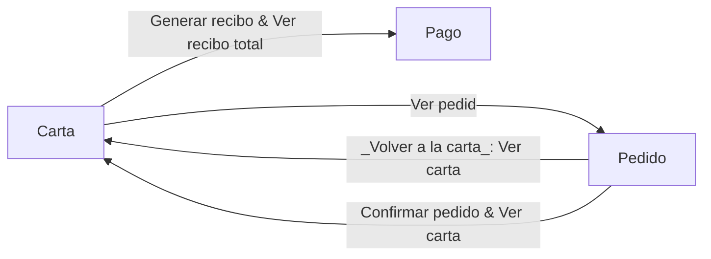
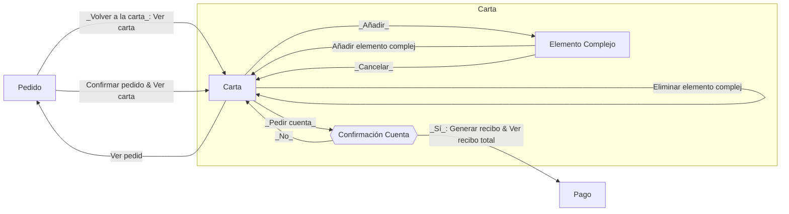
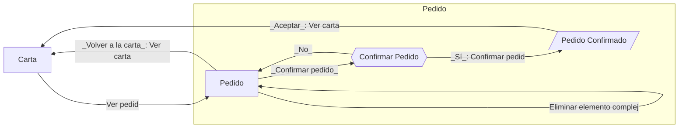
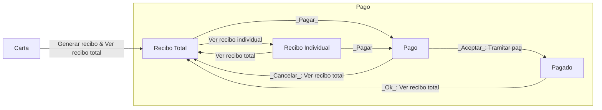
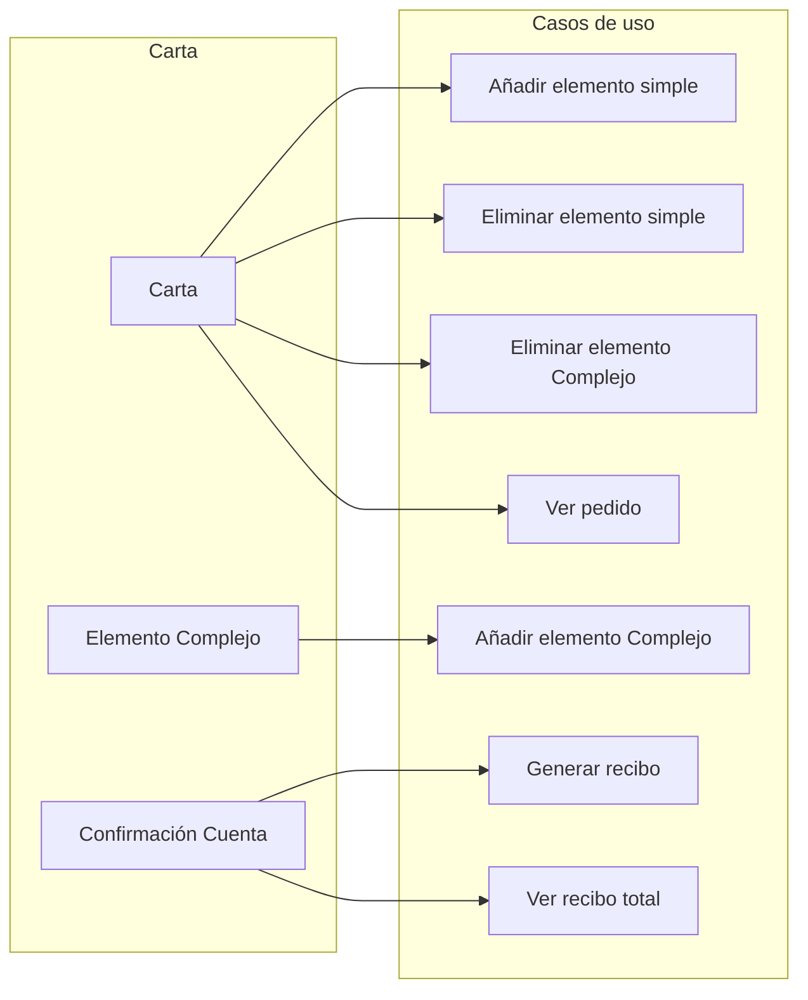
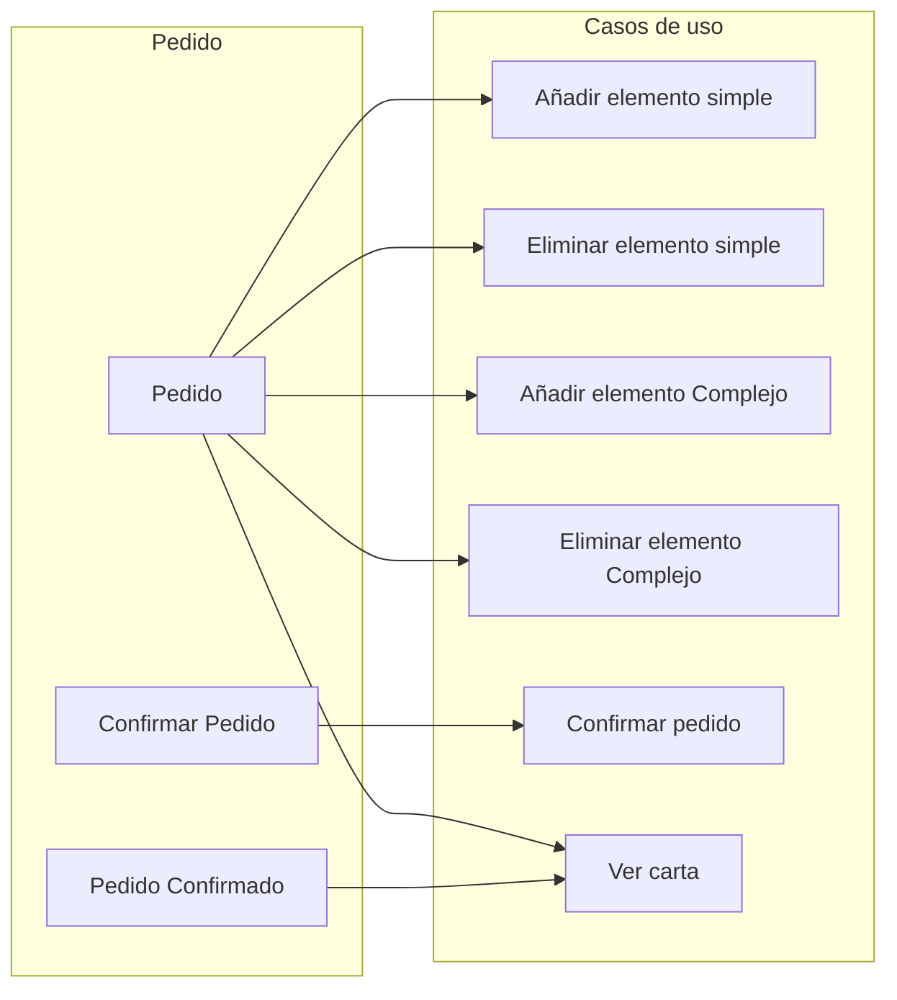
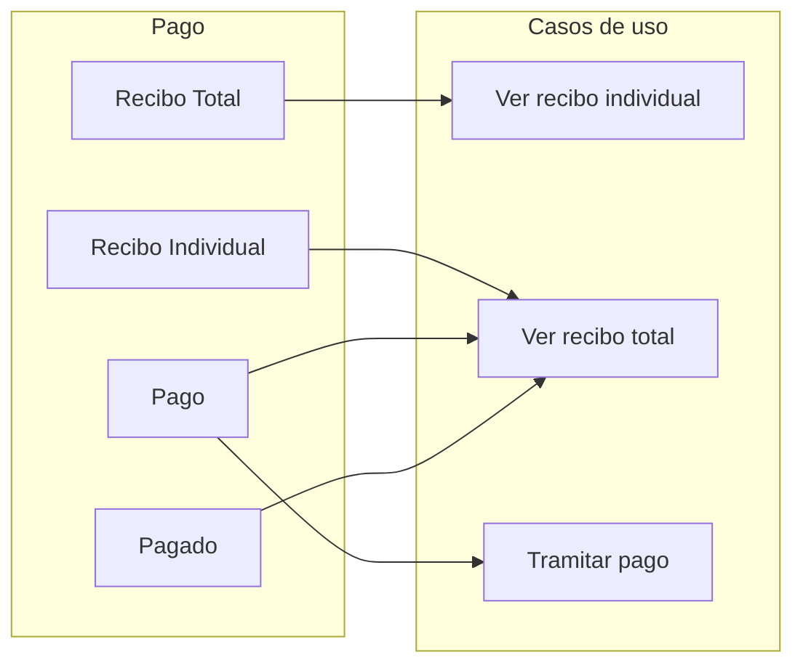
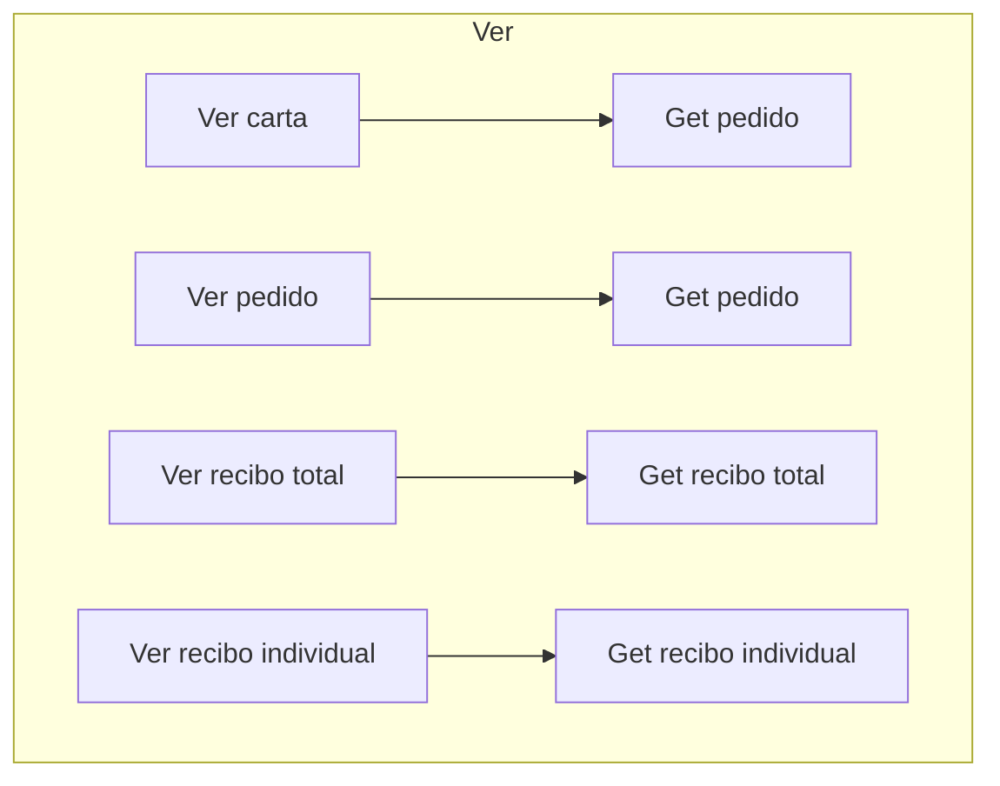

# Diagramas de flujo

## Web

### Clientes

### Carta

### Pedido

### Pago

## Trazabilidad de casos de uso

### Carta

### Pedido

### Pago

### Ver

En la práctica cada caso de uso ver lo que hace es llamar a un caso de uso de tipo GET que se usa para generar el HTML de la nueva pantalla y transitar a ella. 

