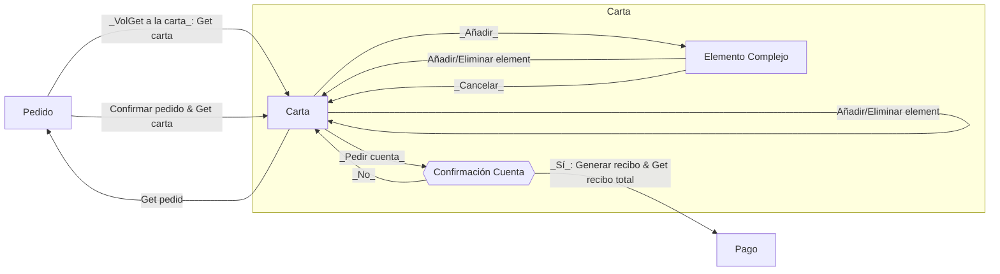
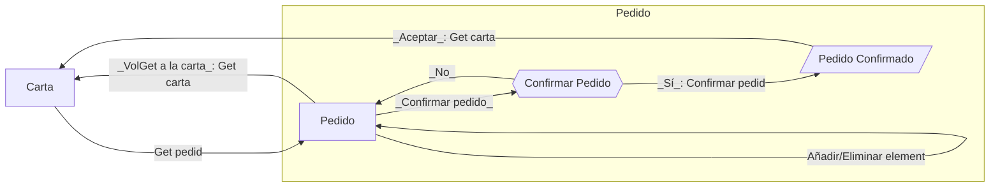
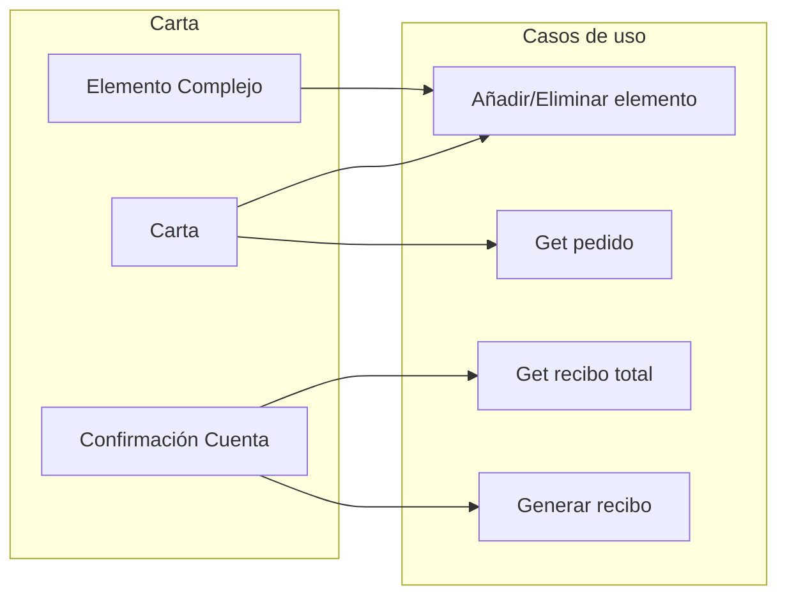
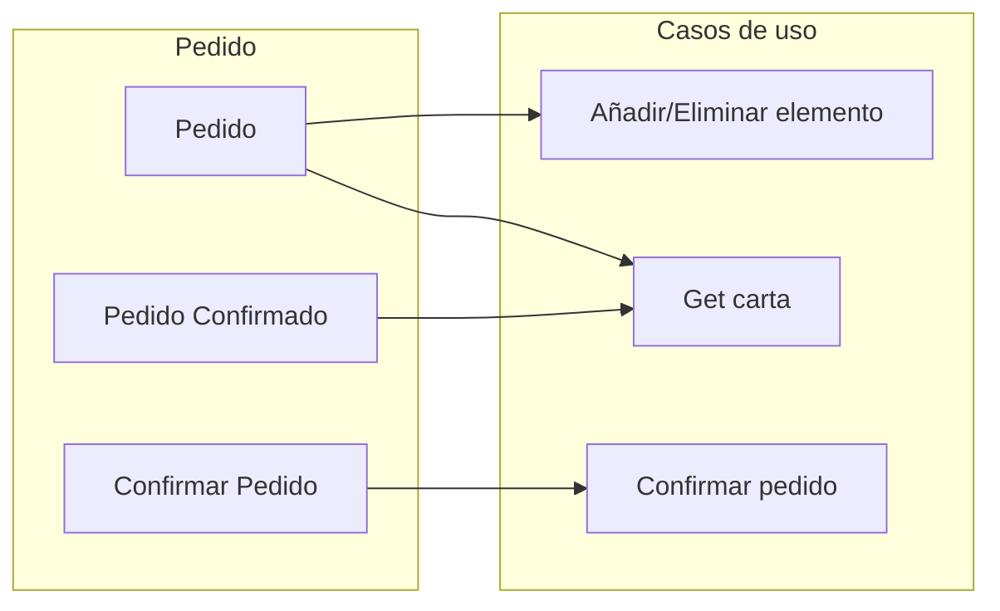
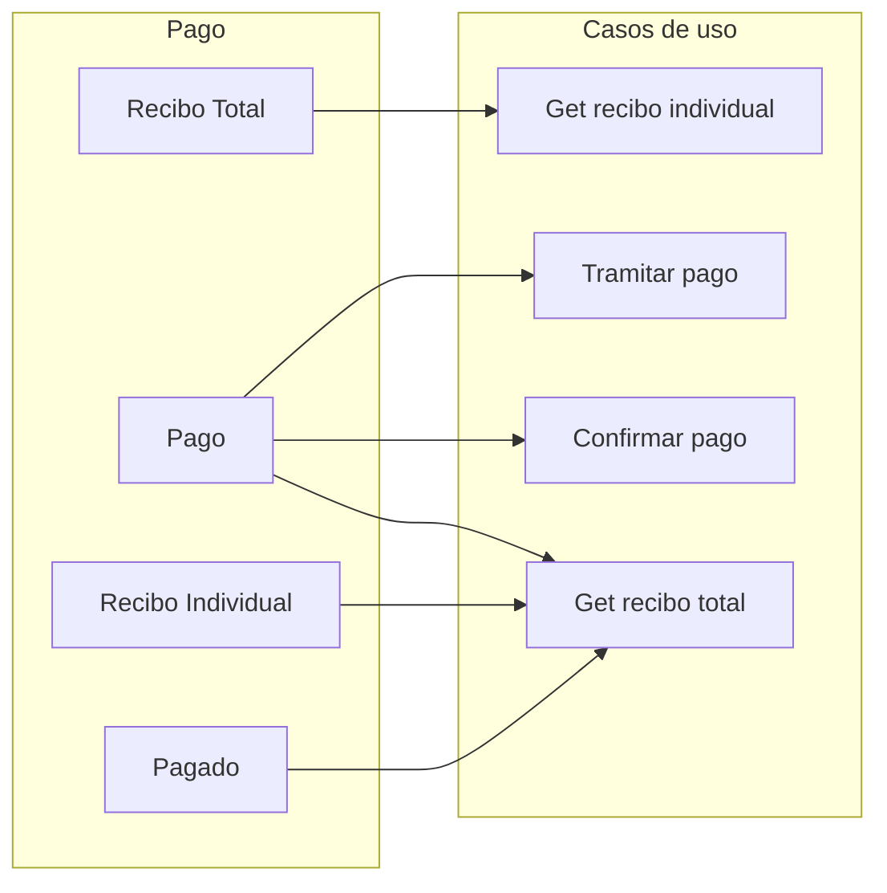

# Diagramas de flujo

En este documento se recogen los diagramas de flujo de los casos de uso de la web.

Diferenciamos entre casos de uso de alto y bajo nivel.

- **Casos de uso de alto nivel**: Los que el usuario realiza haciendo uso de la vista de la aplicación. 
- **Casos de uso de bajo nivel**: Los casos de uso que se ejecutan en el backend de la aplicación. Son las acciones atómicas que se pueden realizar en la aplicación.

## Casos de uso de alto nivel

## Transiciones web

Transiciones entre las distintas páginas de la web y los casos de uso de bajo nivel que activan.

### Sintaxis

#### Tipos de pantalla

#### Transiciones y casos de uso

### Clientes

### Carta

### Pedido

### Pago

## Trazabilidad de casos de uso

### Carta

### Pedido

### Pago

