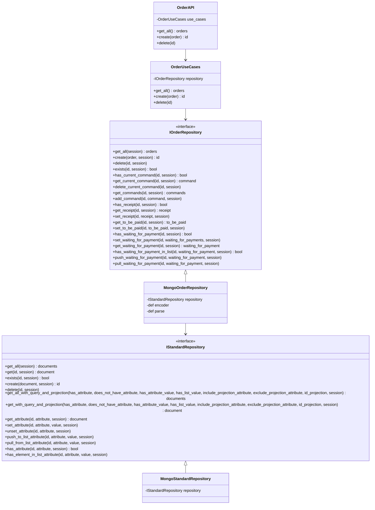

```mermaid
classDiagram

IOrderRepository <|-- MongoOrderRepository
IStandardRepository <|-- MongoStandardRepository
<<interface>> IOrderRepository
<<interface>> IStandardRepository
OrderAPI --> OrderUseCases
OrderUseCases --> IOrderRepository
MongoOrderRepository --> IStandardRepository

class IOrderRepository {
    +get_all(session) orders
    +create(order, session) id
    +delete(id, session)
    +exists(id, session) bool
    +has_current_command(id, session) bool
    +get_current_command(id, session) command
    +delete_current_command(id, session)
    +get_commands(id, session) commands
    +add_command(id, command, session)
    +has_receipt(id, session) bool
    +get_receipt(id, session) receipt
    +set_receipt(id, receipt, session)
    +get_to_be_paid(id, session) to_be_paid
    +set_to_be_paid(id, to_be_paid, session)
    +has_waiting_for_payment(id, session) bool
    +set_waiting_for_payment(id, waiting_for_payments, session)
    +get_waiting_for_payment(id, session) waiting_for_payment
    +has_waiting_for_payment_in_list(id, waiting_for_payment, session) bool
    +push_waiting_for_payment(id, waiting_for_payment, session)
    +pull_waiting_for_payment(id, waiting_for_payment, session)
}

class MongoOrderRepository {
    -IStandardRepository repository
    -def encoder
    -def parse
}

class IStandardRepository {
    +get_all(session) documents
    +get(id, session) document
    +exists(id, session) bool
    +create(document, session) id
    +delete(id, session)
    +get_all_with_query_and_projection(has_attribute, does_not_have_attribute, has_attribute_value, has_list_value, include_projection_attribute, exclude_projection_attribute, id_projection, session) documents
    +get_with_query_and_projection(has_attribute, does_not_have_attribute, has_attribute_value, has_list_value, include_projection_attribute, exclude_projection_attribute, id_projection, session) document
    +get_attribute(id, attribute, session) document
    +set_attribute(id, attribute, value, session)
    +unset_attribute(id, attribute, session)
    +push_to_list_attribute(id, attribute, value, session)
    +pull_from_list_attribute(id, attribute, value, session)
    +has_attribute(id, attribute, session) bool
    +has_element_in_list_attribute(id, attribute, value, session)
}

class MongoStandardRepository {
    -IStandardRepository repository
}

class OrderAPI {
    -OrderUseCases use_cases
    +get_all() orders
    +create(order) id
    +delete(id)
}

class OrderUseCases {
    -IOrderRepository repository
    +get_all() orders
    +create(order) id
    +delete(id)
}
```