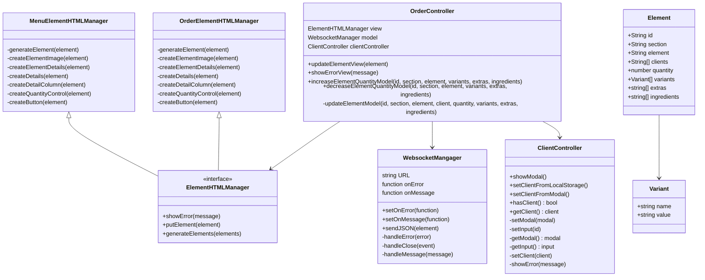

```mermaid
classDiagram

MenuElementHTMLManager <|-- ElementHTMLManager
OrderElementHTMLManager <|-- ElementHTMLManager
<<interface>> ElementHTMLManager
OrderController --> ElementHTMLManager
OrderController --> WebsocketMangager
OrderController --> ClientController
Element --> Variant


class Variant {
    +string name
    +string value 
}

class Element {
    +String id
    +String section
    +String element
    +String[] clients
    +number quantity
    +Variant[] variants
    +string[] extras
    +string[] ingredients
}

class WebsocketMangager {
    string URL
    function onError
    function onMessage
    +setOnError(function)
    +setOnMessage(function)
    +sendJSON(element)
    -handleError(error)
    -handleClose(event)
    -handleMessage(message)
}

class ElementHTMLManager {
    +showError(message)
    +putElement(element)
    +generateElements(elements)
}

class OrderController {
    ElementHTMLManager view
    WebsocketManager model
    ClientController clientController
    +updateElementView(element)
    +showErrorView(message)
    +increaseElementQuantityModel(id, section, element, variants, extras, ingredients)
    +decreaseElementQuantityModel(id, section, element, variants, extras, ingredients)
    -updateElementModel(id, section, element, client, quantity, variants, extras, ingredients)
}

class MenuElementHTMLManager {
    -generateElement(element)
    -createElementImage(element)
    -createElementDetails(element)
    -createDetails(element)
    -createDetailColumn(element)
    -createQuantityControl(element)
    -createButton(element)
}

class OrderElementHTMLManager {
    -generateElement(element)
    -createElementImage(element)
    -createElementDetails(element)
    -createDetails(element)
    -createDetailColumn(element)
    -createQuantityControl(element)
    -createButton(element)
}

class ClientController {
    +showModal()
    +setClientFromLocalStorage()
    +setClientFromModal()
    +hasClient() bool
    +getClient() client
    -setModal(modal)
    -setInput(id)
    -getModal() modal
    -getInput() input
    -setClient(client)
    -showError(message)
}
```