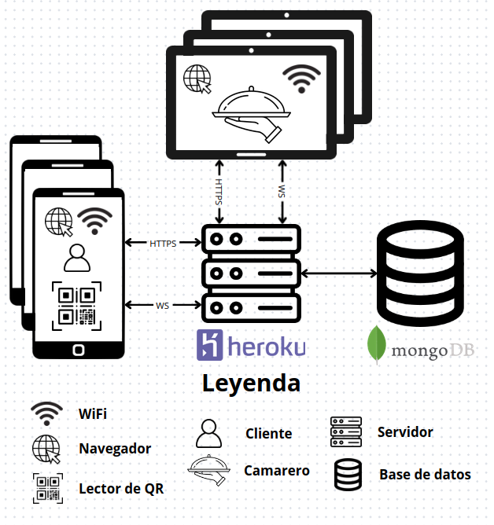
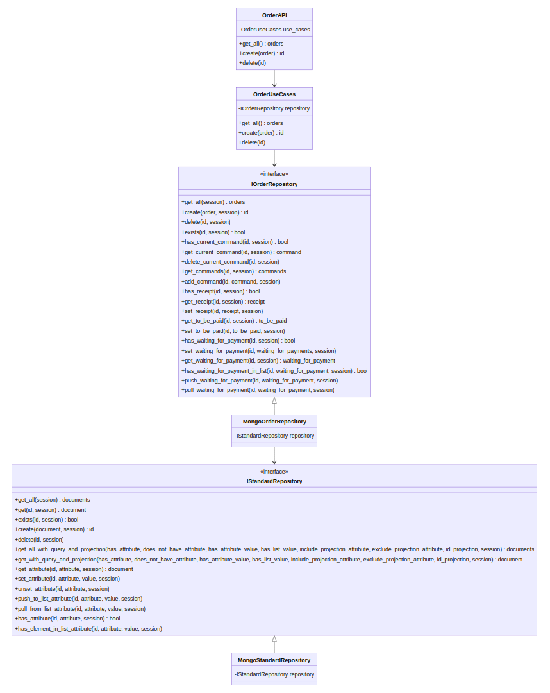
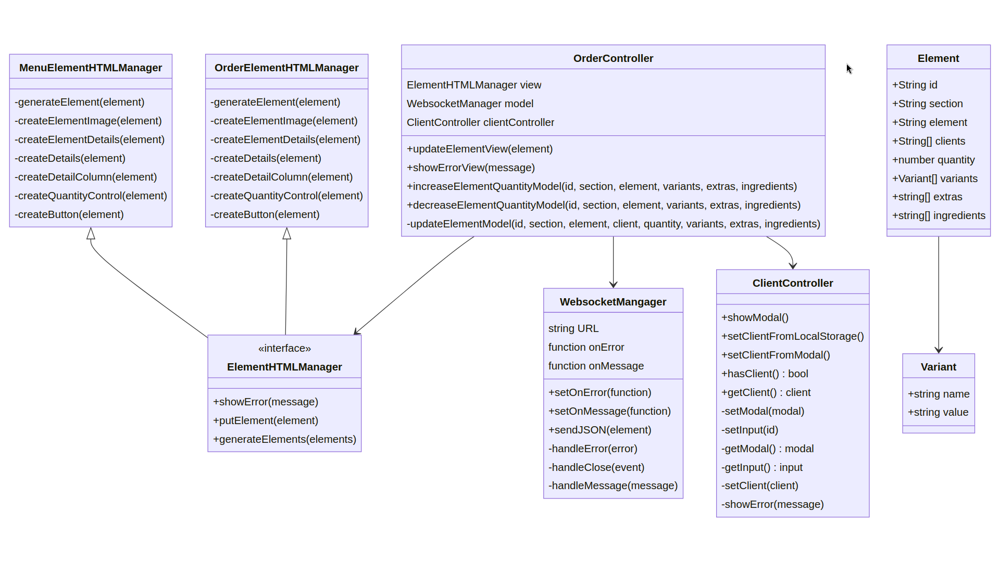
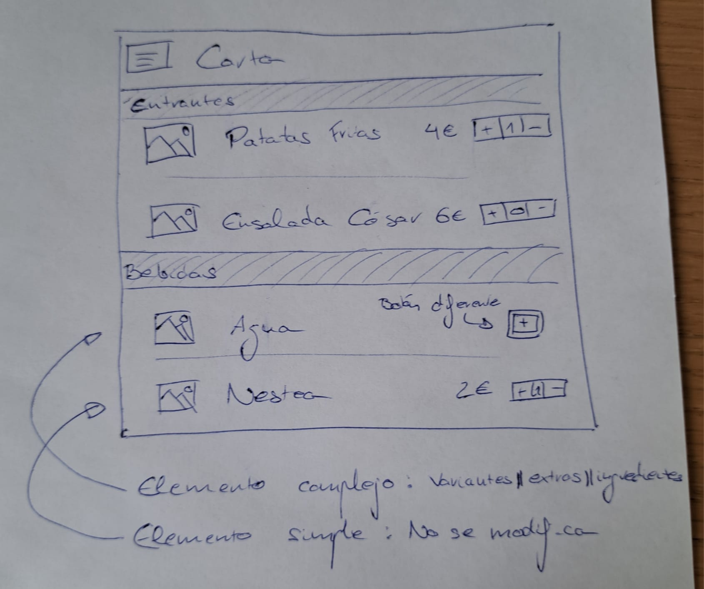
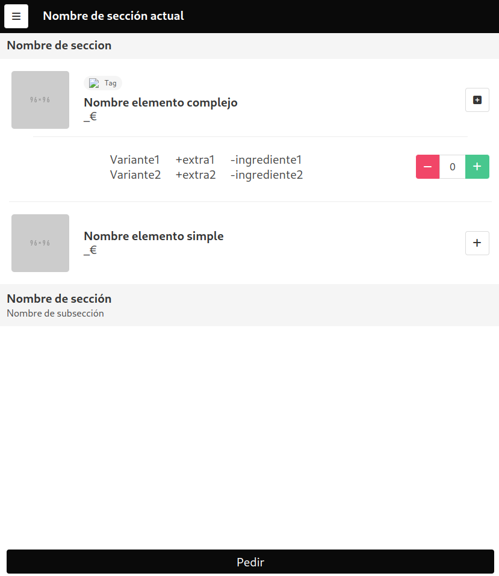
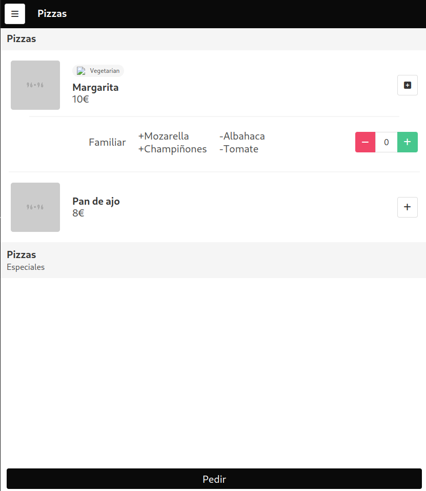
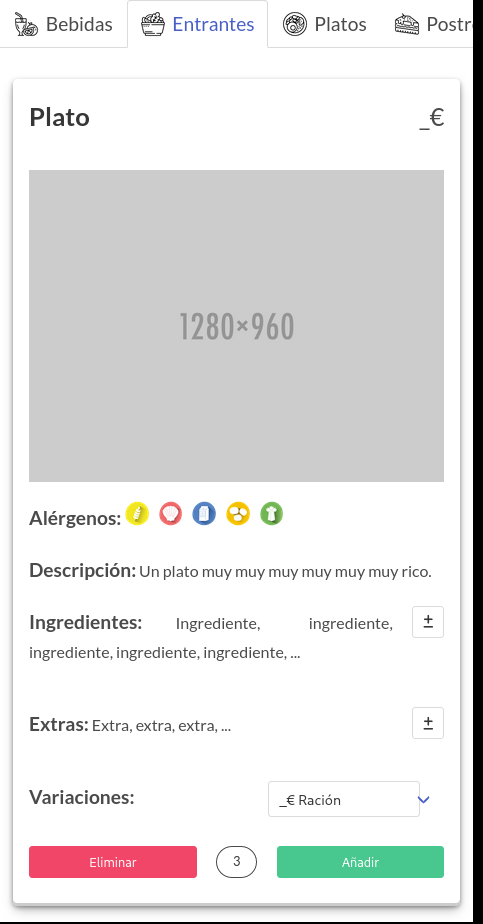
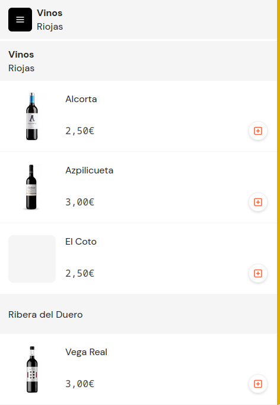
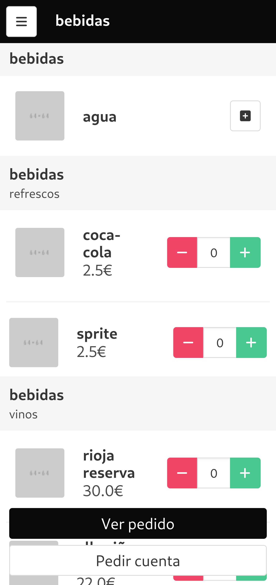
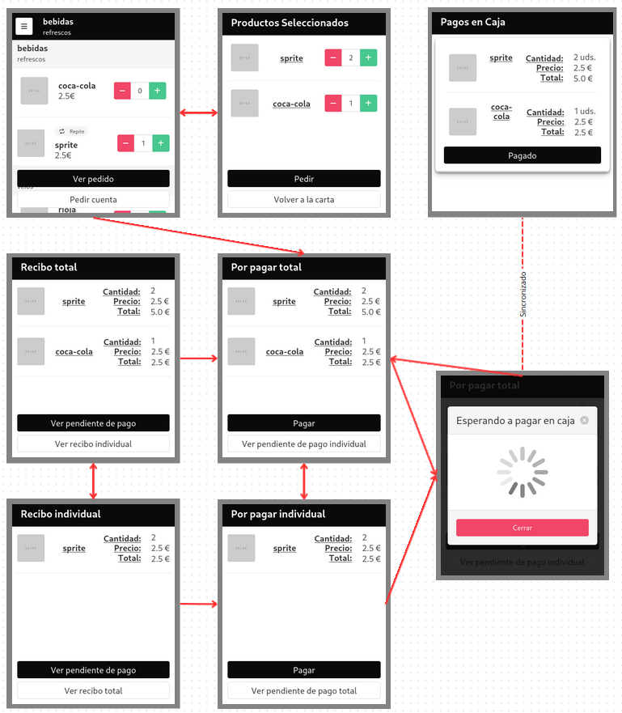

# QRest

## Resumen

En el contexto del crecimiento global del sector de la restauración, los restaurantes enfrentan desafíos significativos en la modernización de sus sistemas de gestión, especialmente en la gestión de comandas. Las soluciones existentes son a menudo costosas y poco accesibles para pequeñas empresas. El proyecto QRest aborda este desafío mediante el desarrollo de una solución integral y accesible para la gestión de comandas en restaurantes.

QRest es un sistema basado en web que ofrece una gama de funcionalidades clave para la gestión eficiente de restaurantes. Entre estas se incluyen la gestión de comandas a través de códigos QR, pagos, digitalización de menús, pedidos interactivos, y sugerencias basadas en pedidos anteriores. Esta solución integral no solo mejora la eficiencia operativa, sino que también reduce significativamente los costos y barreras de entrada para restaurantes de diversos tamaños.

El impacto de QRest es multifacético, ofreciendo una experiencia mejorada tanto para los clientes como para los propietarios de restaurantes. Los clientes disfrutan de una experiencia de pedido más fluida y personalizada, mientras que los restaurantes se benefician de una gestión más eficiente y una reducción en los costos operativos. Con QRest, los restaurantes pueden implementar un sistema de gestión de comandas moderno y eficiente sin la necesidad de una gran inversión inicial.

Palabras clave: Gestión de restaurantes, QRest, eficiencia operativa, automatización.

## Introducción

En este capítulo se exponen los problemas enfrentados en el sector de la resturación, las soluciones existentes en el ámbito de automatización de gestión de comandas, luego se expone lo que se quiere conseguir con este TFG y finalmente los puntos fuertes de la solución alcanzada.

### Problemas del sector

El sector de la restauración en España y a nivel mundial ha experimentado un notable crecimiento en las últimas décadas. Sin embargo, este crecimiento no se ha visto acompañado de una modernización adecuada en la gestión operativa de los restaurantes, especialmente para los establecimientos pequeños y medianos. La mayoría de estos restaurantes aún dependen de métodos anticuados y manuales para la gestión de comandas, enfrentando limitaciones significativas en su eficiencia operativa y capacidad para competir en un mercado cada vez más digitalizado.

Estos desafíos incluyen sistemas de toma de pedido obsoletos, a menudo basados en papel o dependientes de costosos sistemas PDA con hardware especializado. La digitalización de las cartas es mínima; principalmente basadas en PDFs subidos a servicios de almacenamiento en la nube; y su actualización y personalización resultan engorrosas y poco flexibles. Además, los restaurantes enfrentan ineficiencias en la gestión del tiempo de espera de los clientes, desde la toma del pedido hasta el pago de la cuenta. La falta de un registro informatizado de los pedidos impide realizar análisis y estadísticas que podrían mejorar la experiencia del cliente y la gestión del restaurante.

Otro aspecto crítico es la escasa presencia web de muchos restaurantes, combinada con la complejidad y el costo de mantener un sitio propio. En cuanto a los procesos de pago, la ausencia de métodos de pago online y la dificultad para gestionar pagos separados por cliente representan obstáculos adicionales para una experiencia de cliente óptima.

Esta combinación de factores resalta la necesidad de una solución que aborde estos múltiples desafíos de manera integral, ofreciendo a los restaurantes de todos los tamaños una forma accesible y eficiente de modernizar sus operaciones y mejorar la experiencia tanto para los clientes como para el personal del restaurante.

Esta situación presenta un desafío particularmente agudo para los pequeños restaurantes, que constituyen una parte significativa del sector de la restauración en España y en muchos otros países. Estos establecimientos, a menudo con recursos limitados y sin acceso a las economías de escala que benefician a las grandes cadenas, se encuentran en una posición especialmente vulnerable. La falta de sistemas de gestión eficientes y accesibles financieramente les obliga a lidiar con una gestión operativa ineficiente y obsoleta, lo que no solo reduce su competitividad sino que también puede afectar significativamente la experiencia del cliente y, en última instancia, su viabilidad como negocio.

Para muchos emprendedores y propietarios de pequeños restaurantes, estos desafíos representan barreras importantes al momento de iniciar o mantener su negocio. Se enfrentan a la necesidad de equilibrar la calidad del servicio y la eficiencia operativa con una inversión inicial y costes de mantenimiento limitados. Este conjunto de problemas puede hacer que la apertura y gestión de un restaurante sea una tarea desalentadora, poniendo en riesgo el crecimiento y la sostenibilidad de estos importantes actores del sector gastronómico. La urgencia de abordar estas dificultades subraya la necesidad de una solución como QRest, diseñada para ser accesible y beneficiosa para restaurantes de todos los tamaños, pero especialmente para aquellos pequeños establecimientos que son el corazón de la comunidad culinaria y cultural.

### Problemas de soluciones existentes

El mercado actual de sistemas de gestión para restaurantes ofrece una gama de soluciones que se pueden clasificar en dos categorías principales: hardware especializado y sistemas basados en web + QR. Cada una de estas categorías incluye varias opciones, cada una con sus características y desafíos únicos.

En la categoría de hardware especializado, encontramos soluciones como las pantallas de pedido centralizadas, ejemplificadas por las utilizadas en cadenas como McDonalds. Estos sistemas, aunque eficientes para modelos de servicio rápido en barra, presentan desafíos significativos en términos de costos elevados y especialización, lo que los hace inaccesibles para la mayoría de los restaurantes independientes o pequeñas franquicias. Además, su aplicación se limita a ciertos modelos de negocio, excluyendo a aquellos con un enfoque más tradicional o servicio en mesa.

Otra opción dentro del hardware especializado son los dispositivos móviles como los ofrecidos por PilarBox. Aunque estos sistemas mejoran la movilidad y la eficiencia del personal, suelen implicar una inversión considerable en hardware, además de la logística y el tiempo necesarios para mantener los dispositivos cargados y operativos, lo que puede ser un desafío en entornos de alta demanda.

Por otro lado, los sistemas basados en web + QR representan una alternativa tecnológicamente más sencilla, pero con sus propias limitaciones. Los QR estáticos, por ejemplo, pueden estar ubicados en las mesas o incluidos en tarjetas o servilleteros, como lo hace Qamarero. Sin embargo, estos sistemas plantean problemas de seguridad, ya que los clientes pueden seguir accediendo al sistema desde fuera del restaurante si conservan el QR o el enlace. Además, en restaurantes con mesas modulares o configuraciones cambiantes, pueden generar confusión tanto para los clientes como para el personal.

Los QR generados por pedido, como los utilizados por Yasaka y el Servicio QbaR, ofrecen una solución a algunos de estos problemas al crear un QR único para cada grupo de clientes. Sin embargo, esto requiere la generación constante de nuevos códigos y un nivel de atención personalizada para cada cliente que ingresa, lo que puede ser un proceso tedioso y lento durante los períodos de alta afluencia.

Finalmente, la variante de QR estático con contraseña, utilizada por ejemplos como Sushi Som, intenta abordar los problemas de seguridad, pero introduce una nueva capa de complejidad y potencial incomodidad tanto para los clientes, que deben obtener y recordar una contraseña, como para el personal, que debe comunicarla y gestionar su uso.

En resumen, aunque cada una de estas soluciones ofrece ventajas en ciertos aspectos, también presentan una serie de inconvenientes que limitan su eficacia y aceptación general en la industria de la restauración. Estos problemas son especialmente pronunciados en restaurantes más pequeños y establecimientos independientes, donde los costos, la complejidad y las limitaciones operativas pueden hacer que la implementación de estos sistemas sea impracticable.

### Motivación

La iniciativa para desarrollar QRest se originó a partir de experiencias personales significativas, complementadas por un fuerte interés en los desafíos técnicos. La concepción del proyecto surgió tras una visita al restaurante Yasaka, donde observé un sistema de pedidos basado en web y QR específico para el establecimiento, pero con claras deficiencias: una interfaz de usuario poco atractiva, falta de sincronización de pedidos y ausencia de funcionalidad para pagos individuales. Este escenario motivó una profunda reflexión y la decisión de investigar y desarrollar una solución más eficiente y adaptable para una variedad de restaurantes. Desde enero de 2023, he dedicado tiempo a explorar las soluciones existentes en el mercado, observando una evolución continua y la aparición de nuevas opciones a lo largo del año.

A nivel personal, mi interés en el desarrollo web y el desafío de abordar un problema complejo y relevante fueron catalizadores cruciales. Mi experiencia como cliente frecuente en restaurantes proporcionó una perspectiva única sobre las necesidades y desafíos en este sector. Adicionalmente, la posibilidad de transformar QRest en un emprendimiento viable post-TFG resonó con mis aspiraciones profesionales. El proyecto también representó una oportunidad excepcional para aplicar de forma práctica los conocimientos adquiridos en mi formación en Ingeniería del Software.

Técnicamente, la emergencia de soluciones de gestión para restaurantes en 2023 abrió un campo de investigación e innovación. La meta de desarrollar una aplicación escalable, capaz de resolver los problemas operativos de restaurantes de diferentes tamaños, en particular los más pequeños o recientemente inaugurados, era altamente atractiva. El proyecto requería la integración de varios aspectos técnicos complejos, incluyendo transacciones en bases de datos, sincronización en tiempo real con websockets, el uso de bases de datos NoSQL, y el desarrollo de modelos de datos complejos. Asimismo, se enfatizó en la privacidad y seguridad de los datos, implementando técnicas como el almacenamiento local en el navegador del usuario.

Desde la perspectiva de la ingeniería del software, el desafío de desarrollar una aplicación en un área naciente con limitadas referencias preexistentes fue una tarea considerable. Este proceso implicó adoptar metodologías adecuadas de desarrollo de software, definir requisitos claros, elaborar casos de uso y pruebas, y aplicar APIs y principios de programación orientada a objetos en Python y JavaScript, así como el uso de frameworks de desarrollo web. Además, la estructuración y el refactoring del proyecto fueron componentes clave para su éxito.

En conclusión, QRest es fruto de un equilibrio entre motivaciones personales y desafíos técnicos, resultando en una solución innovadora para los retos de la industria restaurantera y un proyecto de crecimiento personal y aplicación práctica de habilidades en ingeniería del software.

### Objetivos

Los objetivos del proyecto QRest se clasifican en tres categorías principales: personales, profesionales y específicos del proyecto, cada una contribuyendo al éxito y la realización integral del proyecto.

**Objetivos Personales:**
Mis metas personales se centran en el logro de un Trabajo de Fin de Grado que no solo me desafíe y emocione, sino que también represente un hito en mi desarrollo personal y profesional. Este proyecto es una plataforma para la realización de un emprendimiento post-TFG, ofreciendo una oportunidad única para aplicar y ampliar mi conocimiento en el desarrollo web y enriquecer mi portafolio profesional con una aplicación full-stack robusta y bien desarrollada.

**Objetivos Profesionales:**
Desde un punto de vista profesional, los objetivos están alineados con el fortalecimiento y la expansión de habilidades técnicas específicas. Esto incluye mejorar en el desarrollo de frontend, particularmente en JavaScript y CSS; dominar la sincronización en tiempo real utilizando Websockets; profundizar en MongoDB; entender las transacciones en bases de datos; explorar la arquitectura de software en aplicaciones web; diseñar y desarrollar APIs eficientes; y reforzar la programación orientada a

 objetos en Python y JavaScript. Además, se busca implementar metodologías ágiles en un proyecto de esta envergadura.

**Objetivos del Proyecto:**
Los objetivos específicos del proyecto incluyen el desarrollo de una solución que supere las limitaciones de las soluciones existentes en el mercado. Entre estos se encuentran la implementación de una sincronización efectiva de pedidos, la facilitación de pagos individuales, y la creación de una carta digital flexible y dinámica. Además, se pretende desarrollar un sistema de sugerencias basado en preferencias y pedidos anteriores, garantizar la privacidad y seguridad de los datos de los clientes, y manejar eficientemente la diversidad de situaciones en un restaurante real. Otro aspecto importante es la propuesta de soluciones innovadoras para los problemas de los sistemas basados en QR estáticos y con contraseña, y la minimización de la necesidad de hardware especializado en los restaurantes.

Estos objetivos delinean un compromiso con el desarrollo de una solución integral que responda a las necesidades de los clientes y los restaurantes, utilizando los conocimientos y habilidades adquiridos en el campo del desarrollo de software.

### Solución Propuesta para QRest

El objetivo del proyecto QRest es desarrollar una solución integral que aborde eficientemente una amplia gama de problemas enfrentados tanto por los restaurantes como por sus clientes. La solución buscará resolver estos problemas de manera económica, flexible, y con una mínima intrusión en los flujos de trabajo existentes.

**Problemas del Restaurante a Resolver:**

1. **Errores en la Toma de Comandas:** Implementar un sistema que reduzca los errores humanos en la toma de pedidos.
2. **Optimización del Tiempo del Personal:** Minimizar el tiempo dedicado por los camareros a tomar comandas, llevar la cuenta y cobrar, liberando así más tiempo para la atención al cliente y otras tareas.
3. **Automatización del Flujo de Trabajo:** Reducir errores relacionados con procesos manuales mediante la automatización de tareas como la gestión de pedidos y reservas.
4. **Presencia y Funcionalidad Web:** Proveer a los restaurantes de una página web propia y funcional que incluya una carta digitalizada fácilmente modificable.
5. **Registro de Pedidos:** Mantener un registro digitalizado y automatizado de todos los pedidos para una mejor gestión y análisis.
6. **Mejora en el Servicio de Pedidos a Domicilio y Reservas:** Digitalizar y simplificar los procesos de pedidos a domicilio y reservas de mesas, reemplazando los métodos telefónicos tradicionales.
7. **Gestión Efectiva de los Estados de los Pedidos:** Implementar un sistema que permita a los restaurantes y al personal ver y gestionar eficientemente el estado de los pedidos de cada mesa.

**Problemas del Cliente a Resolver:**

1. **Reducción de Tiempos de Espera:** Agilizar los procesos de pedir comandas, solicitar la cuenta y realizar el pago.
2. **Facilitación de Pedidos y Reservas:** Permitir a los clientes realizar pedidos a domicilio y reservas de mesas de manera online y sencilla.
3. **Prevención de Malentendidos y Facilidad en la División de Cuentas:** Ofrecer un sistema claro y preciso para evitar malentendidos en los pedidos y facilitar la división y el pago por separado de la cuenta.
4. **Seguimiento del Pedido:** Proporcionar a los clientes la capacidad de ver el estado actual de su pedido.

**Requisitos de la Solución Propuesta:**

1. **Digitalización Flexible de la Carta:** Un sistema que permita a los restaurantes actualizar y modificar fácilmente su carta digital.
2. **Pedidos Directos por Parte del Cliente:** Habilitar a los clientes para que realicen pedidos directamente desde sus dispositivos, mejorando la eficiencia y la experiencia del usuario.
3. **Sistema de Gestión de Comandas Adaptable:** Desarrollar un sistema que se ajuste a los diferentes flujos de trabajo de cada restaurante, evitando la necesidad de adaptaciones significativas en sus operaciones actuales.
4. **Registro Integral de Pedidos:** Asegurar un registro completo y automatizado de todos los pedidos para facilitar la gestión y el análisis.
5. **Recomendaciones Personalizadas:** Ofrecer recomendaciones tanto al restaurante como al cliente, basadas en pedidos anteriores y preferencias.
6. **Pagos Flexibles y Online:** Integrar opciones de pago por separado, online y en caja, para mayor comodidad y eficiencia.
7. **Reservas de Mesa Online y Pedidos a Domicilio:** Facilitar las reservas de mesas y los pedidos a domicilio a través de la web del restaurante.
8. **Sincronización de Pedidos en Mesas Compartidas:** Asegurar que los pedidos de clientes que comparten mesa estén sincronizados y gestionados eficazmente.
9. **Privacidad de Datos del Cliente:** Garantizar la seguridad y privacidad de los datos del cliente.
10. **Estado del Pedido y Flexibilidad en los Pedidos:** Permitir a los clientes ver el estado de su pedido y ofrecer flexibilidad en la modificación de sus pedidos, adaptándose a sus necesidades en tiempo real.
11. **Bajo Coste y Mínimo Hardware Necesario:** Desarrollar una solución que requiera una inversión inicial mínima y poco hardware adicional por parte del restaurante, haciéndola accesible incluso para establecimientos con recursos limitados.
12. **Integración y Sincronización de Servicios:** Asegurar que todos los componentes del sistema, desde la toma de pedidos hasta el pago y la gestión de reservas, estén integrados y sincronizados para una operatividad fluida y eficiente.
13. **Facilidad de Uso y Accesibilidad:** Crear una interfaz de usuario intuitiva y accesible tanto para el personal del restaurante como para los clientes, garantizando una experiencia de usuario agradable y sin complicaciones.
14. **Adaptabilidad a Diversos Modelos de Restaurante:** Diseñar la solución de manera que se pueda adaptar fácilmente a diferentes tipos y tamaños de restaurantes, desde pequeñas cafeterías hasta grandes cadenas, asegurando así una amplia aplicabilidad.

En resumen, la solución propuesta por QRest busca ofrecer una experiencia de restaurante mejorada y más eficiente, abordando los desafíos actuales tanto para el personal como para los clientes. Este sistema integral no solo mejorará la operatividad del restaurante y la satisfacción del cliente, sino que también impulsará la transformación digital en la industria de la restauración.

### Puntos Fuertes de QRest Frente a Competidores

QRest se distingue de sus competidores en el mercado de gestión de restaurantes a través de una combinación única de características de diseño, funcionalidad de producto e ingeniería. Cada uno de estos aspectos contribuye a crear una solución más robusta, flexible y centrada en el usuario.


**Características del Producto:**

1. **Pedidos Directos por Parte del Cliente:** Los clientes pueden realizar sus pedidos directamente, reduciendo errores y tiempos de espera.
2. **Privacidad de Datos de los Clientes:** QRest pone un énfasis especial en la seguridad y privacidad de los datos del cliente.
3. **Opciones de Recibo y Pago Individuales o Totales:** La solución ofrece flexibilidad en la facturación y el pago, adaptándose a las necesidades de diferentes grupos de clientes.
4. **Recomendaciones Personalizadas y Sugerencias del Restaurante:** Basadas en etiquetas y en pedidos anteriores, QRest proporciona recomendaciones útiles tanto para repetir pedidos como para probar nuevos platos, lo que mejora la experiencia del cliente y puede incrementar las ventas.
5. **Pagos en Caja con Confirmación de Pago:** Permite una mayor flexibilidad y comodidad en el proceso de pago, facilitando tanto los pagos individuales como los totales.
6. **Sincronización de Pedidos en Mesas Compartidas:** Esta característica asegura que todos los pedidos de una mesa estén perfectamente sincronizados, mejorando la eficiencia del servicio.
7. **Flexibilidad para Modificar la Carta Digital:** Ofrece a los restaurantes la capacidad de adaptar y actualizar su carta fácilmente, lo que es esencial para responder rápidamente a cambios en la oferta o la demanda.
8. **Seguridad en la API:** QRest se compromete a mantener altos estándares de seguridad en su API, protegiendo tanto los datos del restaurante como los del cliente.

**Aspectos de Ingeniería:**

1. **Arquitectura en Capas al Estilo Clean Architecture:** Esta estructura asegura que el sistema sea escalable, mantenible y fácil de modificar, lo que es crucial para adaptarse a las necesidades cambiantes del mercado y de los clientes.
2. **Tests de Integración:** Estos tests garantizan que todos los componentes del sistema funcionen juntos de manera efectiva y sin errores, lo que es vital para la fiabilidad del sistema.
3. **Estructura de Datos para Toda la Casuística de Restaurantes:** La capacidad de QRest para manejar una amplia gama de situaciones en diferentes tipos de restaurantes lo distingue de otras soluciones más limitadas.
4. **Transacciones Seguras de Casos de Uso:** Esto asegura que todas las operaciones realizadas en el sistema sean seguras y confiables.
5. **Metodología Ágil Basada en Sprints:** Permite una rápida adaptación y mejora del producto, asegurando que QRest pueda evolucionar según las necesidades del mercado y los usuarios.
6. **Uso de LocalStorage para Datos del Cliente:** Mejora la privacidad del cliente al almacenar datos localmente sin enviarlos al servidor, un enfoque único que refuerza la seguridad de los datos.

**Aspectos de deseables para la aplicación comercial (diseñados pero no implementados):**

1. **Generación Segura y Cómoda de Pedidos con QR:** Ofrecer un sistema de pedidos basado en QR que es tanto seguro como fácil de usar, mejorando la experiencia del cliente y la eficiencia del restaurante.
2. **Flujo Flexible de Gestión de Comandas:** El sistema permite a los restaurantes adaptar la gestión de comandas a sus flujos de trabajo específicos, proporcionando una mayor flexibilidad en comparación con sistemas más rígidos.
3. **Conexión con la Impresora de Tickets mediante Librería JS:** Esta característica asegura una integración fluida con los sistemas de impresión existentes, facilitando la transición a QRest.
4. **Búsquedas en la Carta con Filtros:** Permitir a los usuarios buscar fácilmente en la carta y aplicar filtros, mejorando la experiencia de navegación.
5. **Frontend con Elementos Complejos y Personalizables:** La interfaz de usuario avanzada de QRest es tanto visualmente atractiva como funcional, con elementos complejos para una mejor experiencia del usuario.
6. **Frontend para Modificar la Carta:** Ofrecer a los restaurantes la capacidad de modificar fácilmente su carta, proporcionando una solución dinámica y adaptable.

En resumen, QRest se diferencia claramente de sus competidores a través de su enfoque en la seguridad, la flexibilidad, la experiencia del usuario y la robustez técnica. Estos puntos fuertes posicionan a QRest no solo como una solución efectiva para los desafíos actuales de los restaurantes, sino también como un sistema preparado para adaptarse y evolucionar con las tendencias futuras en la industria de la restauración.

## Tecnología y herramientas

### Lenguajes de programación

#### Python

Python es un lenguaje de programación de alto nivel, interpretado y con enfoque en la legibilidad del código. Soporta múltiples paradigmas de programación, incluyendo la orientada a objetos e imperativa. Es ampliamente utilizado en diversas áreas y cuenta con una extensa biblioteca de módulos y frameworks gracias a su vasta comunidad.

En este proyecto, Python ha desempeñado un papel central en el desarrollo del backend de la aplicación. Se ha utilizado para una amplia gama de tareas que incluyen el desarrollo de la API, la implementación de casos de uso, la realización de pruebas y la gestión de interacciones con la base de datos. Esta elección se debe a la robustez, versatilidad y simplicidad del lenguaje, lo que lo hace ideal para una implementación rápida y eficiente del backend.

#### JavaScript

JavaScript es un lenguaje de programación interpretado, principalmente usado para scripts del lado del cliente en páginas web. Ha ganado popularidad en el desarrollo del lado del servidor, especialmente con Node.js. Es fundamental para el desarrollo web, permitiendo la creación de páginas interactivas y dinámicas, y cuenta con un rico ecosistema de frameworks y bibliotecas.

JavaScript se ha empleado para manejar el front-end de la aplicación web, específicamente en la gestión del HTML y CSS. Ha jugado un papel crucial en la creación de una experiencia de usuario interactiva, permitiendo la implementación de eventos y dinamismo en la página web. Además, se ha utilizado para aplicar patrones de diseño como Modelo-Vista-Controlador (MVC) y Programación Orientada a Objetos (POO) en JavaScript, mejorando así la estructura y mantenibilidad del código en el lado del cliente.

### Tecnologías de desarrollo web

#### HTML

HTML (Hypertext Markup Language) es el lenguaje de marcado estándar utilizado para crear y estructurar páginas web. Define la estructura y el contenido de una página web mediante etiquetas y atributos. HTML5, la última versión, incluye soporte para elementos multimedia como video, audio, y gráficos, además de mejoras en la semántica y la accesibilidad.

En este proyecto, HTML ha sido utilizado específicamente para construir la estructura y el contenido de las páginas web. Se ha empleado para definir los elementos básicos de la interfaz de usuario, como encabezados, párrafos, enlaces y otros componentes esenciales de la página. La función principal de HTML aquí ha sido establecer la base sobre la cual se aplican los estilos y las funcionalidades interactivas.

#### CSS

CSS (Cascading Style Sheets) es un lenguaje de hojas de estilo utilizado para describir la presentación de un documento escrito en HTML o XML. CSS permite controlar el diseño, colores, fuentes, y el espaciado, entre otros aspectos visuales de las páginas web. Es fundamental para crear interfaces de usuario atractivas y responsivas, adaptándose a diferentes tamaños de pantalla y dispositivos.

CSS, por su parte, ha tenido la función de dar estilo a las páginas web creadas con HTML. Se ha utilizado para controlar la presentación visual de la web, incluyendo aspectos como el diseño, colores, tipografías y la adaptabilidad a diferentes tamaños de pantalla. El uso de CSS ha sido esencial para asegurar que las páginas no solo estén bien estructuradas, sino también visualmente atractivas y coherentes con el diseño general de la aplicación.

### Frameworks

#### BulmaCSS

BulmaCSS es un framework de CSS libre y de código abierto. Se caracteriza por su enfoque en la simplicidad y la facilidad de uso, con una sintaxis clara y concisa. Utiliza Flexbox para un diseño responsive y ofrece un conjunto de componentes reutilizables para la interfaz de usuario, como botones, formularios y tarjetas. No incluye JavaScript, lo que lo hace ligero y fácil de integrar con otros frameworks de JavaScript.

En el proyecto, BulmaCSS se ha seleccionado como el framework de CSS principal debido a su enfoque en la responsividad y la facilidad de uso. Se ha utilizado para asegurar que la aplicación web sea completamente adaptable a dispositivos móviles y diferentes tamaños de pantalla. BulmaCSS ha facilitado la implementación de un diseño atractivo y funcional, sin la necesidad de escribir extenso código CSS personalizado.

#### FastAPI

FastAPI es un moderno framework de web para Python diseñado para crear APIs rápidas y eficientes. Se destaca por su alto rendimiento, comparable a NodeJS y Go, gracias a su uso de Starlette para el manejo de solicitudes y Pydantic para la validación de datos. FastAPI facilita la creación de APIs con documentación automática utilizando OpenAPI y soporta tanto solicitudes síncronas como asíncronas.

FastAPI se ha empleado para desarrollar y definir la API de la aplicación. Este framework ha sido elegido por su rendimiento, facilidad de uso y capacidad para crear APIs robustas y bien documentadas rápidamente. Ha permitido la implementación de funcionalidades backend eficientes, con una atención particular a las operaciones asíncronas y la gestión eficiente de solicitudes.

#### Pytest

Pytest es un framework de pruebas para Python que es simple y escalable. Se utiliza para escribir pequeñas pruebas unitarias hasta pruebas funcionales complejas. Pytest hace fácil escribir pruebas con su sintaxis simple y la capacidad de correr pruebas en paralelo, lo que mejora la eficiencia. También soporta fixtures para una configuración reutilizable y tiene una gran variedad de plugins para extender su funcionalidad.

Pytest se ha utilizado para realizar pruebas de integración en el proyecto. Este framework ha permitido escribir tests de manera sencilla y eficiente, facilitando la comprobación de que distintas partes del sistema trabajan conjuntamente como se espera. Su uso ha sido clave para mantener la calidad y la fiabilidad del software a lo largo del proceso de desarrollo.

#### Jinja2

Jinja2 es un motor de plantillas para Python, usado para crear archivos HTML u otros formatos de texto basados en plantillas. Es ampliamente utilizado en aplicaciones web para generar contenido dinámico. Su sintaxis es similar a Python, lo que lo hace intuitivo para desarrolladores de Python. Ofrece características como herencia de plantillas y filtros personalizables, lo que facilita la reutilización de código y la organización del contenido.

Jinja2 ha sido implementado en el proyecto para la generación dinámica de contenido HTML, CSS y JavaScript. Este motor de plantillas se ha utilizado para crear páginas web que pueden variar su contenido en función de los datos proporcionados, permitiendo una mayor flexibilidad y personalización en la presentación de la información a los usuarios. Jinja2 ha sido esencial para separar la lógica de la presentación en la aplicación, haciendo el código más mantenible y legible.

### Tecnologías de bases de datos

#### MongoDB

MongoDB es una base de datos NoSQL orientada a documentos. A diferencia de las bases de datos relacionales, utiliza documentos en un formato similar a JSON con esquema dinámico, lo que la hace muy flexible y adecuada para manejar grandes volúmenes de datos desestructurados y heterogéneos. Es escalable, permite realizar consultas complejas y es ampliamente utilizada en aplicaciones modernas de desarrollo web y móvil.

En este proyecto, MongoDB se ha utilizado como la base de datos No-SQL principal para almacenar y gestionar todos los datos del dominio de la aplicación. Esta elección se debe a la flexibilidad y escalabilidad que ofrece MongoDB, permitiendo manejar grandes volúmenes de datos desestructurados y facilitando el desarrollo rápido gracias a su esquema dinámico.

#### LocalStorage

LocalStorage es una característica de almacenamiento web que permite a los sitios web y aplicaciones almacenar y acceder a datos directamente en el navegador del usuario. Proporciona una manera de guardar datos en pares clave-valor y es útil para guardar información como preferencias del usuario, datos de sesión, y otros datos que no necesitan ser enviados al servidor. LocalStorage es limitado a un dominio específico y los datos persisten incluso después de cerrar el navegador.

LocalStorage ha sido empleado para almacenar datos en el lado del cliente, directamente desde JavaScript, sin la necesidad de interacción con el servidor. Esta tecnología se ha utilizado para guardar el nombre del usuario y los elementos de la carta que ha pedido, con fin de mejorar la experiencia del usuario sin comprometer su privacidad, además de reducir la carga en el servidor.

### Herramientas de desarrollo

#### Visual Studio Code

Visual Studio Code (VS Code) es un editor de código fuente desarrollado por Microsoft. Es gratuito, de código abierto y disponible en múltiples plataformas. Ofrece soporte para una amplia gama de lenguajes de programación, depuración integrada, control de versiones Git, resaltado de sintaxis, autocompletado inteligente, y una extensa biblioteca de extensiones. Es popular entre los desarrolladores por su ligereza, personalización y funcionalidades robustas.

Visual Studio Code ha sido la herramienta elegida para múltiples tareas en el proyecto, destacándose en la documentación y en la generación y visualización de prototipos. Su uso ha sido fundamental para escribir y visualizar documentación gracias a sus extensiones. Además, ha sido la herramienta principal para el desarrollo de la interfaz web, incluyendo la codificación de HTML, CSS y JavaScript, aprovechando sus características como resaltado de sintaxis, autocompletado y una amplia gama de extensiones útiles para el desarrollo web.

#### Pycharm

PyCharm es un entorno de desarrollo integrado (IDE) específicamente para Python, desarrollado por JetBrains. Viene en dos versiones: una versión comunitaria gratuita y una versión profesional de pago. PyCharm ofrece varias características para el desarrollo de Python, incluyendo análisis de código, depuración gráfica, un terminal integrado, integración con sistemas de control de versiones, y soporte para desarrollo web con Django. Es conocido por su potente autocompletado, su capacidad para manejar proyectos complejos y su integración con otras herramientas y frameworks de Python.

Pycharm ha sido utilizado como el entorno de desarrollo integrado (IDE) principal para el desarrollo del código backend en Python. Esta herramienta ha sido esencial para escribir, desarrollar y ejecutar pruebas, así como para ejecutar y depurar el servidor. Su entorno integrado, que ofrece herramientas especializadas para Python, ha facilitado significativamente el desarrollo, la depuración y el testing del backend.

### Herramientas de gestión

#### Git

Git es un sistema de control de versiones distribuido, diseñado para manejar desde proyectos pequeños hasta muy grandes con velocidad y eficiencia. Permite a los desarrolladores rastrear cambios en el código, colaborar con otros y revertir a versiones anteriores si es necesario. Es una herramienta esencial para la gestión moderna de código fuente.

Git se ha utilizado como el sistema de control de versiones esencial para el proyecto. Ha permitido llevar un registro detallado de todos los cambios realizados en el código de la aplicación, facilitando el seguimiento de las diferentes etapas del desarrollo. La capacidad de Git para gestionar versiones ha sido fundamental para mantener la integridad y la continuidad del código a lo largo del tiempo.

#### GitHub

GitHub es una plataforma de alojamiento de código que utiliza Git para el control de versiones. Facilita la colaboración entre desarrolladores y ofrece características como el seguimiento de problemas, solicitudes de extracción y un wiki para cada repositorio. También proporciona integraciones con varias herramientas de desarrollo y alojamiento de páginas web.

GitHub ha servido como la plataforma de alojamiento para el repositorio del proyecto. Ha proporcionado un espacio centralizado para almacenar el código, permitiendo el acceso y sincronización a pasar de haber utilizado distintos ordenarodres. Además, GitHub ha sido una herramienta clave para la revisión de código y seguimiento de problemas y despliegue continuo.

#### Trello

Trello es una aplicación de gestión de proyectos basada en la metodología Kanban. Permite a los usuarios crear tableros con listas y tarjetas para organizar tareas y proyectos. Las tarjetas se pueden mover entre listas para indicar el progreso, y se pueden añadir detalles como fechas de vencimiento, adjuntos y comentarios.

Trello se ha utilizado para la gestión ágil del proyecto, específicamente en la definición, documentación y seguimiento del progreso de las tareas durante los sprints. Ha permitido organizar el flujo de trabajo de manera visual, facilitando la planificación y la ejecución eficiente de las tareas del proyecto.

#### MongoDB Atlas

MongoDB Atlas es un servicio de base de datos en la nube automatizado y completamente gestionado por MongoDB. Ofrece despliegue, configuración, mantenimiento y escalabilidad automáticos para bases de datos MongoDB en la nube, con soporte para AWS, Google Cloud y Azure.

MongoDB Atlas ha sido utilizado como el servicio de alojamiento en la nube para la base de datos MongoDB del proyecto. Ha permitido gestionar y manipular documentos de la base de datos de forma remota, incluyendo la creación, eliminación y modificación de documentos, así como la gestión de la configuración.

#### Google Meet

Google Meet es una herramienta de videoconferencia desarrollada por Google. Permite realizar reuniones en línea con video y audio, compartir pantalla y realizar presentaciones, y es ampliamente utilizado para reuniones de trabajo, educación a distancia y eventos en línea.

Google Meet ha sido la herramienta de comunicación elegida para las reuniones en línea de seguimiento del Trabajo de Fin de Grado (TFG). Ha permitido realizar reuniones virtuales efectivas, a pesar de las limitaciones de distancia o disponibilidad física.

#### Cloudinary

Cloudinary es una plataforma de gestión de activos multimedia en la nube. Proporciona soluciones para subir, almacenar, manipular y entregar imágenes y videos, optimizando archivos para diferentes dispositivos y resoluciones, lo que es esencial para el desarrollo web y móvil.

Cloudinary ha sido utilizada para almacenar y gestionar los recursos de imagen del proyecto en la nube. Ha facilitado la carga y el almacenamiento eficiente de imágenes relacionadas con la aplicación, como elementos del menú, iconos y otros gráficos relevantes. Su uso ha sido clave para desacoplar las imágenes del código de la aplicación. También para facilitar la gestión de activos multimedia.

#### Pandoc

Pandoc es una herramienta de conversión de documentos que soporta una amplia variedad de formatos de archivo. Se utiliza para convertir archivos de texto entre formatos como Markdown, HTML, LaTeX y PDF. Es muy útil para autores, académicos y desarrolladores que necesitan manejar diferentes formatos de documentos.

Pandoc se ha empleado para convertir archivos Markdown a PDF. Esta herramienta ha sido crucial para la generación de documentación y reportes en formato PDF, permitiendo una fácil distribución y presentación de la información generada durante el desarrollo del proyecto.

#### Calendario a papel

Un calendario de papel es una herramienta tradicional de gestión del tiempo. Aunque básico, es efectivo para planificar y visualizar eventos, plazos y tareas diarias, mensuales o anuales. No requiere de tecnología y es accesible en todo momento.

El uso de un calendario de papel ha sido esencial para la organización personal y la planificación de tareas semanales. Ha proporcionado una forma simple y directa de visualizar las tareas pendientes, ayudando a mantener un enfoque claro y una gestión eficiente del tiempo.

#### Google Calendar

Google Calendar es una herramienta de gestión de tiempo y planificación de calendario en línea. Permite a los usuarios crear y editar eventos, configurar recordatorios, y compartir calendarios con otros. Es ampliamente utilizado en entornos personales y profesionales para organizar horarios, reuniones y eventos.

Google Calendar se ha utilizado para programar y recordar las reuniones de seguimiento del TFG.

#### Miniconda

Miniconda es una distribución mínima del gestor de paquetes y sistema de gestión de entornos Conda. Está diseñado para Python y permite a los usuarios crear entornos virtuales para aislar diferentes proyectos y sus dependencias, facilitando la gestión de versiones y la reproducibilidad de proyectos.

Miniconda ha sido empleado para gestionar los entornos de Python y sus librerías asociadas. Ha permitido crear entornos aislados para el proyecto, asegurando la compatibilidad y evitando conflictos entre diferentes dependencias y versiones de las librerías.

#### Heroku

Heroku es una plataforma como servicio (PaaS) que permite a los desarrolladores construir, ejecutar y operar aplicaciones en la nube. Es conocido por su facilidad de uso y por ofrecer una gama de servicios y herramientas integradas para desplegar y escalar aplicaciones web modernas.

Heroku se ha utilizado para desplegar la aplicación en la nube. Ha ofrecido una plataforma simplificada para el despliegue, permitiendo que la aplicación sea accesible en línea sin la complejidad de gestionar la infraestructura de servidores. Además de desplegar de forma automatizada en base a los cambios en el repositorio.

#### Zathura

Zathura es un visor de documentos ligero con una interfaz minimalista. Principalmente se utiliza para ver PDF y otros formatos de documentos. Su diseño se centra en la simplicidad y la eficiencia, permitiendo a los usuarios personalizar la experiencia a través de plugins y atajos de teclado.

Zathura ha sido la herramienta seleccionada para la visualización de documentos PDF. Su interfaz minimalista y la capacidad de gestionar eficientemente los documentos PDF han sido útiles para revisar documentación y reportes relacionados con el proyecto.

### Herramientas de documentación

#### Confluence

Confluence es una herramienta de colaboración y gestión del conocimiento utilizada principalmente en el contexto empresarial. Ofrece funcionalidades para crear, compartir y organizar documentación de proyectos, wikis internos y páginas de colaboración. Es ampliamente utilizado para la documentación de proyectos de software, gestión de conocimientos corporativos y trabajo en equipo.

Confluence ha sido utilizada para compilar y organizar la documentación formal del proyecto, como los reportes de sprints, análisis de competidores y evaluación de tecnologías potenciales. Ha permitido centralizar y compartir información clave del proyecto de manera estructurada, facilitando el acceso a la información desde distintos ordenadores.

#### Papel y boli

El papel y el bolígrafo son herramientas de documentación clásicas y fundamentales. A pesar de la prevalencia de las soluciones digitales, tomar notas o esbozar ideas en papel sigue siendo una práctica común. Es inmediato, flexible y no depende de la tecnología, lo que lo hace útil para lluvias de ideas, notas rápidas y esbozos.

El papel y el boli han sido herramientas fundamentales para la documentación informal y la generación de ideas. Se han empleado constantemente para hacer bocetos, organizar lluvias de ideas, definir objetivos de trabajo y esquematizar tareas. Esta técnica tradicional ha sido esencial para la planificación rápida y la captura de ideas en el momento.

#### Neovim
Neovim es un editor de texto de código abierto, derivado de Vim. Está diseñado para la extensibilidad y la usabilidad, manteniendo la eficiencia de Vim. Es popular entre los desarrolladores por su enfoque en la experiencia del usuario, la mejora de la interfaz de usuario y la integración con herramientas modernas de desarrollo.

Neovim ha funcionado como una herramienta de notas rápidas y edición de archivos Markdown. Se ha utilizado para escribir notas de uso temporal y para redactar documentación en formato Markdown, aprovechando su eficiencia y simplicidad.

### Herramientas de diseño

#### MermaidJS

MermaidJS es una biblioteca de JavaScript que permite representar diagramas y gráficos definidos mediante un texto descriptivo. Es útil para generar diagramas de flujo, gráficos de Gantt, diagramas de secuencia, entre otros, directamente en páginas web. Facilita la creación de visualizaciones complejas sin necesidad de herramientas gráficas.

MermaidJS se ha utilizado para crear y visualizar diagramas de la aplicación de forma textual, integrándose con Markdown. Ha sido una herramienta clave para definir y compartir diagramas de flujo, estructuras de datos y otros elementos visuales de diseño, facilitando la comprensión y la documentación del diseño del sistema.

#### Bocetos y diagramas a papel

Los bocetos y diagramas en papel son una forma básica pero efectiva de visualizar ideas, procesos o diseños. Esta técnica es utilizada por diseñadores, arquitectos y profesionales de diversas disciplinas para plasmar conceptos de manera rápida y flexible, facilitando la comprensión y la comunicación de ideas.

Los bocetos y diagramas realizados a mano en papel han sido la principal herramienta de diseño. Se han utilizado para visualizar rápidamente ideas, crear diagramas de flujo y esquematizar interfaces de usuario, proporcionando una forma flexible y directa de experimentar con conceptos de diseño.

### Recursos adicionales

#### Websockets

Websockets es una tecnología que proporciona canales de comunicación bidireccional y en tiempo real entre un navegador y un servidor. Es ampliamente utilizada para aplicaciones web que requieren interacciones en tiempo real como chats, juegos en línea y trading de acciones. A diferencia del HTTP tradicional, Websockets permite una comunicación continua sin la necesidad de hacer múltiples solicitudes.

Websockets ha sido la tecnología clave para sincronizar en tiempo real el frontend con el backend, así como para mantener actualizadas las vistas entre diferentes usuarios. Esta tecnología ha permitido una interacción fluida y continua, crucial para las funcionalidades dinámicas y en tiempo real de la aplicación.

#### Uvicorn

Uvicorn es un servidor ASGI (Asynchronous Server Gateway Interface) ligero y de alto rendimiento para Python. Es especialmente diseñado para trabajar con frameworks asíncronos como Starlette y FastAPI, proporcionando un rendimiento óptimo en operaciones de I/O asíncronas. Uvicorn se destaca por su sencillez, velocidad y capacidad para manejar un gran número de conexiones simultáneas.

Uvicorn, como servidor ASGI, ha sido la elección para ejecutar la aplicación. Ha proporcionado una plataforma eficiente y de alto rendimiento para alojar la aplicación, aprovechando su capacidad para manejar las operaciones asíncronas y una gran cantidad de conexiones simultáneas, lo que ha sido esencial para el funcionamiento óptimo de la aplicación.

## Metodología

### Resumen de la Metodología

En el desarrollo de QRest, el objetivo principal ha sido definir y desarrollar el proyecto con claridad, estableciendo bases sólidas de actuación y detallando las decisiones tomadas a lo largo del proceso. Dada la naturaleza del proyecto, era esencial adoptar un enfoque que permitiera la adaptación a cambios, actualizaciones y variaciones en los requisitos. Esta necesidad de flexibilidad y adaptación ha sido un factor determinante en la elección de la metodología de trabajo.

### Metodología Ágil

Para este proyecto, se ha elegido la metodología ágil Scrum, reconocida por su capacidad para facilitar adaptaciones rápidas a cambios durante el desarrollo del software. Esta metodología es particularmente adecuada para proyectos donde los requisitos pueden evolucionar o no están completamente definidos desde el inicio.

### Características de Scrum en el Proyecto

- **Roles**: En el contexto de este proyecto, el estudiante, ha asumido la mayoría de los roles típicos en un equipo de desarrollo Scrum, incluyendo los de diseñador, analista, desarrollador y tester. La única excepción ha sido el rol de Product Owner, que ha sido desempeñado por mi tutor. Esta estructura de roles ha permitido una gran autonomía en el desarrollo, al mismo tiempo que garantiza una guía y dirección clara a través del tutor como Product Owner.

- **Iteraciones**:
    - **Duración**: Las iteraciones han tenido una duración de una o dos semanas. Esta flexibilidad en la duración se ha debido principalmente a imprevistos en el desarrollo y a pausas entre iteraciones por causas externas.
    - **Enfoque**: Cada iteración se ha centrado en desarrollar funcionalidades concretas. Este enfoque ha permitido un avance sistemático y medible del proyecto, asegurando que cada funcionalidad se desarrolla y prueba adecuadamente antes de pasar a la siguiente.

- **Reuniones**: Se han realizado reuniones tras cada iteración para discutir los avances y planificar la siguiente. Estas reuniones han sido fundamentales para evaluar el progreso del proyecto, identificar y resolver problemas, y ajustar los planes según sea necesario. También han servido como un espacio para la reflexión y el aprendizaje, permitiéndome mejorar continuamente el proceso de desarrollo.

La adopción de la metodología Scrum ha resultado ser una decisión acertada para el proyecto QRest. Su flexibilidad y enfoque iterativo han permitido una adaptación efectiva a los desafíos y cambios que han surgido durante el desarrollo. Además, la estructura de Scrum ha fomentado un enfoque centrado en el usuario y ha permitido una retroalimentación continua, lo cual es crucial en el desarrollo de aplicaciones orientadas al cliente, como es el caso de una solución para la gestión de comandas en restaurantes.

La implementación de esta metodología no solo ha facilitado la gestión del desarrollo del proyecto, sino que también ha proporcionado valiosas lecciones sobre la gestión de proyectos de software en un contexto real. La experiencia adquirida en la aplicación de Scrum, la resolución de problemas y la adaptación a las necesidades cambiantes será sin duda útil en futuras iniciativas profesionales y académicas. 

En conclusión, la metodología ágil Scrum ha demostrado ser una herramienta eficaz para el desarrollo del proyecto QRest, contribuyendo significativamente a su éxito y ofreciendo un marco de trabajo adaptable y centrado en la entrega de valor en cada etapa del proyecto.

### Planificación y gestión del proyecto

La gestión efectiva del proyecto QRest ha requerido la implementación de una estrategia de planificación y seguimiento coherente y estructurada. Para ello, se han utilizado diversas herramientas y técnicas, cada una desempeñando un rol específico en el proceso de desarrollo.

#### Herramientas y Técnicas Utilizadas

1. **Confluence**: Se ha empleado Confluence para la documentación formal y la definición de objetivos de los sprints, incluyendo las funcionalidades específicas a desarrollar en cada uno. Esta herramienta ha sido esencial para mantener un registro organizado y accesible de la planificación y los avances del proyecto.

2. **Trello**: Para la gestión de tareas dentro de cada sprint, se ha utilizado Trello. En esta plataforma, se crearon listas para cada sprint, donde las tareas se movían a través de las etapas de 'To Do', 'Doing' y 'Done'. Al finalizar cada sprint, las tareas completadas se trasladaban de nuevo a la tabla del sprint correspondiente. Esta metodología permitió un seguimiento claro del progreso y facilitó la organización del trabajo.

3. **Estimación de Horas y Prioridades**: Cada tarea se evaluó en términos de horas necesarias para su realización y su prioridad relativa. Esta estimación fue crucial para una asignación de recursos eficiente y para asegurar que las tareas críticas recibieran la atención adecuada.

4. **Planificación en Calendario de Papel**: Utilizando un calendario físico, se planificó semanalmente en base a la prioridad y duración estimada de las tareas. Esta técnica tradicional proporcionó una visión tangible y de fácil acceso del plan semanal.

5. **Objetivos Diarios y Técnica Pomodoro en Papel**: Para una gestión del tiempo más efectiva, se establecieron objetivos diarios y se aplicó la técnica Pomodoro, anotando cada sesión y objetivo en papel. Esta práctica ayudó a mantener un enfoque constante y a gestionar mejor el tiempo de trabajo. Los pensamientos espontáneos, bocetos y notas se realizaron también en papel, aprovechando su comodidad y rapidez.

#### Documentación y Seguimiento

Los aspectos más importantes del proyecto se documentaron en Confluence, en las descripciones de tareas específicas en Trello, o directamente en el repositorio del proyecto. Este enfoque multifacético ha facilitado contar con documentación de lo importante y la velocidad para lo menos relevante.

#### Evolución de la Metodología

La metodología de trabajo se ha ido consolidando y perfeccionando a lo largo del desarrollo de la aplicación. Inicialmente, la implementación de esta metodología fue más flexible y menos estructurada. Sin embargo, en los últimos meses del proyecto, al seguir de manera más rigurosa la metodología descrita, se logró avanzar de manera más eficiente y rápida. El mayor impacto se observó al definir el calendario semanal y planificar objetivos específicos para cada sesión Pomodoro en papel. Esta práctica mejoró notablemente la productividad y el enfoque, permitiendo un avance más rápido y estructurado en el desarrollo de QRest.

### Fases de desarrollo

El desarrollo del proyecto QRest se ha estructurado en varias fases, reflejando un enfoque dinámico y adaptativo. A lo largo del proceso, se han enfrentado diversos desafíos y aprendizajes que han influido en la metodología de trabajo y en la planificación del proyecto.

#### Planificación Inicial y Desafíos

- **Planificación de Sprints Iniciales**: Al comienzo del proyecto, se planificaron detalladamente los sprints para los primeros tres meses, con una agenda específica de lo que se realizaría cada semana. Esta planificación inicial fue un intento de estructurar el proyecto y establecer un marco claro para su desarrollo.

- **Desafíos Encarados**:
    - **Falta de Conocimiento en Tecnologías**: Una de las primeras barreras fue la falta de familiaridad con las tecnologías necesarias para el desarrollo de QRest. Esto significó una curva de aprendizaje más pronunciada y un impacto en la velocidad inicial del proyecto.
    - **Replanteamiento Continuo de Funcionalidades**: Durante las etapas iniciales, hubo una necesidad constante de reevaluar y ajustar las funcionalidades de la aplicación y su enfoque general. Esta reevaluación continua llevó a cambios en la planificación y el diseño del proyecto.
    - **Errores y Necesidades Imprevistas**: Surgieron errores técnicos y necesidades no anticipadas durante el desarrollo, lo que obligó a realizar ajustes y replanteamientos en la planificación.

- **Cambio en la Estrategia de Planificación**: Dada la volatilidad y los desafíos encontrados en los primeros sprints, se adoptó un enfoque más flexible. En lugar de planificar a largo plazo, se decidió definir las funcionalidades del sistema y un orden de implementación con una visión a corto plazo, planificando solo dos semanas por adelantado. Este enfoque permitió una mayor adaptabilidad a los cambios y a las necesidades emergentes del proyecto.

#### Desarrollo Estructurado en Fases

- **Total de Iteraciones**: A lo largo del proyecto, se han llevado a cabo un total de 23 iteraciones (sprints) de desarrollo, cada una con una duración de una o dos semanas. La duración media de estas iteraciones ha sido de aproximadamente 9.56 días, sin incluir el tiempo dedicado a la documentación de la memoria del proyecto.
- **Agrupación en Fases de Desarrollo**: Para facilitar la comprensión y el análisis del proyecto, estas iteraciones se han agrupado en 18 fases de desarrollo. Cada fase representa un conjunto de sprints y encapsula un conjunto específico de tareas y objetivos alcanzados.

##### Fase 1 - Inicial

**Inicio:** 18 de Febrero  
**Fin:** 24 de Febrero  
**Actividades:**

- Investigar competidores.
- Pensar en soluciones a problemas existentes de los competidores.
- Elegir un nombre para el proyecto.
- Crear entidad: correo electrónico y dominio.

##### Fase 2 - Análisis y Planificación

**Inicio:** 20 de Febrero  
**Fin:** 9 de Marzo  
**Actividades:**

- Definir funcionalidades deseables de la aplicación.
- Crear un diagrama conceptual simple del sistema basado en funcionalidades.
- Planificar los sprints basados en las funcionalidades.

##### Fase 3 - Prototipo Carta

**Inicio:** 24 de Febrero  
**Fin:** 22 de Marzo  
**Actividades:**

- Definir y crear el entorno de desarrollo.
- Diseñar modelo de datos de la carta (soportando elementos simples y complejos).
- Diseñar prototipo de carta.
- Crear HTML del prototipo de carta.
- Añadir CSS con BulmaCSS.
- Añadir funciones JS en el mismo documento HTML (principalmente basados en atributos HTML).

##### Fase 4 - Backend Carta

**Inicio:** 10 de Marzo  
**Fin:** 16 de Abril  
**Actividades:**

- Implementar modelo de datos de la carta.
- Desarrollar API CRUD de secciones de la carta.
- Desarrollar API CRUD de elementos embebidos en las secciones de la carta.

##### Fase 5 - Frontend Carta

**Inicio:** 17 de Abril  
**Fin:** 30 de Abril  
**Actividades:**

- Separar CSS en archivos individuales en `/static/css`.
- Separar JS en archivos individuales en `/static/js`.
- Frontend de la carta con Jinja2.

##### Fase 6 - Carta V2

**Inicio:** 1 de Mayo  
**Fin:** 18 de Junio  
**Actividades:**

- Analizar competidor llamado Qamarero.
- Decisión de cambiar el diseño actual al de Qamarero.
- Diseñar un prototipo como el de Qamarero.
- Implementar nuevo JS.
- Nuevo Frontend de la carta V2 con Jinja2.

##### Fase 7 - Subsecciones

**Inicio:** 7 de Junio  
**Fin:** 18 de Junio  
**Actividades:**

- Diseñar nuevo modelo de datos de carta para soportar subsecciones.
- Implementar backend de subsecciones.

##### Fase 8 - Tests de integración de la carta

**Inicio:** 19 de Junio  
**Fin:** 10 de Julio  
**Actividades:**

- Diseñar casos de uso de la carta.
- Diseñar casos de prueba de la carta.
- Desarrollar tests de integración de la carta.

##### Fase 9 - Diseño de pedido

**Inicio:** 26 de Septiembre  
**Fin:** 25 de Octubre  
**Actividades:**

- Diseñar modelo de datos de pedidos.
- Diseñar prototipo de pedidos.
- Implementar backend de pedidos.
- Frontend de pedidos con Jinja2.

##### Fase 10 - Rediseño Clean Architecture

**Inicio:** 8 de Octubre  
**Fin:** 5 de Noviembre  
**Actividades:**

- Buscar solución para cambiar arquitectura monolítica a arquitectura en capas.
- Aprender sobre Clean Architecture.
- Diseñar la arquitectura en capas de la aplicación al estilo Clean Architecture.
- Definir diagramas de flujo de las vistas de la aplicación.
- Definir diagrama en capas de qué casos de uso puede ejecutar cada vista de la aplicación.
- Definir diagrama de capas de qué llamadas a la capa de persistencia puede ejecutar cada caso de uso.
- Re-planificar el proyecto (centrarse solo en la parte de los clientes del restaurante).
- Eliminar la API CRUD monolítica para modificar las secciones de la carta.

##### Fase 11 - Interfaz de persistencia

**Inicio:** 1 de Noviembre  
**Fin:** 12 de Noviembre  
**Actividades:**

- Diseñar una interfaz de persistencia con MongoDB.
- Implementar una capa de persistencia que simplifique la interacción con MongoDB.
- Analizar opciones para evitar colisiones en la base de datos.
- Implementar Optimistic Concurrency Control en la capa de persistencia.
- Implementar Transacciones con MongoDB.

##### Fase 12 - Pedidos

**Inicio:** 6 de Noviembre  
**Fin:** 14 de Diciembre  
**Actividades:**

- Rehacer el backend de pedidos en base al nuevo diseño (en capas).
- Rehacer el frontend de pedidos con FastAPI.
- Diseñar casos de prueba de pedidos.
- Implementar test de integración de pedidos.
- Diseñar protocolo de sincronización de pedidos.
- Diseñar modelo de datos de pedidos para soportar sincronización.
- Re-implementar modelo de datos de pedidos.
- Implementar el backend de Websockets de pedidos.
- Crear Websockets en el JS de Jinja2.
- Implementar Modelo-Vista-Controlador en JS para sincronización.

##### Fase 13 - Cliente LocalStorage

**Inicio:** 7 de Diciembre  
**Fin:** 20 de Diciembre  
**Actividades:**

- Prueba de uso de LocalStorage.
- Prototipo de vista de pedido para pedir cliente.
- Actualizar frontend de pedido para pedir cliente.
- Implementar Modelo-Vista-Controlador para guardar y consultar el cliente en LocalStorage.

##### Fase 14 - Recibos

**Inicio:** 15 de Diciembre  
**Fin:** 2 de Enero  
**Actividades:**

- Diseñar solución para poder consultar el recibo total o individual.
- Diseñar casos de prueba de recibo.
- Implementar test de integración de recibo.
- Implementar backend de recibo.
- Diseñar prototipo de recibo.
- Implementar frontend de recibo.

##### Fase 15 - Por pagar

**Inicio:** 27 de Diciembre  
**Fin:** 2 de Enero  
**Actividades:**

- Diseñar solución para poder consultar por pagar total o individual.
- Diseñar casos de prueba de por pagar.
- Implementar test de integración de por pagar.
- Implementar backend de por pagar.
- Diseñar prototipo de por pagar.
- Implementar frontend de por pagar.

##### Fase 16 - Proteger rutas

**Inicio:** 28 de Noviembre  
**Fin:** 5 de Enero  
**Actividades:**

- Diseñar casos de error en cada vista del sistema.
- Diseñar redirecciones en base al estado del pedido.
- Diseñar redirecciones de nueva API.
- Implementar errores y mensajes en cada vista del sistema (backend + frontend).
- Añadir comprobación del estado del pedido para redireccionar automáticamente si es necesario.
- Añadir nuevas rutas de la API para redireccionar automáticamente y facilitar la navegación.

##### Fase 17 - Pago

**Inicio:** 3 de Enero  
**Fin:** 6 de Enero  
**Actividades:**

- Diseñar solución para solicitar pagar en caja y esperar confirmación.
- Extender el modelo de datos de pedido para soportar pagos pendientes en caja.
- Diseñar prototipo de pago en caja.
- Implementar backend de pago.
- Implementar frontend de pago en caja.
- Implementar websocket con identificadores para sincronización de pago en caja.

##### Fase 18 - Sugerencias

**Inicio:** 7 de Enero  
**Fin:** 9 de Enero  
**Actividades:**

- Analizar qué tipo de sugerencias era más conveniente.
- Diseñar prototipo de sugerencias para volver a pedir elemento pedido anteriormente.
- Implementar Modelo-Vista-Controlador en JS para persistir y consultar LocalStorage.
- Implementar en el frontend con Jinja2.

## Análisis

### Requisitos

Un requisito en el contexto de la ingeniería de software y el desarrollo de sistemas es una condición o capacidad necesaria que un sistema debe cumplir o poseer para satisfacer un contrato, estándar, especificación u otro documento formalmente impuesto. Los requisitos son una descripción detallada de lo que el sistema debe hacer y las restricciones bajo las cuales debe operar. Estos se dividen principalmente en dos categorías: Requisitos funcionales y no funcionales.

#### Requisitos Funcionales

Los requisitos funcionales se refieren a las funciones específicas, comportamientos o capacidades que un sistema debe proporcionar. Estos requisitos definen lo que el sistema debe hacer en términos de tareas y servicios a realizar.

##### Gestión de la Carta _(GC)_

La categoría de Gestión de la Carta engloba todos los requisitos relacionados con la creación, organización, y modificación de los elementos de la carta o menú del restaurante. Estos requisitos son fundamentales para garantizar que el menú sea flexible, actualizable y fácilmente administrable, permitiendo reflejar con precisión la oferta de alimentos y bebidas del establecimiento. Incluyen la capacidad de crear y modificar secciones y subsecciones, así como la gestión de los detalles de cada elemento del menú.

1. _(RF-GC-1)_ **Creación de Secciones de la Carta**: El sistema debe permitir la creación de distintas secciones en la carta del restaurante, como "Entrantes", "Platos Principales", etc.
2. _(RF-GC-2)_ **Creación de Subsecciones de la Carta**: Dentro de cada sección, el sistema debe permitir la creación de subsecciones para una mejor organización, como "Pizzas Vegetarianas" dentro de "Pizzas".
3. _(RF-GC-3)_ **Creación de Elementos Simples**: El sistema debe permitir la creación de elementos básicos en la carta, incluyendo nombre, imagen, precio, ingredientes, alérgenos y etiquetas.
4. _(RF-GC-4)_ **Creación de Elementos Complejos**: Además de los elementos simples, el sistema debe permitir la creación de elementos con opciones adicionales como variantes y extras.
5. _(RF-GC-5)_ **Modificación de Secciones de la Carta**: Debe ser posible modificar las secciones ya creadas, ya sea cambiando el nombre, el orden o el contenido.
6. _(RF-GC-6)_ **Modificación de Elementos de la Carta**: Similar a las secciones, los elementos individuales de la carta deben poder ser modificados.
7. _(RF-GC-7)_ **Ocultar y Mostrar Secciones**: El sistema debe permitir ocultar o mostrar secciones de la carta, útil para elementos estacionales o fuera de stock.
8. _(RF-GC-8)_ **Ocultar y Mostrar Elementos**: De forma similar a las secciones, los elementos individuales deben poder ser ocultados o mostrados en la carta.

##### Gestión de Pedidos y Comandas _(GPC)_

La Gestión de Pedidos y Comandas abarca los requisitos enfocados en cómo los clientes interactúan con el sistema para seleccionar, personalizar y confirmar sus pedidos. Esta categoría es vital para la experiencia del cliente, ya que facilita la elección de platos, la personalización de los pedidos según sus preferencias, y la gestión de los pedidos en un entorno compartido, como es el caso de una mesa con varios comensales.

1. _(RF-GPC-1)_ **Generación de Pedido al Sentarse en la Mesa**: Cuando un cliente se sienta en una mesa, debe poder generar un pedido.
2. _(RF-GPC-2)_ **Compartir Pedido entre Comensales**: Los comensales en la misma mesa deben compartir un único pedido.
3. _(RF-GPC-3)_ **Añadir Elementos a la Comanda**: Los comensales deben poder añadir elementos de la carta a la comanda.
4. _(RF-GPC-4)_ **Eliminar Elementos de la Comanda**: Un comensal debe poder eliminar un elemento que él mismo haya añadido previamente.
5. _(RF-GPC-5)_ **Consulta del Total de Elementos en la Comanda**: Debe ser posible consultar el total de elementos que se han añadido a la comanda.
6. _(RF-GPC-6)_ **Confirmación de la Comanda**: Los comensales deben tener la opción de confirmar la comanda para que sea procesada por el restaurante.

##### Gestión de Pagos y Recibos _(GPR)_

Los requisitos en la categoría de Gestión de Pagos y Recibos se centran en el proceso de facturación y pago. Desde la solicitud de la cuenta hasta el manejo de pagos individuales y grupales, esta categoría cubre todas las funcionalidades necesarias para que los comensales puedan ver, dividir y pagar sus cuentas de manera eficiente y transparente, así como la capacidad del personal del restaurante para gestionar y confirmar los pagos.

1. _(RF-GPR-1)_ **Pedido de la Cuenta (Recibo)**: Los comensales deben poder solicitar la cuenta para ver el total a pagar.
2. _(RF-GPR-2)_ **Visualización del Recibo Individual**: Cada comensal debe poder ver el recibo individual, es decir, el total de lo que ha pedido personalmente.
3. _(RF-GPR-3)_ **Consulta del Recibo Total**: Debe ser posible consultar el recibo que incluye todos los pedidos de la mesa.
4. _(RF-GPR-4)_ **Consulta de lo que Queda por Pagar Individualmente**: Los comensales deben poder ver cuánto les queda por pagar individualmente.
5. _(RF-GPR-5)_ **Consulta del Total a Pagar**: Debe ser posible consultar el total que queda por pagar de toda la mesa.
6. _(RF-GPR-6)_ **Solicitud de Pago en Caja Individual**: Un comensal debe poder solicitar pagar en caja su parte del total.
7. _(RF-GPR-7)_ **Solicitud de Pago en Caja del Total**: Debe ser posible solicitar el pago en caja del total de la mesa.
8. _(RF-GPR-8)_ **Marcar una Solicitud de Pago como Pagada**: Un empleado del restaurante debe poder marcar una solicitud de pago en caja como pagada.

##### Recomendaciones y Sincronización _(RS)_

La categoría Recomendaciones y Sincronización incluye requisitos destinados a mejorar la experiencia del cliente a través de recomendaciones personalizadas y a garantizar la consistencia y actualización de la información entre los comensales de una mesa. Estos requisitos son cruciales para ofrecer un servicio personalizado y eficiente, asegurando que todos los usuarios tengan acceso a la información más reciente sobre su pedido conjunto.

1. _(RF-RS-1)_ **Recomendaciones Basadas en Pedidos Anteriores**: El sistema debe ser capaz de recomendar al cliente elementos basados en sus pedidos anteriores.
2. _(RF-RS-2)_ **Sincronización del Estado de la Comanda**: El estado de la comanda entre los comensales debe estar siempre sincronizado.

#### Requisitos No Funcionales

Los requisitos no funcionales se centran en cómo el sistema realiza sus funciones, abarcando aspectos como la seguridad, la usabilidad, la confiabilidad y la performance. Estos requisitos no describen las actividades del sistema, sino sus propiedades o cualidades.

1. _(RNF-1)_ **Uso de Tecnología Web**: El sistema debe estar basado en tecnologías web.
2. _(RNF-2)_ **Interfaz Orientada a Móvil**: La interfaz de usuario debe estar optimizada para dispositivos móviles.
3. _(RNF-3)_ **Manejo de Errores y Redirecciones**: El sistema debe manejar adecuadamente los errores y realizar redirecciones según el estado del pedido.
4. _(RNF-4)_ **Seguridad de Acceso a Pedidos**: El sistema debe prevenir que clientes anteriores accedan a pedidos actuales de la misma mesa.
5. _(RNF-5)_ **Idioma del Contenido**: Todo el contenido del sistema debe estar en español.
6. _(RNF-6)_ **Idioma de Mensajes y Errores**: Todos los mensajes y errores deben mostrarse en español.
7. _(RNF-7)_ **Almacenamiento de Datos del Cliente**: Los datos del cliente deben almacenarse en el LocalStorage del dispositivo del cliente, sin pasar por el servidor.
8. _(RNF-8)_ **Uso de Base de Datos No Relacional**: Los datos deben almacenarse en una base de datos no relacional, como MongoDB.
9. _(RNF-9)_ **Accesibilidad desde URL Pública**: El sistema debe estar disponible y ser accesible desde una URL pública.
10. _(RNF-10)_ **Uso de Computación en la Nube Distribuida**: El sistema debe utilizar servicios de computación en la nube distribuida.
11. _(RNF-11)_ **Arquitectura en Capas**: El sistema debe estar diseñado con una arquitectura en capas.
12. _(RNF-12)_ **Uso de Transacciones para Evitar Conflictos**: Deben utilizarse transacciones en la base de datos para evitar conflictos de datos.
13. _(RNF-13)_ **Disponibilidad de una API**: El sistema debe proporcionar una API para interactuar con él.

### Casos de uso

La sección de casos de uso proporciona una estructura detallada y organizada de los distintos procesos y flujos de interacción en un sistema, en este caso, un sistema de gestión de pedidos en un restaurante. Los casos de uso son fundamentales para entender cómo interactúan los diferentes actores (clientes, empleados, comensales) con el sistema y entre sí, ofreciendo una visión clara de las funcionalidades requeridas y los posibles escenarios que pueden surgir durante su uso.

Cada caso de uso se centra en un aspecto específico del sistema, detallando las acciones que se llevan a cabo desde el inicio hasta la conclusión de una tarea. Estos incluyen precondiciones que deben cumplirse para que el caso de uso comience, el flujo principal de eventos, escenarios alternativos que podrían surgir y las postcondiciones que indican el final exitoso del caso de uso.

Los casos de uso se presentan de forma secuencial y están interrelacionados, reflejando cómo un proceso lleva al siguiente, creando un flujo de trabajo coherente y eficiente. Esta estructura no solo ayuda en el desarrollo y mejora del sistema, sino que también es una herramienta valiosa para la capacitación de nuevos usuarios y empleados, ya que proporciona un compendio claro y conciso de cómo se espera que interactúen con el sistema.

En esta sección, cada caso de uso se describe detalladamente, con un identificador único, una descripción clara, las condiciones necesarias para su inicio y finalización, y los pasos específicos del proceso.

Antes de adentrarnos en los casos de uso específicos, es esencial familiarizarse con algunos términos clave y los estados de la mesa que constituyen la columna vertebral del sistema: Glosario y Estados de la mesa.

#### Glosario

- **Cliente**: Persona que visita el restaurante pero todavía no tiene un pedido asignado.
- **Empleado**: Individuo encargado de operar diversas funciones dentro del restaurante.
- **Comensal**: Cliente con un pedido asignado, compartiendo mesa con otros clientes.
- **Comanda**: Conjunto de elementos pedidos en una ronda.
- **Comanda Actual**: Selección de elementos aún no confirmados para añadir al pedido.
- **Comanda Confirmada**: Conjunto de elementos de una ronda que han sido confirmados y enviados a cocina.
- **Pedido**: Estructura de datos que registra Comandas, Recibos y Pagos de una mesa de comensales.
- **Elemento**: Cualquier ítem del menú (bebida, entrante, plato principal, postre) que puede añadirse al pedido.
- **Pedido Activo**: Pedido que aún no ha generado una cuenta y puede recibir más comandas.

#### Estados de la Mesa

1. **Mesa sin Pedido Activo**: No existe ningún pedido activo en la mesa actualmente.
2. **Sin Comandas Confirmadas**: La mesa tiene un pedido activo pero sin comandas confirmadas.
3. **Con Comandas Confirmadas**: Al menos una comanda ha sido confirmada en la mesa.
4. **Recibo Generado**: Se ha emitido el recibo para el pedido en la mesa.
5. **Pedido Pagado**: El pedido de la mesa ha sido completamente pagado.

#### Flujo de Uso Total

- **Identificador**: CU-1
- **Descripción**: Describe el proceso completo en un restaurante, desde que el cliente se sienta en la mesa hasta que se realiza el pago del pedido.
- **Precondición**: No hay ningún pedido activo en la mesa.
- **Postcondición**: El pedido ha sido pagado.
- **Requisitos Asociados**:
  - RF-GPC-1: Generación de Pedido al Sentarse en la Mesa.
  - RF-GPC-3: Añadir Elementos a la Comanda.
  - RF-GPC-4: Eliminar Elementos de la Comanda.
  - RF-GPC-6: Confirmación de la Comanda.
  - RF-GPR-1: Pedido de la Cuenta (Recibo).
  - RF-GPR-6: Solicitud de Pago en Caja Individual.
  - RF-GPR-7: Solicitud de Pago en Caja del Total.

**Escenario Principal**:

1. El cliente se sienta en la mesa.
2. El cliente crea un pedido [CU-2].
3. Un comensal modifica la carta [CU-3].
4. Un comensal confirma la comanda [CU-4].
5. Uno de los comensales pide el recibo [CU-5].
6. Los comensales pagan la cuenta [CU-6].

**Escenarios Alternativos**:

4a. Un comensal modifica la carta.

1. Vuelve al paso 3 [CU-3].

5a. Los comensales piden otra comanda.

1. Vuelve al paso 3 [CU-3].

#### Crear Pedido

- **Identificador**: CU-2
- **Descripción**: Proceso de creación de un nuevo pedido activo en la mesa por parte de un cliente.
- **Precondición**: No hay ningún pedido activo en la mesa.
- **Postcondición**: Un pedido activo es creado; los comensales pueden acceder a la carta.
- **Requisitos Asociados**:
  - RF-GPC-1: Generación de Pedido al Sentarse en la Mesa.
  - RF-GPC-2: Compartir Pedido entre Comensales.

**Escenario Principal**:

1. El cliente se sienta en la mesa.
2. El cliente escanea el QR sobre la mesa.
3. El sistema genera un nuevo pedido activo.
4. El sistema muestra al cliente el QR del pedido.
5. El cliente comparte el QR del pedido con los comensales.
6. Los comensales acceden a la carta.

#### Modificar Comanda

- **Identificador**: CU-3
- **Descripción**: Proceso en el que un comensal modifica una comanda actual, añadiendo o eliminando elementos.
- **Precondiciones**: El pedido está activo y los comensales visualizan la carta.
- **Postcondición**: La comanda actual es modificada.
- **Requisitos Asociados**:
  - RF-GPC-3: Añadir Elementos a la Comanda.
  - RF-GPC-4: Eliminar Elementos de la Comanda.

**Escenario Principal**:

1. Un comensal navega por la carta.
2. El comensal selecciona la opción de añadir o eliminar elementos de la carta.
3. El sistema modifica el pedido.
4. El sistema actualiza el estado del pedido para todos los comensales.

**Escenario Alternativo**:

3a. El elemento a eliminar no fue pedido por el cliente.

1. El elemento no ha sido pedido anteriormente por el cliente que solicita eliminarlo.
2. El sitema muestra un mensaje de error.
3. Vuelve al paso 1.   

#### Confirmar Comanda

- **Identificador**: CU-4
- **Descripción**: Proceso donde un comensal confirma la comanda actual, enviándola a cocina.
- **Precondiciones**: El pedido está activo y la comanda actual no es nula.
- **Postcondición**: La comanda actual es confirmada y enviada a cocina.
- **Requisitos Asociados**:
  - RF-GPC-6: Confirmación de la Comanda.
  - RF-RS-2: Sincronización del Estado de la Comanda.

**Escenario Principal**:

1. Un comensal visualiza el resumen de la comanda.
2. El sistema verifica la existencia de elementos en la comanda.
3. El sistema muestra el resumen.
4. El comensal confirma la comanda.
5. El sistema realiza una segunda verificación de elementos.
6. El sistema marca la comanda como confirmada.
7. El sistema muestra un mensaje de éxito y redirige a la carta.

**Escenario Alternativo**:

[2 ó 5]a. No hay elementos en la comanda.

1. El sistema no encuentra elementos en la comanda actual.
2. El sitema muestra un mensaje de error.
3. El sistema muestra la carta.

4a. El comensal modifica la comanda.

1. El comensal añade o elimina elementos del pedido. [CU-3]
2. Vuelve al paso 2.

#### Pedir Recibo

- **Identificador**: CU-5
- **Descripción**: Proceso en el cual un comensal solicita el recibo del pedido.
- **Precondiciones**: El pedido está activo y hay al menos una comanda confirmada.
- **Postcondición**: Se genera el recibo y el pedido deja de estar activo.
- **Requisitos Asociados**:
  - RF-GPR-1: Pedido de la Cuenta (Recibo).
  - RF-GPR-2: Visualización del Recibo Individual.
  - RF-GPR-3: Consulta del Recibo Total.
  - RF-GPR-4: Consulta de lo que Queda por Pagar Individualmente.
  - RF-GPR-5: Consulta del Total a Pagar.

**Escenario Principal**:

1. Un comensal solicita el recibo.
2. El sistema verifica si ya se generó un recibo.
3. El sistema confirma la existencia de comandas confirmadas.
4. El sistema verifica si hay comandas por confirmar.
5. El sistema genera el recibo.
6. El sistema muestra el recibo.

**Escenarios Alternativos**:

2a. Ya existe el recibo.

1. El sistema detecta que ya existe el recibo.
2. El sistema muestra el recibo.

3a. No hay comandas confirmadas.

1. El sistema no encuentra ninguna comanda confirmada.
2. El sistema muestra un mensaje de error.

4a. Hay elementos por confirmar.

1. El sistema detecta que hay elementos en la comanda por confirmar.
2. El sistema muestra un mensaje de error.

#### Pagar

- **Identificador**: CU-6
- **Descripción**: Proceso de pago del pedido en el restaurante.
- **Precondiciones**: Existe un recibo generado.
- **Postcondición**: Se ha realizado el pago del pedido.
- **Requisitos Asociados**:
  - RF-GPR-6: Solicitud de Pago en Caja Individual.
  - RF-GPR-7: Solicitud de Pago en Caja del Total.
  - RF-GPR-8: Marcar una Solicitud de Pago como Pagada.

**Escenario Principal**:

1. El sistema muestra el recibo.
2. Un comensal selecciona pagar.
3. El sistema marca el recibo como pendiente de pago.
4. El sistema indica al comensal dirigirse a caja para pagar.
5. El sistema informa al empleado del restaurante del recibo pendiente.
6. El comensal paga en caja.
7. El empleado marca el recibo como pagado.
8. El sistema confirma el pago.
9. El sistema informa al comensal del éxito en el pago.
10. El sistema muestra el monto pendiente por pagar.

**Escenario Alternativo**:

2a. Ver recibo individual.

1. El comensal visualiza su recibo individual.
2. Vuelve al paso 2.

## Modelado y Diseño

### Arquitectura del proyecto

El proyecto QRest ha sido diseñado con una arquitectura de software robusta y escalable para proporcionar una solución integral en la gestión de comandas en restaurantes. Esta arquitectura se desglosa en un diagrama de despliegue que ilustra la configuración de la infraestructura y la arquitectura del servidor, donde se aplica el modelo de Clean Architecture para garantizar la independencia del código y la escalabilidad. Por otro lado, la arquitectura del cliente se centra en la experiencia del usuario, utilizando tecnologías web para proporcionar una interfaz intuitiva y reactiva. Juntas, estas dos facetas de la arquitectura trabajan para facilitar una solución robusta y mantenible.

#### Diagrama de Despliegue



El diagrama de despliegue para el proyecto QRest ilustra la arquitectura tecnológica y la interacción entre los diferentes componentes del sistema. Estos componentes son cruciales para el funcionamiento efectivo de la aplicación y se describen a continuación:

- **Clientes del Restaurante**:
    - **Dispositivo Móvil**: Los clientes utilizan sus dispositivos móviles para interactuar con la aplicación.
    - **Dependencias**:
        - **WiFi**: Esencial para la conexión a internet y el acceso a la aplicación.
        - **Navegador**: Herramienta a través de la cual los clientes acceden a la interfaz de usuario de la aplicación.
        - **Lector de QR**: Utilizado para escanear códigos QR que posiblemente redirigen al cliente a la carta o a funcionalidades específicas de la aplicación.

- **Empleado del Restaurante**:
    - **Dispositivo Móvil/Tablet**: Los empleados pueden usar tanto dispositivos móviles como tablets para gestionar las comandas.
    - **Dependencias**:
        - **WiFi**: Necesario para conectar el dispositivo del empleado con el servidor de la aplicación.
        - **Navegador**: Permite al empleado acceder a la aplicación para realizar operaciones de gestión de pedidos y otras tareas administrativas.

- **Aplicación**:
    - **Tipo**: Servidor.
    - **Plataforma**: Heroku, una plataforma de servicios en la nube que permite el despliegue y la operación eficiente de aplicaciones.
    - **Características**: La aplicación se define como sin estado, distribuida y escalable, lo que permite manejar eficientemente un gran número de peticiones y adaptarse a la carga de trabajo mediante el escalado horizontal.

- **Base de Datos**:
    - **Tipo**: MongoDB, una base de datos NoSQL orientada a documentos.
    - **Plataforma**: MongoDB Atlas, un servicio de base de datos en la nube totalmente gestionado que maneja las operaciones de MongoDB.
    - **Características**: Distribuida y escalable, MongoDB Atlas proporciona una solución robusta para el manejo de grandes volúmenes de datos y peticiones con la capacidad de escalar según sea necesario.

La arquitectura se basa en un modelo en el que múltiples clientes (usuarios y empleados) interactúan con la aplicación a través de la web, la cual se comunica con un backend desplegado en Heroku. Este backend se encarga de procesar las peticiones y comunicarse con la base de datos en MongoDB Atlas para realizar operaciones como consultar la carta y gestionar los pedidos. La escalabilidad horizontal tanto del servidor de la aplicación en Heroku como de la base de datos en MongoDB Atlas garantiza que el sistema pueda crecer y adaptarse a una mayor demanda sin que esto afecte al rendimiento o disponibilidad de la aplicación.

#### Arquitectura del servidor

##### Arquitectura limpia (Clean Architecture)


La arquitectura limpia (Clean Architecture) es un marco de diseño de software enfocado en la organización del código de manera que promueva la separabilidad, la independencia de frameworks y la capacidad de adaptarse a cambios tecnológicos con mínimo esfuerzo. Fue propuesta por Robert C. Martin y es representativa de un enfoque de diseño que coloca las preocupaciones más fundamentales y estables del software en el centro del diseño.

En la Clean Architecture, la organización del código se estructura en capas concéntricas, cada una con un nivel de responsabilidad específico:

1. **Entidades (Entities)**: En el corazón de la arquitectura se encuentran las entidades. Estas son representaciones de los objetos de dominio, que encapsulan las reglas de negocio más generales y de alto nivel. Son agnósticas a cómo se presenta la información al usuario final o cómo se almacena en una base de datos.

2. **Casos de Uso (Use Cases)**: Alrededor de las entidades se sitúan los casos de uso. Estos implementan la lógica de aplicación específica y actúan como intermediarios entre las entidades y los adaptadores de interfaz. Los casos de uso dictan cómo se deben usar las entidades para realizar operaciones específicas del dominio.

3. **Adaptadores de Interfaz (Interface Adapters)**: Esta capa incluye presentadores, controladores y gateways. Se encarga de traducir los datos entre la forma más conveniente para los casos de uso y entidades, y la forma que puede ser presentada al usuario final o almacenada en una base de datos.

4. **Frameworks y Drivers (Frameworks & Drivers)**: La capa más externa es donde residen la interfaz de usuario (UI), la base de datos, los agentes externos y los frameworks. Esta capa está diseñada para ser la más flexible y susceptible a cambios, permitiendo que la aplicación se adapte a nuevas tecnologías de presentación o persistencia de datos sin impactar las reglas de negocio.

Las dependencias en Clean Architecture siempre apuntan hacia adentro. Las capas más externas pueden depender de las capas internas, pero nunca al revés. Esto se logra a través del principio de inversión de dependencias, el cual dicta que las abstracciones no deben depender de los detalles, sino que los detalles deben depender de abstracciones.

Implementar la Clean Architecture en QRest significa que la aplicación está bien preparada para soportar tanto el crecimiento como los cambios tecnológicos, manteniendo las reglas de negocio del software protegidas de los cambios externos y facilitando las pruebas y el mantenimiento del sistema.

##### Implementación de la arquitectura

La implementación de la arquitectura limpia en el servidor de la aplicación QRest se ha diseñado meticulosamente para asegurar una estructura modular y flexible que permita un mantenimiento sencillo y la capacidad de adaptarse a cambios futuros sin grandes sobrecostes. La organización de la arquitectura en capas y la adopción del principio de inversión de dependencias son pilares fundamentales en este diseño. A continuación, se desglosa el flujo de llamadas dentro de esta arquitectura:

1. **FastAPI**: Actúa como la puerta de entrada externa, recibiendo solicitudes y activando los controladores web correspondientes.
   
2. **Controladores Web**: Ubicados en el backend o frontend, invocan los casos de uso necesarios a través de una subcapa de servicios, actuando como intermediarios entre la solicitud entrante y la lógica de negocio.

3. **Casos de Uso**: Procesan la lógica de negocio invocando la capa de persistencia para las entidades pertinentes, también a través de una subcapa de servicios.

4. **Capa de Persistencia**: Interactúa con el Proxy de Pymongo para realizar operaciones de base de datos, manteniendo la independencia del código de las entidades respecto a la tecnología de base de datos específica.

5. **Proxy de Pymongo**: Abstrae las llamadas específicas a Pymongo, permitiendo que los detalles de implementación de la base de datos permanezcan ocultos a las capas superiores.

6. **Pymongo**: Es el driver de MongoDB utilizado para comunicarse con MongoDB Atlas, efectuando operaciones de base de datos y generando respuestas.

7. **Respuesta de Pymongo**: La información procesada asciende a través de las capas hasta llegar a los casos de uso, que completan su lógica y devuelven una respuesta.

8. **Respuesta del Controlador Web**: Después de finalizar las interacciones con los casos de uso, el controlador web genera una respuesta adecuada al tipo de solicitud:
   - Para las solicitudes a la API del backend, se devuelve una respuesta en formato JSON.
   - Para las solicitudes al frontend, se carga una plantilla de Jinja2 para la presentación al usuario.

La implementación de la Clean Architecture garantiza que las entidades, que son el núcleo del sistema y representan las reglas de negocio, permanecen desacopladas de la tecnología de base de datos específica utilizada. Si se hubiera optado por un enfoque donde las entidades interactúan directamente con Pymongo, cualquier cambio en la tecnología de base de datos resultaría en una necesidad de modificar también las reglas de negocio centrales, lo que es altamente ineficiente y propenso a errores.

Por consiguiente, la arquitectura en capas y la inversión de dependencias, principios esenciales de la arquitectura limpia, facilitan la escalabilidad, el mantenimiento y la introducción de nuevas funcionalidades, minimizando el acoplamiento y las dependencias entre componentes. La adopción de esta arquitectura ha permitido un desarrollo más rápido y flexible, facilitando cambios de enfoque y correcciones con gran agilidad.

El diagrama que sigue muestra cómo esta estructura se alinea con los principios de la arquitectura limpia, presentando las capas en forma de círculos concéntricos donde el núcleo central está protegido de los cambios tecnológicos y las capas externas se adaptan a nuevas tecnologías y demandas del entorno.

#### Arquitectura del Cliente en QRest

##### Estructura y Diseño

En la arquitectura del cliente de QRest, se utiliza Jinja2 para generar HTML en el servidor, configurando la estructura básica del documento. El diseño se apoya en BulmaCSS, un framework de CSS que no requiere JavaScript, proporcionando una estética coherente y moderna. Las bibliotecas externas como BulmaCSS y FontAwesome se incorporan mediante CDN en el encabezado del documento HTML.

##### Gestión de Recursos Estáticos

Los recursos estáticos como CSS y JavaScript se manejan desde las carpetas `/static/css` y `/static/js`, respectivamente. Esto facilita la organización y el mantenimiento del código necesario para la presentación y la interactividad del cliente.

##### JavaScript y Modularidad

El código JavaScript se estructura utilizando la notación "module", combinando tanto funciones normales como clases para una gestión eficaz. El código de inicialización y configuración se integra directamente en el documento HTML mediante etiquetas `<script>` ubicadas antes o después del cuerpo del documento.

##### Comunicación y Sincronización

Para la sincronización del estado de las vistas de los comensales, se emplean WebSockets con funcionalidad de broadcast desde el servidor. Este enfoque permite una actualización en tiempo real y una interacción fluida entre los clientes.

##### Patrón Modelo-Vista-Controlador (MVC)

Se aplica el patrón MVC, principalmente en la sincronización e identificación de los clientes, utilizando WebSockets como el modelo. Este patrón facilita la separación de la lógica de la interfaz de usuario, la lógica de negocio y la lógica de control, mejorando la organización y mantenibilidad del código.

##### Gestión de Errores y Navegación

El control de errores en WebSockets se maneja mostrando mensajes de error relevantes al usuario. Además, en ciertos casos, la navegación se controla activamente desde JavaScript, realizando llamadas a la API del backend y redireccionando según la respuesta, lo que mejora la experiencia del usuario y la eficiencia de la interacción.

### Modelo de datos

#### MongoDB BSON

BSON, que significa "Binary JSON" (JSON Binario), es un formato de serialización binario que se utiliza para almacenar documentos y hacer llamadas remotas de procedimiento en MongoDB. BSON está diseñado para ser eficiente tanto en espacio como en velocidad, facilitando el almacenamiento rápido de documentos grandes y complejos, así como la manipulación de los mismos. A diferencia de JSON, que es puramente textual, BSON soporta tipos de datos adicionales, como `date` y `binary data`, además de los tipos de datos típicos de JSON como números, cadenas, booleanos, arrays y objetos.

En MongoDB, BSON juega un papel crucial en varias áreas:

1. **Almacenamiento**: MongoDB almacena documentos en colecciones utilizando BSON. Esto permite a MongoDB manejar eficientemente una amplia gama de tipos de datos, incluidos aquellos específicos de aplicaciones, como datos binarios o timestamps, algo que no sería posible con JSON puro.

2. **Interfaz de programación de aplicaciones (API)**: Las API de MongoDB utilizan BSON para el intercambio de datos. Cuando realizas operaciones como insertar, actualizar o recuperar documentos desde y hacia una base de datos MongoDB, estos documentos están en formato BSON. Esto hace que las operaciones con los datos sean rápidas y eficientes, especialmente para documentos complejos o grandes.

3. **Consulta y Agregación**: BSON facilita la creación de índices sobre los campos de los documentos, lo que mejora significativamente la velocidad de las operaciones de consulta. Además, el motor de agregación de MongoDB puede operar directamente sobre los datos almacenados en BSON, permitiendo realizar análisis y transformaciones complejas de los datos con alta eficiencia.

MongoDB Atlas, la base de datos como servicio (DBaaS) de MongoDB alojada en la nube, utiliza BSON de la misma manera que lo haría una instancia de MongoDB autoalojada. Al trabajar con MongoDB Atlas, interactúas con tus datos utilizando BSON a través de diversas interfaces como el shell de MongoDB, los drivers de MongoDB para diferentes lenguajes de programación, como pymongo en este caso, o incluso herramientas visuales proporcionadas por MongoDB Atlas. Esto significa que, independientemente de la interfaz que elijas, tus documentos se almacenan en BSON, se indexan utilizando BSON y se consultan o se manipulan utilizando operaciones basadas en BSON.

En resumen, BSON es un componente fundamental de cómo MongoDB, incluido MongoDB Atlas, almacena, manipula y recupera datos, proporcionando una forma eficiente y flexible de trabajar con información estructurada y semi-estructurada en aplicaciones modernas.

### Estructura de Datos

La implementación de las estructuras de datos en QRest es un componente esencial para el manejo eficiente de la información dentro de la aplicación. A través de la definición clara de las entidades, la aplicación puede gestionar y procesar datos de manera lógica y coherente, facilitando el desarrollo y la futura escalabilidad del sistema. A continuación, se describen las entidades principales que forman la base de datos de la aplicación.

#### Alérgenos

La representación de los alérgenos en QRest es una estructura simple pero fundamental que permite identificar posibles alérgenos presentes en los alimentos ofrecidos por el restaurante. Cada alérgeno está caracterizado por dos atributos esenciales: su nombre y un icono representativo. Esta estructura no solo facilita el reconocimiento visual para los usuarios finales, sino que también contribuye a la gestión adecuada de la información relacionada con los alérgenos en el backend de la aplicación.

La base de datos recoge la información de los 14 alérgenos de declaración obligatoria, asegurando que el restaurante cumpla con las regulaciones pertinentes y proporcionando a los clientes la información necesaria para realizar elecciones seguras de alimentos.

El modelo de datos de Alérgenos se expone a continuación, con su correspondiente código en python:

```python
class Allergen(BaseModel):
    name: str
    icon: HttpUrl
```

A continuación se muestra un ejemplo concreto en MongoDB, del alérgeno de gluten:

```bson
{
    "_id": {"$oid":"644918ffe364e91b199bf987"},
    "name":"gluten",
    "icon":"https://res.cloudinary.com/dteqcnpp3/image/upload/v1682504398/allergens/gluten_c6tk3b.png"
}
```

##### Carta

La carta es una representación detallada de los productos que ofrece el restaurante, donde cada elemento de la carta se ha modelado para capturar la variedad y complejidad de opciones disponibles en un entorno de restauración moderno. Esta estructura de datos está diseñada para ser extremadamente adaptable, capaz de representar la amplia gama de opciones que se pueden dar en los restaurantes, a excepción de los menús.

El modelo de datos de la carta se compone principalmente de secciones y elementos. De forma que todos los elementos de la carta se agrupan en secciones de la carta. Y se trata de una estructura de datos estática, es decir, sin estado.

A continuación se expone el modelo de datos de la carta con el código python de la aplicación:

```python
class Variant(ComplexModel):
    name: str
    image: Optional[HttpUrl] = None
    price: Optional[float] = None


class Variants(ComplexModel):
    name: str
    variants: list[Variant]


class Extra(BaseModel):
    name: str
    price: Optional[float] = None


class Tag(ComplexModel):
    name: str
    icon: Optional[HttpUrl] = None


class Element(ComplexModel):
    name: str
    image: Optional[HttpUrl] = None
    description: Optional[str] = None
    price: Optional[float] = None
    manager: str
    visible: bool = True
    ingredients: Optional[list[str]] = None
    allergens: Optional[list[str]] = None
    variants: Optional[list[Variants]] = None
    extras: Optional[list[Extra]] = None
    tags: Optional[list[Tag]] = None


class Section(ComplexModel):
    name: str
    visible: bool = True
    parent: Optional[str] = None
    elements: Optional[list[Element]] = None
```

Las Secciones de la carta funcionan como categorías que agrupan los elementos relacionados, como bebidas, entrantes, platos principales y postres. Cada sección puede contener subsecciones, permitiendo una organización más precisa y una navegación intuitiva para los usuarios. Los atributos de visibilidad y parentesco de las secciones facilitan tanto la presentación jerárquica de la carta como la posibilidad de ocultar temporalmente ciertas opciones.

Los atributos de las secciones `Section` se explican a continuación:

- `name`: El nombre de la sección.
- `visible`: Un booleano que indica si la sección es visible para el cliente en la interfaz de usuario.
- `parent`: Un identificador opcional que, de estar presente, indica que la sección es una subsección de otra.
- `elements`: Una lista opcional de elementos (`Element`) que pertenecen a la sección.

Dentro de las secciones, encontramos los Elementos de la carta, que son la representación individual de cada plato, bebida o producto disponible. Estos elementos están definidos por una serie de atributos esenciales que incluyen nombre, imagen, descripción, precio y gestión de la visibilidad. Este modelo permite a los encargados del restaurante detallar cada elemento con información sobre ingredientes, posibles alérgenos y extras disponibles para personalizar la orden. Las variantes de cada elemento permiten a los clientes seleccionar opciones específicas, como el tamaño o la temperatura de una bebida.

Los atributos de los elementos `Element` se explican a continuación:

- `name`: El nombre del elemento.
- `image`: Una URL opcional de una imagen del elemento.
- `description`: Una descripción opcional del elemento.
- `price`: Un precio opcional del elemento.
- `manager`: El rol del empleado responsable de la preparación del elemento.
- `visible`: Un booleano que indica si el elemento está actualmente disponible para ser pedido.
- `ingredients`: Una lista opcional de ingredientes que el cliente puede elegir excluir.
- `allergens`: Una lista opcional de alérgenos asociados con el elemento.
- `variants`: Una lista opcional de variantes de tipo `Variants`.
- `extras`: Una lista opcional de extras disponibles para el elemento.
- `tags`: Una lista opcional de etiquetas que describen características del elemento, como "picante", "vegano", etc.

Las Variantes (`Variants`) y sus Variantes individuales (`Variant`) permiten representar diferentes opciones o modificaciones que los clientes pueden seleccionar para personalizar su pedido. Por ejemplo, diferentes tamaños de una pizza.

Atributos de las variantes `Variants` y sus variantes individuales `Variant`:

- `Variants`:
  - `name`: El nombre que identifica el grupo de variantes, como "Tamaño" o "Temperatura".
  - `variants`: Una lista de objetos `Variant` que representan las opciones específicas dentro del grupo.

- `Variant`:
  - `name`: El nombre de la opción de variante específica, como "500mL" o "Fría".
  - `image`: Una URL opcional para una imagen que representa la variante.
  - `price`: Un precio opcional que se añade al coste base del elemento al seleccionar esta variante.

Los Extras (`Extra`) son adiciones opcionales que los clientes pueden añadir a su pedido, permitiendo una mayor personalización de los elementos.

Atributos de los extras `Extra`:

- `name`: El nombre del extra, como "Champiñones" o "Piñones".
- `price`: Un precio opcional que se añade al coste base del elemento al seleccionar este extra.

Las Etiquetas (`Tag`) sirven para proporcionar información adicional sobre los elementos de la carta, como si son recomendados, picantes, aptos para vegetarianos, etc.

Atributos de las etiquetas `Tag`:

- `name`: El nombre de la etiqueta.
- `icon`: Una URL opcional para un icono que representa visualmente la etiqueta.

Para mayor entendimiento de la estrucutura de datos de la carta, se expone un ejemplo a continuación:

```json
[
    {
        "name": "bebidas",
        "elements": [
            {
                "name": "agua",
                "image": "https://a0.soysuper.com/2e2183403b25e1e3f6ae43b77f5a3829.1500.0.0.0.wmark.9a7d5cd2.jpg"
                "description": "Agua Bezolla"
                "manager": "camareros",
                "variants": [
                    {
                        "name": "tamaño",
                        "variants": [
                            {
                                "name": "500mL",
                                "price": 1
                            },
                            {
                                "name": "1L",
                                "price": 1.5
                            }
                        ]
                    },
                    {
                        "name": "temperatura",
                        "variants": [
                            {
                                "name": "del tiempo"
                            },
                            {
                                "name": "fría"
                            }
                        ]
                    }
                ]
            }
        ]
    },
    {
        "name": "vinos",
        "visible": false,
        "parent": "bebidas",
        "elements": [
            {
                "name": "rioja reserva",
                "image": "https://www.tusvinosonline.com/media/rioja-vega-reserva.png"
                "description": "un clásico vino tinto de Rioja, con cuerpo y notas de frutos rojos y especias.",
                "price": 17.5,
                "manager": "camareros",
                "tags": [
                    {
                        "name": "recomendado"
                    }
                ]
            }
        ]
    },
    {
        "name": "pizzas",
        "elements": [
            {
                "name": "margarita",
                "image": "https://cdn.loveandlemons.com/wp-content/uploads/2019/09/margherita-pizza-1080x1080.jpg",
                "manager": "cocina",
                "allergens": "lacteos"
                "ingredients": [
                    "mozzarella",
                    "tomate",
                    "albahaca"
                ],
                "variants": [
                    {
                        "name": "tamaño",
                        "variants":
                            {
                                "name": "pequeña",
                                "price": 8
                            },
                            {
                                "name": "mediana",
                                "price": 12,
                            },
                            {
                                "name": "familiar",
                                "price": 15
                            }
                    }
                ],
                "extras": [
                    {
                        "name": "champiñones",
                        "price": 1.5,
                    },
                    {
                        "name": "piñones",
                        "price": 2
                    }                    
                ],
                "tags": [
                    {
                        "name": "vegetariano",
                        "icon": "https://res.cloudinary.com/dteqcnpp3/image/upload/v1682613571/tags/vegetarian_f5xmq9.png"
                    }
                ]
            }
        ]
    }
]
```

##### Pedido

El proceso de pedido en QRest es un componente crítico diseñado para reflejar la dinámica de un restaurante real, manejando desde la selección inicial de elementos por parte de los clientes hasta el pago final de la cuenta.

La estructura de datos para gestionar los pedidos es dinámica, adaptándose a los distintos estados que un pedido puede atravesar a lo largo de su ciclo de vida. Estos estados son:

- **Nuevo Pedido**: El pedido ha sido creado, pero aún no contiene elementos confirmados.
- **Primera Comanda sin Confirmar**: Los elementos se han agregado a la comanda actual, pero aún no se han confirmado.
- **Alguna Comanda Confirmada**: Al menos una comanda ha sido confirmada y está pendiente de servicio o ya ha sido servida.
- **Pedido Cerrado**: El recibo del pedido ha sido solicitado, aunque el pago aún no se ha realizado.
- **Pedido a Medio Pagar**: Parte del recibo ha sido pagada.
- **Pedido Pagado**: El total del recibo ha sido pagado.

La arquitectura del pedido se ha diseñado para reflejar la instanciación dinámica de la carta del restaurante, permitiendo la incorporación, modificación y eliminación de elementos por parte de los clientes en tiempo real. A continuación se detalla el flujo del pedido:

1. **Comanda Actual (current_command)**: Los clientes pueden añadir, modificar o eliminar elementos en la comanda actual, que aún no ha sido confirmada o enviada a cocina.
2. **Confirmación de Comandas (commands)**: Al confirmar la comanda, la comanda actual se añade a la lista de comandas confirmadas, que han sido enviadas a cocina para su preparación.
3. **Generación del Recibo (receipt)**: Una vez solicitado el recibo, se genera a partir de las comandas confirmadas. Los elementos de este recibo se copian a la lista de elementos pendientes de pago (`to_be_paid`).
4. **Solicitud de Pago (waiting_for_payment)**: Los elementos que los clientes desean pagar se mueven a la lista de espera para el pago, indicando que se ha solicitado su pago en caja.
5. **Gestión del Pago**: Al pagar, los elementos se marcan como pagados, retirándose de las listas `to_be_paid` y `waiting_for_payment` y añadiéndose a la lista de elementos pagados (`paid`).

A continuación se presenta el modelo de datos para los pedidos, ilustrando cómo se implementan en el código Python de la aplicación:

```python
class Variant(BaseModel):
    name: str
    value: str


class BasicElement(BaseModel):
    section: str
    element: str
    variants: Optional[list[Variant]] = None
    extras: Optional[list[str]] = None
    ingredients: Optional[list[str]] = None


class Element(BasicElement):
    quantity: int
    clients: list[str]


class ReceiptElement(Element):
    price: float
    total: float


class Command(BaseModel):
    timestamp: datetime
    elements: list[Element]


class OrderPost(BaseModel):
    zone: Optional[str] = None
    table: Optional[str] = None


class OrderNew(OrderPost):
    date: datetime = Field(default_factory=datetime.now)


class WaitingForPayment(BaseModel):
    websocket: str
    client: Optional[str] = None
    elements: Optional[list[ReceiptElement]] = None


class Order(OrderNew, Id):
    current_command: Optional[list[Element]] = None
    commands: Optional[list[Command]] = None
    receipt: Optional[list[ReceiptElement]] = None
    to_be_paid: Optional[list[ReceiptElement]] = None
    waiting_for_payment: Optional[list[WaitingForPayment]] = None
    paid: Optional[bool] = None
```

Los pedidos `Order` son la entidad central que encapsula toda la información relacionada con las órdenes realizadas por los clientes. Esta entidad extiende las propiedades de `OrderPost` y `OrderNew`, incorporando atributos adicionales que permiten una gestión eficaz de comandas y pagos.

Atributos de los pedidos `Order`:

- `zone`: Heredado de `OrderPost`. Define la zona específica del restaurante donde se encuentra la mesa de los comensales.
- `table`: Heredado de `OrderPost`. El número o identificador único de la mesa ocupada por los clientes.
- `date`: Heredado de `OrderNew`. La fecha y hora exactas cuando se inició el pedido.
- `current_command`: Lista opcional de elementos (`Element`) que representa la comanda actual que aún no ha sido confirmada ni enviada a la cocina.
- `commands`: Lista opcional de todas las comandas (`Command`) que han sido confirmadas y están en proceso de preparación o ya han sido servidas.
- `receipt`: Lista opcional de elementos (`ReceiptElement`) que forman el recibo final del pedido.
- `to_be_paid`: Elementos que están pendientes de pago.
- `waiting_for_payment`: Información sobre las solicitudes de pago en caja, representadas por la entidad `WaitingForPayment`.
- `paid`: Indica si el pedido ha sido completamente pagado.

`WaitingForPayment` se refiere a los elementos que un cliente ha solicitado pagar en la caja, permitiendo al personal del restaurante gestionar estos pagos de manera eficiente.

Atributos de `WaitingForPayment`:

- `websocket`: Identificador de la conexión WebSocket del cliente, que permite la comunicación en tiempo real para notificar el estado del pago.
- `client`: Identificador opcional del cliente que ha solicitado pagar.
- `elements`: Lista opcional de elementos (`ReceiptElement`) que el cliente desea pagar.

Las comandas `Command` representan grupos de elementos que han sido confirmados por los clientes y enviados a la cocina para su preparación.

Atributos de `Command`:

- `timestamp`: Marca temporal que indica el momento en que la comanda fue confirmada.
- `elements`: Lista de elementos (`Element`) incluidos en la comanda.

Los elementos `Element` extienden la funcionalidad de `BasicElement`, añadiendo detalles específicos requeridos para gestionar los pedidos de manera eficaz.

Atributos de `Element` y `BasicElement`:

- `section`: Sección del menú en la que se encuentra el elemento, proporcionando una organización clara de la carta.
- `element`: Nombre del elemento pedido.
- `variants`: Lista opcional de variantes (`Variant`) seleccionadas para el elemento.
- `extras`: Lista opcional de extras seleccionados para añadir al elemento.
- `ingredients`: Lista opcional de ingredientes que se desean excluir del elemento.
- `quantity`: (Solo en `Element`) Cantidad del elemento pedido.
- `clients`: (Solo en `Element`) Lista de identificadores de los clientes que han ordenado el elemento.

Las variantes permiten a los clientes personalizar los elementos de su pedido seleccionando diferentes opciones disponibles.

Atributos de `Variant`:

- `name`: El nombre descriptivo de la variante.
- `value`: El valor específico de la variante escogida.

`ReceiptElement` extiende la entidad `Element`, añadiendo información financiera necesaria para la facturación y el pago.

Atributos de `ReceiptElement`:

- `price`: Precio unitario del elemento, calculado en base al precio base más las variantes y extras.
- `total`: Precio total a pagar por el elemento, basado en la cantidad pedida multiplicada por el precio unitario.

Vamos a mostra a continucación ejemplos de pedidos en función del estado el pedido.

Nuevo pedido: Se crea un pedido en la mesa 1 de la terraza.

```json
{
    "_id": ObjectId('659d0d8787900bdd5a7883c2'),
    "zone": "terraza",
    "table": "1",
}
```

Primera comanda sin confirmar:

- Pedro pide una botella de rioja reserva.
- Lucía pide una botella de rioja reserva.
- Pedro pide una pizza margarita familiar, sin tomate y con extra de piñones.

```json
{
    "_id": ObjectId('659d0d8787900bdd5a7883c2'),
    "zone": "terraza",
    "table": "1",
    "current_command": [
        {
            "section": "vinos",
            "element": "rioja reserva"
            "quantity": 2,
            "clients": [
                "pedro",
                "lucía"
            ]
        },
        {
            "section": "pizzas",
            "element": "margarita",
            "variants": [
                {
                    "name": "tamaño",
                    "value": "familiar"
                }
            ],
            "extras": [
                "piñones"
            ],
            "ingredients": [
                "tomate"
            ],
            "quantity": 1,
            "clients": [
                "pedro"
            ]
        }
    ]
}
```

Alguna comanda confirmada: Pedro o Lucía confirman la comanda.

```json
{
    "_id": ObjectId('659d0d8787900bdd5a7883c2'),
    "zone": "terraza",
    "table": "1",
    "commands": [
        {
            "timestamp": "2024-01-09t10:12:01.589303",
            "elements": [
                {
                    "section": "vinos",
                    "element": "rioja reserva"
                    "quantity": 2,
                    "clients": [
                        "pedro",
                        "lucía"
                    ]
                },
                {
                    "section": "pizzas",
                    "element": "margarita",
                    "variants": [
                        {
                            "name": "tamaño",
                            "value": "familiar"
                        }
                    ],
                    "extras": [
                        "piñones"
                    ],
                    "ingredients": [
                        "tomate"
                    ],
                    "quantity": 1,
                    "clients": [
                        "pedro"
                    ]
                }
            ]
        }
    ]
}
```

Pedido cerrado: Pedro o Lucía piden el recibo (la cuenta).

```json
{
    "_id": ObjectId('659d0d8787900bdd5a7883c2'),
    "zone": "terraza",
    "table": "1",
    "commands": [
        {
            "timestamp": "2024-01-09t10:12:01.589303",
            "elements": [
                {
                    "section": "vinos",
                    "element": "rioja reserva"
                    "quantity": 2,
                    "clients": [
                        "pedro",
                        "lucía"
                    ]
                },
                {
                    "section": "pizzas",
                    "element": "margarita",
                    "variants": [
                        {
                            "name": "tamaño",
                            "value": "familiar"
                        }
                    ],
                    "extras": [
                        "piñones"
                    ],
                    "ingredients": [
                        "tomate"
                    ],
                    "quantity": 1,
                    "clients": [
                        "pedro"
                    ]
                }
            ]
        }
    ],
    "receipt": [
        {
            "section": "vinos",
            "element": "rioja reserva"
            "quantity": 2,
            "clients": [
                "pedro",
                "lucía"
            ],
            "price": 17.5,
            "total": 35
        },
        {
            "section": "pizzas",
            "element": "margarita",
            "variants": [
                {
                    "name": "tamaño",
                    "value": "familiar"
                }
            ],
            "extras": [
                "piñones"
            ],
            "ingredients": [
                "tomate"
            ],
            "quantity": 1,
            "clients": [
                "pedro"
            ],
            "price": 15,
            "total": 15
        }
    ],
    "to_be_paid": [
        {
            "section": "vinos",
            "element": "rioja reserva"
            "quantity": 2,
            "clients": [
                "pedro",
                "lucía"
            ],
            "price": 17.5,
            "total": 35
        },
        {
            "section": "pizzas",
            "element": "margarita",
            "variants": [
                {
                    "name": "tamaño",
                    "value": "familiar"
                }
            ],
            "extras": [
                "piñones"
            ],
            "ingredients": [
                "tomate"
            ],
            "quantity": 1,
            "clients": [
                "pedro"
            ],
            "price": 15,
            "total": 15
        }
    ]
}
```

Pedido a medio pagar:

1. Pedro solicita pagar su parte.
2. Pedro paga su parte en caja.
3. El restaurante marca como pagado el recibo de Pedro.
4. Lucía solicita pagar su parte.

```json
{
    "_id": ObjectId('659d0d8787900bdd5a7883c2'),
    "zone": "terraza",
    "table": "1",
    "commands": [
        {
            "timestamp": "2024-01-09t10:12:01.589303",
            "elements": [
                {
                    "section": "vinos",
                    "element": "rioja reserva"
                    "quantity": 2,
                    "clients": [
                        "pedro",
                        "lucía"
                    ]
                },
                {
                    "section": "pizzas",
                    "element": "margarita",
                    "variants": [
                        {
                            "name": "tamaño",
                            "value": "familiar"
                        }
                    ],
                    "extras": [
                        "piñones"
                    ],
                    "ingredients": [
                        "tomate"
                    ],
                    "quantity": 1,
                    "clients": [
                        "pedro"
                    ]
                }
            ]
        }
    ],
    "receipt": [
        {
            "section": "vinos",
            "element": "rioja reserva"
            "quantity": 2,
            "clients": [
                "pedro",
                "lucía"
            ],
            "price": 17.5,
            "total": 35
        },
        {
            "section": "pizzas",
            "element": "margarita",
            "variants": [
                {
                    "name": "tamaño",
                    "value": "familiar"
                }
            ],
            "extras": [
                "piñones"
            ],
            "ingredients": [
                "tomate"
            ],
            "quantity": 1,
            "clients": [
                "pedro"
            ],
            "price": 15,
            "total": 15
        }
    ],
    "to_be_paid": [
        {
            "section": "vinos",
            "element": "rioja reserva"
            "quantity": 1,
            "clients": [
                "lucía"
            ],
            "price": 17.5,
            "total": 17.5
        }
    ],
    "waiting_for_payment": [
        {
            "section": "vinos",
            "element": "rioja reserva"
            "quantity": 1,
            "clients": [
                "lucía"
            ],
            "price": 17.5,
            "total": 17.5
        }
    ],
    "paid": [
        {
            "section": "vinos",
            "element": "rioja reserva"
            "quantity": 1,
            "clients": [
                "pedro"
            ],
            "price": 17.5,
            "total": 17.5
        },
        {
            "section": "pizzas",
            "element": "margarita",
            "variants": [
                {
                    "name": "tamaño",
                    "value": "familiar"
                }
            ],
            "extras": [
                "piñones"
            ],
            "ingredients": [
                "tomate"
            ],
            "quantity": 1,
            "clients": [
                "pedro"
            ],
            "price": 15,
            "total": 15
        }
    ]
}
```

Pedido pagado: 

1. Lucía paga su parte en caja.
2. El restaurante marca como pagado el recibo de Lucía.

```json
{
    "_id": ObjectId('659d0d8787900bdd5a7883c2'),
    "zone": "terraza",
    "table": "1",
    "commands": [
        {
            "timestamp": "2024-01-09t10:12:01.589303",
            "elements": [
                {
                    "section": "vinos",
                    "element": "rioja reserva"
                    "quantity": 2,
                    "clients": [
                        "pedro",
                        "lucía"
                    ]
                },
                {
                    "section": "pizzas",
                    "element": "margarita",
                    "variants": [
                        {
                            "name": "tamaño",
                            "value": "familiar"
                        }
                    ],
                    "extras": [
                        "piñones"
                    ],
                    "ingredients": [
                        "tomate"
                    ],
                    "quantity": 1,
                    "clients": [
                        "pedro"
                    ]
                }
            ]
        }
    ],
    "receipt": [
        {
            "section": "vinos",
            "element": "rioja reserva"
            "quantity": 2,
            "clients": [
                "pedro",
                "lucía"
            ],
            "price": 17.5,
            "total": 35
        },
        {
            "section": "pizzas",
            "element": "margarita",
            "variants": [
                {
                    "name": "tamaño",
                    "value": "familiar"
                }
            ],
            "extras": [
                "piñones"
            ],
            "ingredients": [
                "tomate"
            ],
            "quantity": 1,
            "clients": [
                "pedro"
            ],
            "price": 15,
            "total": 15
        }
    ],
    "paid": [
        {
            "section": "vinos",
            "element": "rioja reserva"
            "quantity": 2,
            "clients": [
                "pedro",
                "lucía"
            ],
            "price": 17.5,
            "total": 35
        },
        {
            "section": "pizzas",
            "element": "margarita",
            "variants": [
                {
                    "name": "tamaño",
                    "value": "familiar"
                }
            ],
            "extras": [
                "piñones"
            ],
            "ingredients": [
                "tomate"
            ],
            "quantity": 1,
            "clients": [
                "pedro"
            ],
            "price": 15,
            "total": 15
        }
    ]
}
```

#### Comunicación websockets

### Modelo de objetos

#### Diagrama de clases

Como pudimos ver en el diagrama en la sección de arquitectura, QRest está dividido en capas. Estas capas contienen clases con responsabilidades bien definidas. Para ver un ejemplo concreto de las clases que se usan en la aplicación, se muestra a continuación un diagrama simplificado de las clases implicadas en la API de Pedidos `Order`. De igual forma ocurre con las APIs de la Carta, Alérgenos, Comandas, Pagos, Recibos y Pendiente de pago.



Como se muestra en el diagrama, tenemos las siguientes clases asociadas a las capas indicadas:

1. Controladores Web: OrderAPI
2. Casos de Uso: OrderUseCases
3. Persistencia:
    1. Repositorios de entidades: IOrderRepository y MongoOrderRepository
    2. Proxy de Pymongo: IStandardRepository y MongoStandardRepository

- Cada capa contiene una instancia de la clase de la capa inferior, así se realizan las llamadas de capa en capa.
- Cada clases tiene una responsabilidad concreta en función de la capa en la que está, de forma que cada función es clara y concisa, haciendo uso de las capas inferiores y a veces también de una subcapa intermedia Services que aísla la lógica compleja de las capas, para simplificar las funciones. 
- En el diagrama mostrado de las clases de Pedido no están las subcapas Services porque sus llamadas son muy simples y no requieren de esa subcapa, pero en Carta, Comandas, Pagos, Recibos y Pendiente de pago sí se utilizan.
- La capa de Proxy de Pymongo es compartida para todos los repositorios de entidades.

### modelo-vista-controlador de frontend

En el lado del cliente, para manejar la sincronización, comunicación con el servidor mediante websockets, almacenar datos en LocalStorage y actualización de las vistas, se ha utilizado el patron de diseño Modelo-Vista-Controlador para: 

- Pagos: Solicitar los pagos en caja y que cuando el personal del restaurante lo marque como pagado que al cliente le muestre una nofificación de éxito y redirija lo que queda por pagar total.
- Cliente: Para pedir el nombre del cliente, almacenarlo en LocalStorage y conlultarlo.
- Sugerencias: Conultar y mostrar como recomendación de volver a pedir un elemento que ya haya pedido el cliente anteriormente. Almacenando en LocalStorage cada vez que el cliente pide un elemento de la carta.
- Estado del pedido: Enviar al servidor cada vez que un cliente añade o elimina un elemento a la comanda actual y restransmitir desde el servidor a los comensales de la misma mesa para mantener sincronizado el estado del pedido.

Vamos a mostrar un diagrama de clases simplificado del Modelo-Vista-Controlador implementado en JS para la sincronización del Estado del pedido, ya que es el más fundamental del sistema.



Como podemos observar en el diagrama tenemos las siguientes clases con sus correspondientes roles:

- Modelo (WebsocketManager): Actúa como modelo comunicándose mediante websocket con el servidor. Enviando y recibiendo el nuevo estado de los elementos que se añaden y eliminan. Haciendo también uso de las funciones de la Vista para mostrar mensajes y errores.
- Vista (ElementHTMLManager): Se ha definido como intefaz, cuyas implementaciones son MenuElementHTMLManager y OrderElementHTMLManager, para la pantalla de la Carta y la del Pedido, respectivamente. Su funcionalidad es mostrar mensajes y crear y actualizar los elementos del HTML.
- Controlador (OrderController): Actúa como controlador, recibiendo los eventos desde el HTML y actuando en el modelo y en la vista. Además es el responsable de inicializar correctamente el modelo y la vista, sincronizar sus funciones para que cuando el modelo cambie o genere un error, llame a las funciones de la vista sin ser conocedor de esta.

### Proceso de diseño

El diseño de QRest se ha hecho con BulmaCSS como framework de CSS. 

Vamos a diferenciar en las fases que se han realizado en el diseño y los distintos diseños por los que ha pasado la aplicación.

#### Fases de diseño

Las fases de diseño que se han seguido para QRest son: 

1. Bocetos a papel.
2. Esqueleto HTML + CSS.
3. Añadir contenido.
4. Crear JS.
5. Generar template Jinja2.

Vamos a definir y mostrar un ejemplo de cada uno de las fases.

##### Bocetos a papel

Los bocetos a papel son una forma rápida de plantear distintas alternativas.



##### Esqueleto HTML + CSS

El esquelete del HTML + CSS se hace sin contendido. Indicando qué contenido poner en cada lugar.



##### Añadir contenido

Se añade contenido para ver cómo debería quedar en la aplicación real.



##### Crear JS

En esta fase se añade el código JS necesario para que funcione el la página según la funcionalidad deseada.

Para ello se añaden eventos desde el HTML, se añaden los scripts correspondientes y se inicalizan las variables necesarias.

Ejemplo de eventos desde el HTML:

```html
<div class="column is-narrow">
  <button id="addElement" class="button" onclick="incrementValue(event); hide(event); show(event)"
    to="cantidadSeccion" show="counterSeccion" hide="addElement">
    <span class="icon">
      <i class="fas fa-plus"></i>
    </span>
  </button>
  <div id="counterSeccion" class="field has-addons is-hidden">
    <div class="control">
      <button class="button is-danger" onclick="decrementValue(event)" to="cantidadSeccion" show="addElement"
        hide="counterSeccion">
        <span class="icon">
          <i class="fas fa-minus"></i>
        </span>
      </button>
    </div>
    <div class="control">
      <input id="cantidadSeccion" class="input" type="number" min="0" value="0" readonly>
    </div>
    <div class="control">
      <button class="button is-success" onclick="incrementValue(event)" to="cantidadSeccion">
        <span class="icon">
          <i class="fas fa-plus"></i>
        </span>
      </button>
    </div>
  </div>
</div>
```

Ejemplo de importar Scripts:

```html
<script src="/static/js/counter.js"></script>
<script src="/static/js/scroll.js"></script>
<script src="/static/js/modal.js"></script>
<script src="/static/js/sections.js"></script>
<script src="/static/js/showhide.js"></script>
```

Ejemplo de inicialzar clases:

```html
<script type="module">
    import { SuggestionHTML } from 'http://127.0.0.1:8000/static/js/suggestion/view.js';
    import { LocalStorageListManager } from 'http://127.0.0.1:8000/static/js/suggestion/localStorageListManager.js';
    import { SuggestionController } from 'http://127.0.0.1:8000/static/js/suggestion/controller.js';

    var suggestion_html = new SuggestionHTML();
    var suggestion_model = new LocalStorageListManager("elementsForSuggestion");
    var suggestion_controller = new SuggestionController(suggestion_html, suggestion_model);
    suggestion_controller.setSuggestions();
</script>
```

##### Generar template Jinja2

Finalmente, sabiendo el resultado que se busca obtener, se crea un template (plantilla) de Jinja2.

Para ello: 

- Se sustituyen los valores con variables.
- Se cran variables de Jinja2.
- Se crean condicionales y bucles.
- Se remplazan URLs estáticas por generadas.

Ejemplo:

```html
<div class="containter p-2">

    
        
        
        
    <div class="columns m-0 is-mobile is-vcentered">
        <div class="column is-narrow">
            <figure class="image is-64x64">
                
            </figure>
        </div>
        <div class="column">
            <div id="tags_{{ element.name }}" class="tags m-0 {{ 'is-hidden' if not element.tags is defined }}">
            
                <span class="tag is-rounded">
                
                    <span class="icon">
                        
                    </span>
                
                    <span class="is-size-7 is-capitalized ml-1">{{ tag.name }}</span>
                </span>
            
            </div>
            <p class="title is-size-5 m-0">{{ element.name }}</p>
        
            <p class="subtitle is-size-5 m-0">{{ element.price }}€</p>
        
        </div>
        
        <div class="column is-narrow">
            <button id="{{ element.id ~ '_add_btn' }}" class="button"
                onclick="{{ modal_id }}.open()">
                <span class="icon">
                    <i class="fas fa-square-plus"></i>
                </span>
            </button>
        </div>
        
            
        <div class="column column is-narrow">
            <div class="field has-addons">
                <div class="control">
                    <button class="button is-danger"
                        onclick='element_controller.decreaseElementQuantityModel("{{ element.id }}", "{{ section.name }}", "{{ element.name }}", {{ element.variants | tojson if element.variants is defined else 'undefined' }}, {{ element.extras | tojson if element.extras is defined else 'undefined' }}, {{ element.ingredients | tojson if element.ingredients is defined else 'undefined' }})'>
                        <span class="icon">
                            <i class="fas fa-minus"></i>
                        </span>
                    </button>
                </div>
                <div class="control">
                    <input id="{{ element_quantity_id }}" class="input" type="number" min="0"
                        value="{{ element.quantity }}" />
                </div>
                <div class="control">
                    <button class="button is-success"
                        onclick='element_controller.increaseElementQuantityModel("{{ element.id }}", "{{ section.name }}", "{{ element.name }}", {{ element.variants | tojson if element.variants is defined else 'undefined' }}, {{ element.extras | tojson if element.extras is defined else 'undefined' }}, {{ element.ingredients | tojson if element.ingredients is defined else 'undefined' }})'>
                        <span class="icon">
                            <i class="fas fa-plus"></i>
                        </span>
                    </button>
                </div>
            </div>
        </div>
    </div>
        
</div>
        
<div id="{{ element_command_id }}" class="container is-hidden"></div>
        
</div>
        
<hr class="m-2" />
        
    

</div>
```

Ejemplo de URLs generadas: 

```html
<script src="{{ url_for('static', path='/js/scroll.js') }}"></script>
<script src="{{ url_for('static', path='/js/showhide.js') }}"></script>
<script src="{{ url_for('static', path='/js/modal.js') }}"></script>
<script src="{{ url_for('static', path='/js/sections.js') }}"></script>
```

#### Versiones de diseño

QRest ha pasado por dos principales diseños, una primera versión (V1) que se empezó a diseñar sin tener ningún modelo de referencia. Y una segunda versión tomando como referencia el diseño de Qamarero, que tras muchas mejoras ha llegado a ser el diseño final.

Para mostar el diseño vamos a centrarnos en la pantalla de Carta por ser el corazón de la aplicación. Para ver el resto de pantallas de la aplicación diríjase al manual de usuario de QRest.

##### Privera versión V1

La primera versión trataba de mostrar toda la información del los elementos: nombre, descripción, imagen, ingredientes, variantes y extras. Pero este diseño tení el problema de que ocupaba demasiado espacio en pantalla, un solo elemento ocupaba casi toda la pantalla.

Vemos el ejemplo a continucación:



Teniendo en cuenta este problema se empezó a buscar otra solución.

##### Quamarero

Se empezó a investigar a los competidores cómo lo habían hecho, cual era el diseño que tenían. Y entre todos los competidores, se escogió Qamarero por su diseño sencillo e intuitivo.

Así pues se hizo un análisis de Qamarero, que se podrá encontrar en los anexos. Y se tomo como referencia, lo que obligó a empezar de cero el diseño, cambiando todo el frontend y ligeramente el modelo de datos para soportar subsecciones.

Se muestra a continuación el ejemplo de carta de Qamarero:



##### Diseño final

Tomando como referencia el diseño Qamarero inicialmente, se creo una segunda versión de la carta V2, que tras muchas iteraciones de mejoras del diseño han llegado a ser la versión final.

A diferencia de Qamarero, soporta elementos complejos y muestra de una forma más simple e intuitiva el estado de la carta sin necesitar de tantos modales como usa Qamarero.

A continucación se muestra la versión final:



El resto de las pantallas de la aplicación siguien un diseño similar. Aunque sin tomar ya como referencia a Qamarero, ya que Qamarero no tiene tantas funcionaliades como QRest.

### Diagrama de navegación

Vamos a explicar el diagrama de navegación de la aplicación de QRest.



Como podemos ver en el diagrama de navegación están las siguientes pantallas:

- Carta: Muestra la carta del restaurante y el estado del pedido.
- Pedido: Muestra el estado del pedido a modo de resumen.
- Recibo total/indiviudal: Muestra el recibo total/indiviudal tras pedir la cuenta en el restaunrante.
- Por pagar total/indiviudal: Muestra lo que queda por pagar de la cuenta en total/individual.
- Espera de pago: Pagina de espera hasta que se haya pagado lo que se ha solicitado pagar.
- Pagos en caja: Página del restaurante donde se muestran los pagos pendientes en caja.

La interacción entre las pantallas es la siguiente:

- Carta
    - Ver pedido: Al seleccinar esta opción se redirige a la página de Pedido.
    - Pedir cuenta: Al seleccionar esta opción se pide la cuenta y se redirige al Por pagar total.
- Pedido
    - Pedir: Al seleccionar esta opción se confirma la comanda actual y se redirige a la página de Carta.
    - Volver a la Carta: Al seleccionar esta opción se redirige a la página de Carta.
- Recibo total:
    - Ver pendiente de pago: Al seleccionar esta opción se redirige a la página Pendiente de pago total.
    - Ver recibo individual: Al seleccionar esta opción se redirige a la página de Recibo individual.
- Recibo indiviudal:
    - Ver pendiente de pago: Al seleccionar esta opción se redirige a la página Pendiente de pago individual.
    - Ver recibo total: Al seleccionar esta opción se redirige a la página de Recibo total.
- Pendiente de pago total:
    - Pagar: Al seleccionar esta opción se marca todo lo que queda por pagar a espera de pago en caja y se muestra el modal de la página Espera de pago.
    - Ver pendiente de pago individual: Al seleccionar esta opción se redirige a la página de Ver pendiente de pago individual.
- Pendiente de pago total:
    - Pagar: Al seleccionar esta opción se marca todo lo que queda por pagar a espera de pago en caja y se muestra el modal de la página Espera de pago.
    - Ver pendiente de pago individual: Al seleccionar esta opción se redirige a la página de Ver pendiente de pago individual.
- Espera de pago:
    - Cancelar: Se cierra el modal y se queda en la página de Pendiente de pago total/indiviudal.
    - [Al pagar en caja]: Se redirige a ver pago total.

## Conclusiones y Líneas Futuras para QRest

### Conclusiones

#### Empresa

QRest emergió de una visión emprendedora, concebida como una solución integral, económica y accesible para optimizar la gestión de comandas en la industria restaurantera. Desarrollada inicialmente como un Trabajo de Fin de Grado (TFG), QRest aspira a posicionarse en el mercado como una herramienta indispensable para el sector de la restauración.

#### Objetivos

Los objetivos establecidos para QRest eran de gran alcance, proponiendo el lanzamiento de una solución con un espectro completo de funcionalidades al mercado al finalizar el TFG. Nos enfrentamos a múltiples desafíos, incluyendo limitaciones en el tamaño de la aplicación, el aprendizaje de nuevas tecnologías, la exploración de soluciones existentes y la consideración de aspectos legales como patentes.

#### Errores

A lo largo del desarrollo, se reconocieron varios errores:

- Tiempo insuficiente dedicado al dominio de las tecnologías empleadas.
- Selección inicial de una arquitectura que no era la más adecuada.
- Omisión del uso de tecnologías avanzadas de frontend por desconocimiento.
- Intento de implementar una gama demasiado amplia de funcionalidades de manera simultánea.
- Documentación inicial limitada, careciendo de un análisis y requisitos detallados.
- Foco excesivo en detalles menores, desviando la atención de los objetivos principales.
- Rediseño y reevaluación constantes en lugar de progresar con lo ya establecido.
- Falta de utilización de herramientas de apoyo tecnológico.
- Ausencia de una estructura de sistema central que facilitase una interacción más eficiente con las clases.
- Inicial reticencia a adoptar la Programación Orientada a Objetos (POO) en JavaScript.

- No dedicar tiempor a aprender: 
    - Error: Tiempo insuficiente dedicado al dominio de las tecnologías empleadas.
    Mitigación: 
        - Consultar ejemplos de uso de las tecnologías empleadas para extrapolar a mi solución.
        - Usar Cheat Sheets a modo de guía.
- Mala arquitectura inicial:
    - Error: Selección inicial de una arquitectura que no era la más adecuada.
    - Mitigación: Refactorizar la aplicación en mitad del desarrollo a una arquitectura estilo Clean Architecture.
- Implementar mucho a la vez: 
    - Error: Intento de implementar una gama demasiado amplia de funcionalidades de manera simultánea.
    - Mitigación: 
        - Ordernar las funcionalidades por prioridad e intentar centrarse en una sola funcionalidad en cada iteración. 
        - Mejorar la metodología de organización para cada iteración.
- Falta de documentación inicial:
    - Error: Documentación inicial limitada, careciendo de un análisis y requisitos detallados.
    - Mitigación: Detener el desarrollo temporalmente a mitad del proyecto para centrarse definir la documentación de ingeniería necesaria para refactorizar el proyecto, definir lor requisitos, casos de uso, diagramas, principios SOLID y responsabilidades.

#### Aprendizajes

El desarrollo de QRest ha proporcionado lecciones valiosas:

- La crucial importancia de la documentación y el diseño preliminar en proyectos de envergadura.
- Los beneficios de un trabajo colaborativo en iniciativas ambiciosas.
- La necesidad de una elección tecnológica informada antes del inicio del desarrollo.
- El valor de una introducción gradual de funcionalidades, desde las más básicas hasta las más complejas.
- La eficacia de la consulta con expertos para resolver dudas.
- La importancia de mantener un seguimiento constante del progreso.
- La conveniencia de realizar pruebas y commits regulares para facilitar la detección y corrección de errores.
- La relevancia de una metodología de desarrollo estructurada, la definición de una arquitectura robusta, y la implementación de un backend sólido.

### Líneas Futuras

#### Funcionalidades

QRest planea incorporar:

- Creación de pedidos mediante códigos QR de manera segura y eficiente.
- Gestión avanzada y flexible de comandas.
- Integración con impresoras de tickets a través de librerías JavaScript.
- Implementación de filtros y búsquedas dinámicas en la carta.
- Desarrollo de una interfaz de usuario compleja para la edición de la carta.
- Opción para solicitar la atención del camarero directamente desde la aplicación.
- Sincronización en tiempo real del estado de los pedidos.
- Introducción de pagos online mediante una pasarela de pago segura.

#### Tecnología

En términos tecnológicos, se contempla:

- Desplazar la lógica de negocio hacia las entidades.
- Separar completamente el frontend del backend, considerando el uso de React.
- Mejorar la sincronización entre servidores empleando RabbitMQ o alcanzar un diseño 100% sin estado.

#### Aspecto Empresarial

Desde la perspectiva empresarial, se busca:

- Constituir un equipo multidisciplinario para el lanzamiento comercial de la aplicación.
- Liberar funcionalidades de manera gradual, garantizando su calidad.
- Definir un modelo de negocio claro, establecer colaboraciones estratégicas, y elaborar un plan de negocio y un roadmap detallado.

Estas conclusiones y líneas futuras marcan el cierre de una etapa de aprendizaje y el comienzo de un futuro prometedor para QRest, con un camino claro hacia la innovación y el éxito en el mercado de la restauración.
