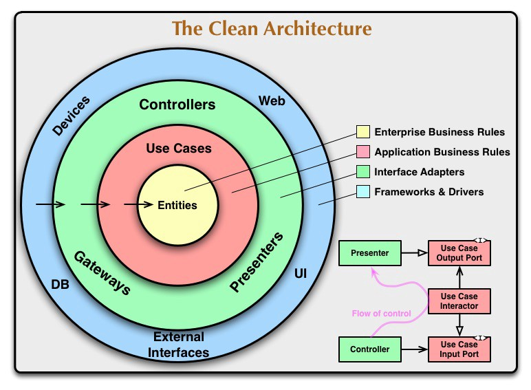

# QRest

## Glosario

### Actores

- **Empleado**: Entendido como una persona que opera el restaurante.
- **Comensal**: Dicho de un cliente que está sentado en la mesa que. Comparte pedido con los comensales de la misma mesa.

### Pantallas

- **Entrada**: Métodos para acceder a la pantalla en cuestión. Puede ser otra pantalla u otro método.
- **Salida**: Pantallas a las que se puede acceder desde la pantalla en cuestión.
- **Ruta**: Punto de acceso en la API.

### Carta

**Elemento**: Cualquier bebida, entrante, plato, postre, etc. de la carta que puede añadirse al pedido.

**Elemento simple**: Aquel que no hay que elegir nada. Es decir, no tiene variantes, ni extras opcionales, ni se le pueden quitar ingradientes. Ejemplo: Nestea.

**Elemento complejo**: Aquel para el que hay que elegir algo. Tiene variantes o extras o se pueden eliminar ingredientes.

## Pantallas

### Carta

Es la **pantalla inicial**. Se ven los elementos de la carta del restaurante y pueden añadir o eliminar unidades de cualquier elemento de la carta. Todos los comensales de una misma mesa están asociados al mismo pedido y ven en tiempo real cualquer actualización (añadir o eliminar unidades de algún elemento) que haga cualquier otro comensal de la misma mesa.

- **Ruta**: mesa/{Identificador de la mesa}
- **Entrada**: QR, Pantalla Pedido.
- **Salidas**: Pantalla Pedido, Pantalla Recibo Total.

### Pedido

Se ven todos los elementos que han pedido los comensales de la mesa. Esto incluye el elemento concreto; con sus variantes, extras, e ingredientes eliminados, en caso de elementos complejos; y la cantidad.

- **Ruta**: mesa/{Identificador de la mesa}/pedido
- **Entrada**: Pantalla Carta.
- **Salidas**:
  - Carta.
  - Pedido Confirmado.

### Recibo Total

En esta pantalla se ve el recibo del pedido de toda la mesa en todas las comandas. Además del estdo de pago de cada elemento y quíen lo ha pedido.

- **Ruta**: mesa/{Identificador de la mesa}/recibo
- **Entrada**: Pantalla Carta.
- **Salidas**:
  - Recibo Individual.
  - Pago.

### Recibo Individual

En esta pantalla se ve el recibo del total del comensal en todas las comandas. Además del estdo de pago de cada elemento y quíen lo ha pedido.

- **Ruta**: mesa/{Identificador de la mesa}/recibo/{comensal}
- **Entrada**: Pantalla Recibo total.
- **Salidas**:
  - Recibo Total.
  - Pago.

### Pago

En esta pantalla se tramita el pago.

- **Ruta**: mesa/{Identificador de la mesa}/pago/{comensal}
- **Entrada**: Pantalla Recibo total.
- **Salida**: Recibo Total.

## Introducción

### Problemas del sector

- Gran sector de la restauración en españa
- Sector poco automatizado
- Mismos problemas:
    - Toma de pedido: 
        - Toman pedido en libreta 
        - Costosos sistemas PDA con hardware especializado
    - Carta:
        - No digitalización de la carta
        - Carta guardada como PDF que hay que descargarse
        - Dificil actualizar la carta.
        - No hay flexibilidad de modificar la carta fácilmente.
        - No hay recomendaciones 
        - No hay sugerencias
        - No hay facilidad para volver a pedir lo que ya pediste
    - Tiempo de espera:
        - El cliente tiene que esperar a que el camarero pase por la mesa
        - El cliente tiene que esperar para pedir la cuenta
    - No hay registro:
        - No se lleva un registro de los platos más pedidos
        - No se lleva registro informatizado de los pedidos
        - No se hacen estadísticas
    - Web:
        - La mayoría de restaurantes no tienen web
        - Los restaurantes que tiene web tienen que buscar su propio dominio, hosting y mantenimiento.
        - Las web son costosas.
    - Pagos:
        - No suelen tener métodos de pago online.
        - No se suele llevar registro de qué ha pedido cada cliente, va todo la misma cuenta.
        - No se puede a veces pagar por separado.
        - No se puede consultar qué es lo que ha pedido cada persona.

### Problemas de soluciones existentes

Las opciones presentes en el mercado suelen caer en las siquientes categorías, pondremos un ejemplo de cada uno:

- Hardware especializado:
    - Pantalla de pedido centralizada: 
        - Ejemplo: McDonals
        - Problemas: 
            - Súper costoso y especializado.
            - Solo lo tienen actualmente franquicias.
            - Solo funciona para modelo de recoger en barra.
    - Hardware móvil: 
        - Ejemplo: PilarBox
        - Problemas:
            - Hardware costoso
            - Hay que cargar los dispositivos.
- Web + QR:
    - QR estático:
        - Variantes: En la mesa, tarjetita o en el servilletero.
        - Ejemplo: Qamarero. (En tarjetitas asociadas a una mesa)
        - Problemas:
            - Seguridad: Cuando vuelves a casa si sigues teniendo el QR o el enlace puedes pedir desde casa a la mesa aunque ya no estés allí.
            - Si están en la mesa y las mesas son modulares hay que ponerse en consenso de qué QR usar pedir.
            - Si las mesas se mueven ocasiona confusión para los camareros de donde está la mesa.
    - QR por pedido:
        - Funcionamiento: Cada vez que entra un cliente al restaurante se genera un QR para ese pedido.
        - Ejemplo: Yasaka, Servicio QbaR 
        - Problemas:
            - Tener que estar generando un QR nuevo por cada cliente (grupo de clientes) que entra.
            - Tener que atender a cada cliente que entra.
    - QR estático + contraseña:
        - Ejemplo: Sushi Som
        - Funcinamiento: Genera una contraseña diaria que el cliente tiene que usar.
        - Problemas:
            - Los mismos que los QR estático con la diferencia que el problema dura lo que dure la contraseña.
            - Incomodidad para el cliente, el tener que estar preguntando la contraseña.
            - Los camareros tienen que estar informando de la contraseña.            

Como se puede observar no hay una solución lo suficientemente satisfactia que solucione todos los problemas. Todos tienen algunas ventajas e inconvenientes. Es por todos estos problemas expuestos que muchos restaurantes son reacios a este tipo de sistemas, o no pueden costearselo.

Lista de opciones:

- Servicio QbaR: servicioqbar
- PilarBox: pilarbox.com
- McDonalds: mcdonalds.es
- Yasaka: yasaka.es
- Qamarero: qamarero.com
- SushiSom: sushisom.net

### Motivación

Aquí plasmo por una parte la motivación personal y la motivación técnica al respecto.

Por la parte personal: Todo comenzó un día yendo a un sushi llamado Yasaka, que tenía un sistema web + QR del tipo QR por pedido, pero que era un desarrollo específico para ese restaurante pero con muchas carencias, entre ellas: frontend poco atractivo, no se sincronizaban los pedidos y no se podía pagar por separado. Desde entonces mi mente empezó a darle vueltas y a decirme a mí mismo: Oye esto se puede hacer para todos los restaurantes. Desde entonces me puse a ver lo que había ya hecho en enero de 2023. Por ese entonces no había muchas soluciones o no las encontré. Y desde que decidí realizar el proyecto he ido descubriendo todas las opciones que hay en el mercado y que se han expuesto en el apartado anterior. Muchas de ellas han surgiodo este 2023. Otras motivaciones personales.

- También era una oportunidad de aprender desarrollo web, que es lo que más me interesa, abordando un problema que me intersa mucho.
- Es un trabajo muy interesante ya que es algo que todo el mundo experimenta, en mi caso como cliente de restaurantes.
- Como motivación también tenía el hecho de que soy emprendedor y la idea es sacarlo como negocio tras el TFG.
- Quería dearrollar una aplicación full-stack
- Aprender todo lo aprendido en la carrera de Ingeniería del Software
- Ponerme a prueba a mí mismo para desarrollar una aplicación que combinase tantas coasa que desconocía.
- Aprender cómo hacer ingeniería del software con un proyecto tan grande. 

Por la parte técnica:

- Este tipo de soluciones son muy muy recientes. Ma mayoría de soluciones ha surgido este 2023. Por lo que es era un campo de investigación e innovación.
- Hay muchísimas oportunidades de mercado, ya que este tipo de soluciones no están extendidas.
- Es una solución súper escalable a todos los restaurantes.
- Una misma aplicación puede solucionar muchísimos de los problemas que los restaurantes experimentas. Sobre todo los pequeños restaurantes y los nuevos.
- Es un proyecto full stack.
- Combina muchos aspectos técnicos: 
    - Transacciones en base de datos
    - Sincronización entre clientes con websocket
    - Bases de datos NoSQL.
    - Modelos de datos capaces de representar toda la casuistica que puede darse en un restaurante real.
    - Sincronización de servidores.
    - Interacciones con JavaScript.
    - Eventos con JavaScript.
    - Guardar datos del usuario en LocalStorage sin que lleguen los datos del cliente al servidor y por tanto con privacidad.
- A nivel de ingeniería:
    - Desarrollar una aplicación en un campo que está todavía emergiendo. Y por tanto hay poco en lo que te puedas basar.
    - Metodologías de desarrollo software.
    - Requisitos, Casos de uso, Casos de prueba, tests.
    - APIs, POO en Python y JS.
    - Frameworks de desarrollo web
    - Aprender a estructurar un proyecto web grande.
    - Refactoring.

### Objetivos

Vamos a diferenciar en tres tipos de objetivos: objetivos personales, profesionales y del proyecto.

Objetivos personales:

- Hacer un TFG por que que estuviese realmente emocionado de hacer.
- Montar un negocio a partir de mi TFG
- Desarrollarme tanto personal como profesinalmente.
- Aprender desarrollo web.
- Hacer una aplicación interesante full-stack para mi porfolio.

Objetivos profesionales:

- Aprender frontend: JS y CSS 
- Aprender sincronización con Websockets.
- Aprender profundamente MongoDB.
- Aprender desarrollo web.
- Aprender transacciones en base de datos.
- Aprender sobre arquitectura software aplicada a web.
- Aprender a hacer APIs.
- Aprender CSS y JS
- Aprender POO en Python y JS.
- Aprender a seguir una metodología ágil en un proyecto grande.

Objetivos del proyecto: Solucionar los problemas encontrados en las soluciones existentes.

- Sincronización de pedidos de clientes.
- Pagos por separado.
- Carta digital flexible y dinámica.
- Sugerencias de clientes.
- Privacidad de datos del cliente.
- Poder manejar toda la casuistica de los restaurantes.
- Crear una gestión de comandas por parte del personal del restaurante que sea flexible.
- Proponer una solución a los QR estáticos y por contraseña.
- Minimizar el hardware necesario por parte del restaurante. 

### Solución buscada

Se busca una solución que resuleva los siguientes problemas:

Por parte del restaurante:

- Errores al tomar comandas.
- Tiempo de camareros destinado a tomar comandas.
- Tiempo de camareros destinado a llevar la cuenta.
- Tiempo de camareros destinado a cobrar a los clientes.
- Errores en el flujo de trabajo no automatizado.
- No disponer de web.
- No carta de digitalizada.
- Poca flexibilidad para modifcar la carta.
- No se lleva registro informatizado de los pedidos.
- Pedidos a domicilio por telefono.
- Reserva de mesa por teléfono.
- Dificultad para ver el estado de los pedidos de una mesa.

Por parte del cliente:

- Tiempo de espera para pedir comanda.
- Tiempo de espera para pedir cuenta.
- Tiempo de espera para pagar.
- Llamar para pedir a domicilio.
- Llamar para reservar mesa.
- Malentendidos al pedir.
- Dificultad para dividir la cuenta.
- Dificultad para pagar por separado.
- Dificultad para recordar el total de lo que se ha pedido y lo que no.
- Dificultad para ver el estado del pedido.

Requisitos de la solución buscada:

Se busca una solución integral que pueda abordar todas estos problemas de una forma accesible económicamente, sobre todo sin una barrera de entrada inicial, de forma flexible y poco intrusiva.

- Digitalización de carta flexible.
- Pedidos por parte del cliente.
- Sistema de gestión de comandas flexible. (De modo que el restaurante no tenga que adaptarse a un flujo concreto, sino que la solución se adapte al flujo de funcionamiento que ya tiene el restaurante).
- Registro de todos los pedidos.
- Página web.
- Recomendaciones por parte del restaurante.
- Recomendaciones al cliente para pedir lo que se ha pedido anteriormente.
- Pagos por separado.
- Pagos online.
- Pagos en caja.
- Reserva de mesa.
- Pedidos online.
- Sincronización de pedidos de clientes de la misma mesa.
- Privacidad de datos del cliente.
- Ver estado del pedido.
- Pedidos flexibles.
- Bajo coste.
- Mínimo hardware.

### Puntos fuertes QRest vs competidores

Diseñado pero no implementado

- Solución segura y cómoda de generación de pedidos con QR.
- Flujo flexible de gestión de comandas del restaurante.
- Conexión con la impesora de tickets con librería de JS.
- Búsquedas en la carta, con filtros.
- Frontend con elementos complejos.
- Frontend para modificar la carta.
- Llamar al camarero desde la app.
- Sincronización de estado de servidores.

Producto

- Pedidos por parte de cliente.
- Privacidad de datos de los clientes.
- Recibos y pagos de forma individual o total.
- Recomendaciones de repetir lo pedido anteriormente. 
- Sugentencias del restaurante en base a etiquetas.
- Pagos en caja con confirmación de pago.
- Sincronización de pedido de clientes de la misma mesa. 
- Flexibilidad para modificar la carta.
- Seguridad de API. 
- Mostrar alérgenos.

Ingeniería

- Arquitectura en capas al estilo clean Achitecture.
- Tests de integración.
- Estructura de datos capaz de representar toda la casuística de restaurantes.
- Transacciones seguras de casos de uso.
- Metodología ágil basada en sprints.
- Uso de LocalStorage para guardar los datos del cliente sin que lleguen al servidor.

## Tecnología y herramientas

### Lenguajes de programación

- Python: Se ha utilizado para desarrollar todo el backend de la aplicación, desde desarrollo de la API, casos de uso, tests, hasta llamadas a la base de datos. 
- JavaScript: Se ha utilizado para gestionar el HTML y CSS de la página web. También para hacer que la página sea interactiva con eventos, etc. Se han implementado patrones como Modelo-Vista-Controlador y POO en JS. 

### Tecnologías de desarrollo web

- HTML: Para generar las páginas de la web.
- CSS: Para dar estilo a las páginas de la web.

### Frameworks

- BulmaCSS: Se ha usado como el framework de CSS usado para que la aplicación sea responsive y orientada a mobiles.
- FastAPI: Se ha utilizado para definir la API de de la aplicación.
- Pytest: Se ha utilizado para hacer los test de integración.
- Jinja2: Se ha utilizado para la generación dinámica del HTML, CSS y JS.

### Tecnologías de bases de datos

- MongoDB: Se ha utilizado como base de datos No-SQL para persistir todos los datos del dominio de la aplicación.
- LocalStorage: Se ha utilizado para almacenar los datos del cliente desde el JS sin que pasen por el servidor.

### Herramientas de desarrollo

- Visual Studio Code: Se ha utilizado principalmente para la documentación tanto para escribir como para visualizarla con sus extensiones. También generación y visualización de prototipos, de toda la parte web, HTML, CSS y JS. 
- Pycharm: Se ha utilizado como la herramienta principal para desarrollar el código del backend en python. También para desarrollar y correr los tests. También para correr el servidor y debuguear. 

### Herramientas de gestión

- Git: Se ha utilizado para llevar el control de versiones de la aplicación y documentar los cambios. 
- GitHub: Se ha utilizado como repositorio del proyecto.
- Trello: Se ha utilizado para definir, documentar y cambiar de estado las tareas de los sprints.
- MongoDB Atlas: Se ha utilizado como repositorio en la nube de nuestra base de datos mongoDB. Y para crear documentos, eliminarlos, modificarlos, etc.
- Googel Meet: Para las reuniones online de seguimiento del TFG.
- Cloudinary: Para guardar en la nube las imágenes que el proyecto ha necesitado. Como: imágenes de elementos de la carta, iconos de la aplicación (ej: alérgenos, secciones, etc.).
- Pandoc: Se ha utilizado para generar PDFs a partir de los archivos Markdown.
- Calendario a papel: Para organizar la semana y saber qué tarea hacer en cada momento.
- Google Calendar: Para guardar las reuniones de seguimiento del TFG.
- Miniconda: Para gestionar el entorno de python y sus librerías.
- Heroku: Para desplegar la aplicación.
- Zathura: Para visualizar los PDF.

### Herramientas de documentación

- Confluence: Para hacer los reportes de los sprints y otra documentación como investigaciones de competidores, análisis de posibles tecnología a usar.
- Papel y boli: Mucha de la documentación, sobre todo la menos formal ha sido con papel y boli. Cada vez que trabajaba en el proyecto tenía papel y boli al lado e iba haciendo bocetos, lluvia de idea, definir los objetivos de los pomodoro, del día, etc.
- Neovim: Como blog de notas de usar y tirar. También para escirbir los archivos markdown.

### Herramientas de diseño

- MermaidJS: Para definir textualmente todo tipo de diagramas de la aplicación. Compatible con Markdown. Y visualizarlo.
- Bocetos y diagramas a papel: La mayor herramienta de diseño ha sido bocetos y diagramas de flujo en papel.

### Recursos adicionales

- Websockets: Es la forma de sincronizar el frontend con el backend y de sincronizar las vistas de los usuarios.  
- Uvicorn: Es el servidor que se ha usado para correr la aplicación.

## Metodología

### Resumen de la Metodología

- Objetivo: Definir y desarrollar el proyecto, establecer bases de actuación, y detallar decisiones tomadas.
- Enfoque: Adaptación a cambios, actualizaciones, y variaciones de requisitos.

### Metodología Ágil

- Uso de la metodología ágil Scrum para facilitar adaptaciones rápidas a cambios durante el desarrollo.
- Roles: Yo, (el estudiante) ha tomado todos los roles: diseñadores, analistas, desarrolladores, testers; excepto el de Product Owner (cubierto por el tutor).
- Iteraciones:
    - Duración de una o dos semanas.
    - Flexibilidad en la duración, debido a inprevistos en el desarrollo y pausas entre iteraciones debido a causas externas.
    - Iteraciones orientadas en funcionalidades concretas.
- Reuniones: Tras cada iteración para discutir avances y planificar la siguiente.

### Planificación y gestión del proyecto

Se han usado las siguientes tecnologías y herramientas: Trello, Confluence, Calendario y papel y boli.

1. La documentación formal y definición de objetivos de sprints con sus funcionalidades se definen en Confluence. 
2. Luego para cada sprint se ha creado una lista en Trello con todas las tareas. Al iniciar el sprint se van pasando a To Do y siguen el flujo de To Do, Doing, Done. Y al finalizar el sprint todas las de Done se pasan a la tabla del sprint otra vez. 
3. Luego se estiman las horas para cada tarea y las prioridades.
4. Luego en base a la prioridad y el tiempo que consumen se planifica en un calendario a papel semanal.
5. Luego dentro de cada día y con cada tarea concreta se establecen objetivos del día y objetivos para cada pomodoro a papel, que una vez completado se desecha. Los pensamientos, bocetos, etc. también a papel, por comodidad y rapidez.

Nota: las cosas más importantes se han ido documentando en Confluence, en Trello en la descripción de tareas concretas, o en el propio repositorio.

Esta metodología de trabajo se ha ido consolidando a lo largo del desarrollo de la aplicación. 

Al principio esta metodología no se seguía tal y como se ha explicado, sino más bien de una forma un poco más laxa. En los últimos meses del proyecto al seguir esta metodología se ha avanzado mucho más rápido. 

La mayor mejora se ha dado al definir el calendario semanal y planificar los objetivos de cada pomodoro a papel.

### Fases de desarrollo

- Al principio se planificaron los sprints de los 3 primeros meses en detalle, definiendo lo que se iba a hacer cada semana. 
    - Pero los siguientes factores lastraron muchísimo el desarrollo inicial rompiendo completamente con la planificación:
      - No sabía mucho sobre las tecnologías a utilizar
      - Se replanteaba continuamente las funcionalidades de la aplicación y el enfoque.
      - Surgían errores y necesidades imprevistas. 
    - Desde entonces lo que hicimos es definir las distintas funcionalidades del sistema y un orden de implementación, pero en vez de planificarlo a largo plazo, se iban definiendo a dos semanas vista.

Durante el proyecto se han realizado un total de 23 itereaciones (sprints) de desarrollo de una o dos semanas, con una duración media de 9.56 días, excluyendo la documentación de la propia memoria. Pero para simplificar vamos a agrupar los sprints en las fases de desarrollo, un total de 18 fases de desarrollo. Que son las siguientes:

#### Fase 1 - Inicio
**Inicio:** 18 de Febrero  
**Fin:** 24 de Febrero  
**Actividades:**
- Investigar competidores.
- Pensar en soluciones a problemas existentes de los competidores.
- Elegir un nombre para el proyecto.
- Crear entidad: correo electrónico y dominio.

#### Fase 2 - Análisis y Planificación
**Inicio:** 20 de Febrero  
**Fin:** 9 de Marzo  
**Actividades:**
- Definir funcionalidades deseables de la aplicación.
- Crear un diagrama conceptual simple del sistema basado en funcionalidades.
- Planificar los sprints basados en las funcionalidades.

#### Fase 3 - Prototipo Carta
**Inicio:** 24 de Febrero  
**Fin:** 22 de Marzo  
**Actividades:**
- Definir y crear el entorno de desarrollo.
- Diseñar modelo de datos de la carta (soportando elementos simples y complejos).
- Diseñar prototipo de carta.
- Crear HTML del prototipo de carta.
- Añadir CSS con BulmaCSS.
- Añadir funciones JS en el mismo documento HTML (principalmente basados en atributos HTML).

#### Fase 4 - Backend Carta
**Inicio:** 10 de Marzo  
**Fin:** 16 de Abril  
**Actividades:**
- Implementar modelo de datos de la carta.
- Desarrollar API CRUD de secciones de la carta.
- Desarrollar API CRUD de elementos embebidos en las secciones de la carta.

#### Fase 5 - Frontend Carta
**Inicio:** 17 de Abril  
**Fin:** 30 de Abril  
**Actividades:**
- Separar CSS en archivos individuales en `/static/css`.
- Separar JS en archivos individuales en `/static/js`.
- Frontend de la carta con Jinja2.

#### Fase 6 - Carta V2
**Inicio:** 1 de Mayo  
**Fin:** 18 de Junio  
**Actividades:**
- Analizar competidor llamado Qamarero.
- Decisión de cambiar el diseño actual al de Qamarero.
- Diseñar un prototipo como el de Qamarero.
- Implementar nuevo JS.
- Nuevo Frontend de la carta V2 con Jinja2.

#### Fase 7 - Subsecciones
**Inicio:** 7 de Junio  
**Fin:** 18 de Junio  
**Actividades:**
- Diseñar nuevo modelo de datos de carta para soportar subsecciones.
- Implementar backend de subsecciones.

#### Fase 8 - Tests de integración de la carta
**Inicio:** 19 de Junio  
**Fin:** 10 de Julio  
**Actividades:**
- Diseñar casos de uso de la carta.
- Diseñar casos de prueba de la carta.
- Desarrollar tests de integración de la carta.

#### Fase 9 - Diseño de pedido
**Inicio:** 26 de Septiembre  
**Fin:** 25 de Octubre  
**Actividades:**
- Diseñar modelo de datos de pedidos.
- Diseñar prototipo de pedidos.
- Implementar backend de pedidos.
- Frontend de pedidos con Jinja2.

#### Fase 10 - Rediseño Clean Architecture
**Inicio:** 8 de Octubre  
**Fin:** 5 de Noviembre  
**Actividades:**
- Buscar solución para cambiar arquitectura monolítica a arquitectura en capas.
- Aprender sobre Clean Architecture.
- Diseñar la arquitectura en capas de la aplicación al estilo Clean Architecture.
- Definir diagramas de flujo de las vistas de la aplicación.
- Definir diagrama en capas de qué casos de uso puede ejecutar cada vista de la aplicación.
- Definir diagrama de capas de qué llamadas a la capa de persistencia puede ejecutar cada caso de uso.
- Re-planificar el proyecto (centrarse solo en la parte de los clientes del restaurante).
- Eliminar la API CRUD monolítica para modificar las secciones de la carta.

#### Fase 11 - Interfaz de persistencia
**Inicio:** 1 de Noviembre  
**Fin:** 12 de Noviembre  
**Actividades:**
- Diseñar una interfaz de persistencia con MongoDB.
- Implementar una capa de persistencia que simplifique la

 interacción con MongoDB.
- Analizar opciones para evitar colisiones en la base de datos.
- Implementar Optimistic Concurrency Control en la capa de persistencia.
- Implementar Transacciones con MongoDB.

#### Fase 12 - Pedidos
**Inicio:** 6 de Noviembre  
**Fin:** 14 de Diciembre  
**Actividades:**
- Rehacer el backend de pedidos en base al nuevo diseño (en capas).
- Rehacer el frontend de pedidos con FastAPI.
- Diseñar casos de prueba de pedidos.
- Implementar test de integración de pedidos.
- Diseñar protocolo de sincronización de pedidos.
- Diseñar modelo de datos de pedidos para soportar sincronización.
- Re-implementar modelo de datos de pedidos.
- Implementar el backend de Websockets de pedidos.
- Crear Websockets en el JS de Jinja2.
- Implementar Modelo-Vista-Controlador en JS para sincronización.

#### Fase 13 - Cliente LocalStorage
**Inicio:** 7 de Diciembre  
**Fin:** 20 de Diciembre  
**Actividades:**
- Prueba de uso de LocalStorage.
- Prototipo de vista de pedido para pedir cliente.
- Actualizar frontend de pedido para pedir cliente.
- Implementar Modelo-Vista-Controlador para guardar y consultar el cliente en LocalStorage.

#### Fase 14 - Recibos
**Inicio:** 15 de Diciembre  
**Fin:** 2 de Enero  
**Actividades:**
- Diseñar solución para poder consultar el recibo total o individual.
- Diseñar casos de prueba de recibo.
- Implementar test de integración de recibo.
- Implementar backend de recibo.
- Diseñar prototipo de recibo.
- Implementar frontend de recibo.

#### Fase 15 - Por pagar
**Inicio:** 27 de Diciembre  
**Fin:** 2 de Enero  
**Actividades:**
- Diseñar solución para poder consultar por pagar total o individual.
- Diseñar casos de prueba de por pagar.
- Implementar test de integración de por pagar.
- Implementar backend de por pagar.
- Diseñar prototipo de por pagar.
- Implementar frontend de por pagar.

#### Fase 16 - Proteger rutas
**Inicio:** 28 de Noviembre  
**Fin:** 5 de Enero  
**Actividades:**
- Diseñar casos de error en cada vista del sistema.
- Diseñar redirecciones en base al estado del pedido.
- Diseñar redirecciones de nueva API.
- Implementar errores y mensajes en cada vista del sistema (backend + frontend).
- Añadir comprobación del estado del pedido para redireccionar automáticamente si es necesario.
- Añadir nuevas rutas de la API para redireccionar automáticamente y facilitar la navegación.

#### Fase 17 - Pago
**Inicio:** 3 de Enero  
**Fin:** 6 de Enero  
**Actividades:**
- Diseñar solución para solicitar pagar en caja y esperar confirmación.
- Extender el modelo de datos de pedido para soportar pagos pendientes en caja.
- Diseñar prototipo de pago en caja.
- Implementar backend de pago.
- Implementar frontend de pago en caja.
- Implementar websocket con identificadores para sincronización de pago en caja.

#### Fase 18 - Sugerencias
**Inicio:** 7 de Enero  
**Fin:** 9 de Enero  
**Actividades:**
- Analizar qué tipo de sugerencias era más conveniente.
- Diseñar prototipo de sugerencias para volver a pedir elemento pedido anteriormente.
- Implementar Modelo-Vista-Controlador en JS para persistir y consultar LocalStorage.
- Implementar en el frontend con Jinja2.

## Análisis 

### Requisitos

- El sistema permite la creación de secciones de elementos de la carta.
- El sistema permite la creación de subsecciones de la carta.
- El sistema permite crear elementos simples: Nombre, Imagen, Precio, Ingredientes, Alérgenos y Etiquetas.
- El sistema permite crear elementos complejos: Nombre, Imagen, Precio, Ingredientes, Alérgenos, Etiquetas, Variantes y Extras.
- El sistema permite modificar las secciones de la carta.
- El sistema permite modificar los elementos de la carta.
- El sistema permite ocultar y mostrar secciones.
- El sistema permite ocultar y mostrar elementos.

- Un cliente puede generar un pedido al sentarse en la mesa.
- Los comensales comparten el mismo pedido.
- Un comensal puede añadir elementos de la carta a la comanda.
- Un comensal puede eliminar un elemento que el haya añadido anteriomente a la comanda.
- Un comensal puede consultar el total de elementos en la comanda.
- Un comensal puede confirmar la comanda.
- Un comensal puede pedir la cuenta (el recibo).
- Un comensal puede ver el recibo individual (el total de lo que ha pedido él).
- Un comental puede consultar el recibo total (todo lo que se ha pedido entre todos los comensales).
- Un comensal puede consultar lo que le queda por pagar de forma individual.
- Un comensal puede consultar el total de lo que queda por pagar.
- Un comensal puede solicitar pagar en caja lo que le queda por pagar de forma individual.
- Un comensal puede solicitar pagar en caja el total de lo que queda por pagar.
- Un empleado del restaurante puede marcar una solicitud de pago en caja como pagado.
- El sistema recomienda al cliente pedir elementos que ha pedido anteriormente.
- El estado de la comanda de los comensales está sincronizado.

- El sistema usa tecnología web.
- La interfaz del sistema debe estar orientada a móvil.
- El sistema redirecciona y lanza errores en función del estado del pedido.
- El sistema hace imposible que clientes que hayan estado anteriormente en la misma mesa puedan acceder al pedido actual de la mesa.
- El contendido del sistema se mostrará en Español.
- Los mensajes y errores del sistema se mostrarán en Español.
- Los datos del cliente se almacenan en el propio dispositivo del cliente, en el LocalStorage sin pasar por el servidor.
- Los datos se almacenan en una base de datos no relacional, como MongoDB.
- El sistema está desplegado y accesible desde una URL pública.
- El sistema usa computación en la nube distribuida.
- El sistema tiene una arquitectura en capas.
- El sistema usa transacciones para evitar conflictos en la base de datos.
- El sistema proporciona una API.

#### Identificadores de Categoría para Requisitos Funcionales
1. **Gestión de la Carta**: `GC`
2. **Gestión de Pedidos y Comandas**: `GPC`
3. **Gestión de Pagos y Recibos**: `GPR`
4. **Recomendaciones y Sincronización**: `RS`

#### Identificadores de Requisitos Funcionales
- **RF-GC-1**: Creación de Secciones de la Carta.
- **RF-GC-2**: Creación de Subsecciones de la Carta.
- **RF-GC-3**: Creación de Elementos Simples.
- **RF-GC-4**: Creación de Elementos Complejos.
- **RF-GC-5**: Modificación de Secciones de la Carta.
- **RF-GC-6**: Modificación de Elementos de la Carta.
- **RF-GC-7**: Ocultar y Mostrar Secciones.
- **RF-GC-8**: Ocultar y Mostrar Elementos.

- **RF-GPC-1**: Generación de Pedido al Sentarse en la Mesa.
- **RF-GPC-2**: Compartir Pedido entre Comensales.
- **RF-GPC-3**: Añadir Elementos a la Comanda.
- **RF-GPC-4**: Eliminar Elementos de la Comanda.
- **RF-GPC-5**: Consulta del Total de Elementos en la Comanda.
- **RF-GPC-6**: Confirmación de la Comanda.

- **RF-GPR-1**: Pedido de la Cuenta (Recibo).
- **RF-GPR-2**: Visualización del Recibo Individual.
- **RF-GPR-3**: Consulta del Recibo Total.
- **RF-GPR-4**: Consulta de lo que Queda por Pagar Individualmente.
- **RF-GPR-5**: Consulta del Total a Pagar.
- **RF-GPR-6**: Solicitud de Pago en Caja Individual.
- **RF-GPR-7**: Solicitud de Pago en Caja del Total.
- **RF-GPR-8**: Marcar una Solicitud de Pago como Pagada.

- **RF-RS-1**: Recomendaciones Basadas en Pedidos Anteriores.
- **RF-RS-2**: Sincronización del Estado de la Comanda.

#### Identificadores de Requisitos No Funcionales
Dado que los requisitos no funcionales no se categorizan de la misma manera, los identificaremos secuencialmente sin un identificador de categoría.

- **RNF-1**: Uso de Tecnología Web.
- **RNF-2**: Interfaz Orientada a Móvil.
- **RNF-3**: Manejo de Errores y Redirecciones.
- **RNF-4**: Seguridad de Acceso a Pedidos.
- **RNF-5**: Idioma del Contenido.
- **RNF-6**: Idioma de Mensajes y Errores.
- **RNF-7**: Almacenamiento de Datos del Cliente.
- **RNF-8**: Uso de Base de Datos No Relacional.
- **RNF-9**: Accesibilidad desde URL Pública.
- **RNF-10**: Uso de Computación en la Nube Distribuida.
- **RNF-11**: Arquitectura en Capas.
- **RNF-12**: Uso de Transacciones para Evitar Conflictos.
- **RNF-13**: Disponibilidad de una API.

Esta estructura de identificación ayuda a organizar y referenciar los requisitos de manera más clara y estructurada, facilitando su gestión durante el desarrollo del proyecto.

## Modelado y Diseño

### Arquitectura del proyecto

- Diagrama móvil
- Arquitectura en capas aplicación
- Arquitectura frontend

#### Diagramad de despliegue

Los compomentes principales son:

- Clientes del restaurante:
    - Dispositivo móvil
    - Dependencias: WiFi, Navegador y Lector de QR
- Empleado del restaurante:
    - Dispositivo móvil o tablet
    - Dependencias: WiFi, Navegador
- Aplicación:
    - Tipo: Servidor
    - Plataforma: Heroku
    - Característica: Sin estado, distribuido y escalable.
- Base de datos:
    - Tipo: MongoDB
    - Plataforma: MongoDB Atlas
    - Características: Distribuido y escalable.

Los clientes (muchos) con sus dispositivos móviles, se conectan al servidor de la aplicación desplegado en Heroku. De igual forma lo hacen los empleados del restaurante (muchos) con sus dispositivos móviles o tablets. El servidor de Heroku escala horizontalmente (muchos servidores) cuando la carga del servidor es elevada. Es decir, a pesa de que en el diagrama se muestre un solo servidor, pueden estar varios servidores activos. Los servidores de Heroku se conectan con el servidor de MongoDB Atlas, usándolo como base de datos para consultar la carta y gestionar los pedidos. De igual forma MongoDB Atlas escala de forma horizontal, pero a nivel de usuario y de desarrollador el escalado horizontal del MongoDB Atlas es transparente (no afecta).

#### Arquitectura del servidor

La arquitectura del backend se base en los principios de arquitectura limpia (Clean Architecture). Así pues vamos a comenzar por definirlo.

##### Arquitectura limpia (Clean Architecture)

La arquitectura limpia (Clean Architecture) es un conjunto de principios de diseño de software propuesto por Robert C. Martin (también conocido como "Uncle Bob"), con el objetivo de crear sistemas de software que sean independientes de frameworks, UI, bases de datos, y cualquier otra agencia externa. Se enfoca en permitir que un sistema sea fácil de mantener y evolucionar, especialmente en lo que respecta a las tecnologías subyacentes que pueden cambiar con el tiempo.

La idea central es la separación de intereses, donde el código se divide en capas con responsabilidades bien definidas. Esto se visualiza a menudo en forma de círculos concéntricos, donde cada círculo representa una capa de la arquitectura:

1. **Entidades (Entities)**: En el núcleo, encontramos las entidades, que son los objetos de negocio que representan las reglas de negocio más generales y de alto nivel. Estas reglas son las menos propensas a cambiar cuando algo externo al sistema cambia.

2. **Casos de Uso (Use Cases)**: Rodeando a las entidades están los casos de uso, que contienen la lógica de aplicación específica. Estos casos de uso orquestan el flujo de datos hacia y desde las entidades, y pueden ser alterados con más frecuencia que las entidades, pero aún así son independientes de las capas exteriores.

3. **Adaptadores de Interfaz (Interface Adapters)**: Esta capa contiene adaptadores que convierten datos en la forma más conveniente para los casos de uso y entidades, y para los agentes externos como la base de datos o la web. Incluye presentadores, vistas y controladores.

4. **Frameworks y Drivers (Frameworks & Drivers)**: En la capa más externa están los frameworks y drivers, que incluyen la UI, bases de datos, servidores web, frameworks de aplicación, etc. Esta capa es la que cambia con más frecuencia y a la que el resto de la aplicación no debería estar acoplada.

La arquitectura limpia también enfatiza el principio de inversión de dependencias, en el cual las capas internas definen interfaces, y las capas externas implementan estas interfaces. Esto permite que las capas internas sean independientes de las capas externas, facilitando la sustitución de una capa externa sin afectar las reglas de negocio.

##### Implementación de la arquitectura

Como podemos ver en el diagrama de capas de la aplicación en la parte del servidor, el flujo de llamadas es el siguiente:

1. FastAPI (Externo) activa los Controladores web.
2. Los Controladores web (Backend o Frontend) llaman a los Casos de uso necesarios, a través de una subcapa Services.
3. Los Casos de uso llaman a la capa de Persistencia de las entidades pertinentes, a través de una subcapa Services.
4. La capa de Persistencia de la entidad llama a un Proxy de Pymongo.
5. El Proxy de Pymongo llama a Pymongo.
6. Pymongo llama a MongoDB Atalas y genera una respuesta.
7. La respuesta de Pymongo sube por todas las llamadas hasta el Caso de uso.
8. El Caso de uso al finalizar devuelve una respuesta al Controlador web.
9. El Controlador web al finalizar las interacciones con los casos de uso Generan una respuesta.
    - Los controladores de la API del backend generan una respuesta JSON.
    - Los controladores del frontend cargan una plantilla de Jinja2.

Si todas estas llamadas se hiciesen sin usar un enfoque de arquitectura limpia, el código de las entidades llamaría directamente a pymongo, lo que resultaría en que el núcleo de la aplicación, las entidades, dependiesen diréctamente de la tecnología de base de datos que utiliza la aplicación. Lo que dificultaría la migración de la base de datos, la modificación de las entidades y el mantenimiento frente a cambios de versión.

Así pues siguiendo las bases de arquitectura limpia, la implementación de la capa de persistencia con pymongo, es se inyecta a los Casos de uso desde los controladores mediante una interfaz que abstrae la tecnología de base de datos utilizada. Itulizando lo que se conoce como inversión de dependencias.

Es decir, la implementación de la arquitectura limpia tiene dos principales ventajas: la arquitectura en capas y la inversión de dependencias. Lo que hace la aplicación muy mantenible, fácil de añadir nuevas funcionalidades y minimizando el acoplamiento y las depencias entre componentes. De hecho no fue hasta que se implementó esta arquitectura que pude empezar a desarrollar la aplicación mucho más rápido y fácil, permitiendo también cambiar de enfoques y corregir errores con gran flexibilidad.

A continuación podemos ver el diagrama que muestra como encaja esta arquitectura en el patrón arquitectura limpia. Representando las capa en con círculos concéntricos. Siendo los circulos más internos el corazón de la apliación y lo que menos está sujeto a cambios; y las capas más externas las que dependen más de la tecnología y están más sujetas a cambios.

#### Arquitectura del cliente

Los detalles de arquitectura del lado de cliente son los siguientes.

- Básicamente el HTML se genera con Jinja2 en el lado del servidor.
- El documento HTML, define la estructura del documento y a nivel de diseño usa BulmaCSS, un framework CSS sin asociado.
- Se importa BulmaCSS y FontAwesome con CDN en el header del HTML.
- Se importa el código CSS y JS necesario en el header de la carpeta /static/css o /static/js.
- El JS usa notación "module".
- En JS hay tanto funciones normales como clases.
- El código de inicialización y configuración necesario se hace directamente con un <script> de JS antes del body y/o después.
- Para sincronizar el estado de las vistas de los comensales se usan Websocket con broadcast en el servidor.
- También se utiliza el patrón de diseño Modelo-Vista-Controlador, pricipalmente para la sincronización e identificación de clientes, donde se usa el websocket como modelo.
- También se hace un control de errores en el websocket, que muestra mensajes.
- En algunos casos la redirección se hace de forma activa desde el JS, haciendo una llamada a la API del backend y redireccionando en función de la respuesta.

---

La arquitectura del lado del cliente en el proyecto QRest está diseñada para ser eficiente y funcional, utilizando una combinación de tecnologías y patrones de diseño. A continuación, se detalla la estructura y las herramientas implementadas:

1. **Generación de HTML**: 
   - El HTML se genera utilizando Jinja2 en el servidor. Este enfoque permite una integración eficiente entre el backend y el frontend.

2. **Diseño y Estructura del Documento**:
   - El documento HTML define la estructura básica y se apoya en BulmaCSS para el diseño. BulmaCSS es un framework CSS moderno y ligero que facilita la estilización.
   - Se incorpora FontAwesome para los iconos, mejorando la interfaz de usuario.

3. **Importaciones y Recursos Estáticos**:
   - BulmaCSS y FontAwesome se importan a través de CDN en el encabezado del HTML.
   - Los archivos CSS y JS necesarios se alojan en las carpetas `/static/css` y `/static/js`, respectivamente.

4. **JavaScript y Estructura de Código**:
   - El código JavaScript sigue la notación "module", proporcionando una estructura clara y mantenible.
   - Se utilizan tanto funciones normales como clases para organizar el código de manera efectiva.
   - El código de inicialización y configuración se ejecuta mediante etiquetas `<script>` ubicadas antes del cierre del `body` o en el `header`.

5. **Comunicación y Sincronización**:
   - Para la sincronización del estado de las vistas entre comensales, se utilizan WebSockets con broadcast en el servidor. Esto permite una actualización en tiempo real de la información en todos los clientes conectados.
   - Se adopta el patrón Modelo-Vista-Controlador (MVC), principalmente para la sincronización e identificación de clientes, utilizando WebSockets como parte del modelo.

6. **Gestión de Errores y Navegación**:
   - Se implementa un control de errores en el WebSocket, mostrando mensajes relevantes al usuario en caso de problemas.
   - En ciertos escenarios, la redirección se maneja activamente desde el JavaScript, realizando llamadas a la API del backend y redirigiendo según la respuesta obtenida.

### Modelo de datos

- MongoDB BSON
- Estructura de datos
- Datos extendidos frontend
- Comunicación websockets

### Modelo de objetos

- Explicar cómo se relacionan las clases de todas las capas.
- Explicar los modelo-vista-controlador de frontend.

### Proceso de diseño

- V1
- Qamarero como ejemplo
- Diagrama de navegación
