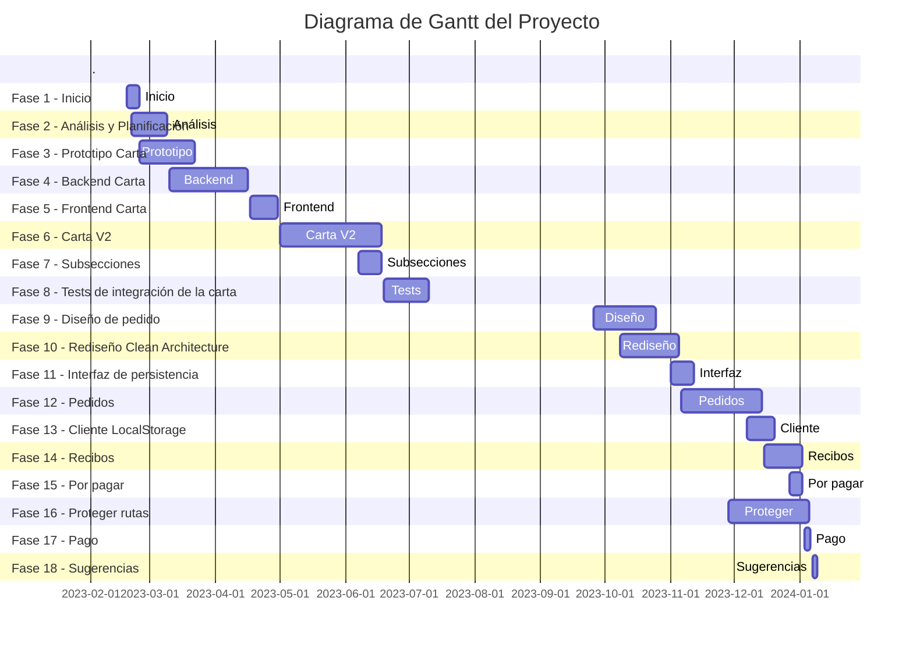

# Desarrollo

## Sprints

1. **18 de Febrero al 23 de Febrero:**
   - Preparación entorno de desarrollo.
   - Definición de sprints y modelo del sistema.

2. **24 de Febrero al 9 de Marzo:**
   - Redefinición de sprints.
   - [Detalle de Sprints](https://pedrobenito.atlassian.net/wiki/spaces/QRest/pages/295061).
   - Prototipo de Carta.

3. **10 de Marzo al 22 de Marzo:**
   - Corregir errores del prototipo.
   - Desarrollo de API y Tests.

4. **22 Marzo al 16 Abril:**
   - Cambio de idioma del código de Español a Inglés.

5. **17 de Abril al 20 de Abril:**
   - Creación de Confluence para reportes semanales.
   - Redefinición de sprints. [Detalle de Sprints](https://pedrobenito.atlassian.net/wiki/spaces/QRest/pages/295092).

6. **23 de Abril al 30 de Abril:**
   - Análisis de tecnologías para el resto del sistema. [Detalle de Tecnologías](https://pedrobenito.atlassian.net/wiki/spaces/QRest/pages/295089).

7. **1 de Mayo al 7 de Mayo:**
   - Añadir JavaScript a la carta y análisis de competidor. [Detalle de Análisis](https://pedrobenito.atlassian.net/wiki/spaces/QRest/pages/294938).

8. **22 de Mayo al 28 de Mayo:**
   - Rediseño de la carta como la de Qamarero.

9. **7 de Junio al 18 de Junio:**
   - Añadir subsecciones y prueba de LocalStorage.

10. **19 de Junio al 11 de Julio:**
    - Modelo de datos de pedido y prototipo.

11. **26 de Septiembre al 8 de Octubre:**
    - Actualización de Python 10 a Python 11 y CRUD de pedidos.
    - Descarga de archivos de Confluence.
    - Creación de API de pedidos.

12. **8 de Octubre al 19 de Octubre:**
    - Aprendizaje sobre Arquitectura web.
    - Reestructuración de la aplicación y reinicio desde cero.

13. **20 de Octubre a 25 de Octubre:**
    - Definición de diagramas de flujo de la aplicación.
    - Casos de uso del usuario y del backend.
    - Trazabilidad de matriz de casos de uso.

14. **26 de Octubre al 30 de Octubre:**
    - Implementación en capas de menú, alérgenos y pedidos.
    - Definición de casos de prueba e implementación de tests para los pedidos.

15. **1 de Noviembre al 5 de Noviembre:**
    - Implementación de MongoStandardRepository.
    - Implementación de OCC y transacciones.
    - Creación de repositorios de pedidos, menú y alérgenos.
    - Creación de Excepciones como una Fábrica.

16. **6 de Noviembre al 12 de Noviembre:**
    - Modificación de casos de uso de la carta y de los alérgenos.
    - Creación de interfaces con ABC.
    - Implementación de IStandardRepository y MongoStandardRepository con MongoDB.
    - Añadir manejadores de Excepciones a FastAPI.
    - Arreglo de tests de comandas.
    - Frontend de carta y pedido funcionando.
    - Creación de la capa de servicios en los casos de uso.

17. **13 de Noviembre al 20 de Noviembre:**
    - Creación de un modelo de datos para el frontend.
    - Actualización del JavaScript para gestionar elementos.
    - Añadir elementos del pedido a la carta.
    - Sincronización de elementos del pedido en la carta con websocket.

18. **21 de Noviembre al 27 de Noviembre:**
    - Pedidos sincronizados.
    - Mensajes de error en pedidos.

19. **28 de Noviembre al 6 de Diciembre:**
    - Despliegue en Heroku.
    - Mensajes de error en carta.
    - Redirección de rutas.
    - Soporte de mensajes y errores como query.
    - Gestión de errores en WebSocket.
    - Finalización del frontend de la carta sincronizada.

20. **7 de Diciembre al 14 de Diciembre:**
    - Arreglo de la función que comprueba si un elemento está en el menú.
    - API para mostrar todos los pedidos existentes.
    - Arreglo de CSS para centrar mensajes en pantalla.
    - Cambio de WS a WSS.
    - Implementación del Modelo-Vista-Controlador para pedidos.

21. **15 de Diciembre al 20 de Diciembre:**
    - API para generar nuevo pedido y redirigir a /{pedido}.
    - Backend para generar recibo.
    - Casos de prueba y tests para generar recibo.
    - Prototipo y frontend para generar recibo.

22. **27 de Diciembre al 2 de Enero:**
    - Casos de uso de pago.
    - Casos de prueba de ver por pagar y pago.
    - Backend de ver por pagar y de pago.
    - Separación de por pagar y recibo en por pagar individual y total.
    - Prototipo y frontend de por pagar.

23. **3 de Enero al 9 de Enero:**
    - API /{pedido} redirige a /{pedido}/carta.
    - Solución de problemas con /carta.
    - Funcionalidad para solicitar pagar en caja.
    - Creación de websocket y backend para solicitar pagar en caja.
    - API /caja para gestión de pagos en caja.
    - Prototipo y frontend /caja.
    - Modelo-Vista-Controlador para gestionar la espera de pago en caja.
    - Arreglo de imágenes del frontend.
    - Añadir Modelo-Vista-Controlador para sugerencias de re-pedido. 

## Trello

Sprint 1, 2 y 3:
- Modelo conceptual del sistema
- Planificar sprints
- Preparar entorno de desarrollo
- Prototipado
- Coger entidad (correo y dominio)
- Aprender pymongo a fondo
- Modelo de datos de Carta y Pedidos

Sprint 4:
- Establecer Jinja2
    1. Crear un HTML en la carpeta _static_.
    2. Crear con FastAPI un endpoint que lo devuelva. 
    3. Probar a añadirle un CSS o imágenes. 
    4. Probar a añadirle variables.
    5. Probar a añadirle código de Jinja2
- Carta con Jinja2:
    1. Devolver prototipo estático desde FastAPI
    2. Devolverlo con Jinja2.
    3. Recoger los datos de la base de datos. 
    4. Mostrar alguna variable.
    5. Integrar mostrar variable con código.
    6. Mostrar imágenes. 
    7. Mostrar todo.

Sprint 5: 
- Prototipo de carta V2 basada en Qamarero.
- Javascript para la carta. Separar en documentos en /static/js
- Extraer CSS a /static/css.

Sprint 6: 
- Añadir subsecciones al backend
- Hacer tests de subsecciones
- Independizar el la base de datos en un archivo aparta database.py
- Jinja2 de Carta v2.

Sprint 7:
- Prototipo de pedido.
- Modelo de datos de pedido
- Reestructuración de modelo de datos de pedidos
- Extraer modelos en carpeta independiente
- Buscar solución para cambiar de un código monolítico a en capas. Principios SOLID y Clean Architecture.
- Planear cómo resolver problema de volver a la carta desde la página del peido.
- Diseño de solución para sincronizar los pedidos: Se eliminan requests, guardar en cada elemento los clientes que lo han pedido y actualizar directamente en la comanda actual cada vez que se hace un +/- en un elemento.

## Hacer fases del desarrollo

El desarrollo comienza el 18 de febrero de 2023 y termina el 9 de enero de 2024.

### Fase 1 - Inicio
**Inicio:** 18 de Febrero  
**Fin:** 24 de Febrero  
**Actividades:**
- Investigar competidores.
- Pensar en soluciones a problemas existentes de los competidores.
- Elegir un nombre para el proyecto.
- Crear entidad: correo electrónico y dominio.

### Fase 2 - Análisis y Planificación
**Inicio:** 20 de Febrero  
**Fin:** 9 de Marzo  
**Actividades:**
- Definir funcionalidades deseables de la aplicación.
- Crear un diagrama conceptual simple del sistema basado en funcionalidades.
- Planificar los sprints basados en las funcionalidades.

### Fase 3 - Prototipo Carta
**Inicio:** 24 de Febrero  
**Fin:** 22 de Marzo  
**Actividades:**
- Definir y crear el entorno de desarrollo.
- Diseñar modelo de datos de la carta (soportando elementos simples y complejos).
- Diseñar prototipo de carta.
- Crear HTML del prototipo de carta.
- Añadir CSS con BulmaCSS.
- Añadir funciones JS en el mismo documento HTML (principalmente basados en atributos HTML).

### Fase 4 - Backend Carta
**Inicio:** 10 de Marzo  
**Fin:** 16 de Abril  
**Actividades:**
- Implementar modelo de datos de la carta.
- Desarrollar API CRUD de secciones de la carta.
- Desarrollar API CRUD de elementos embebidos en las secciones de la carta.

### Fase 5 - Frontend Carta
**Inicio:** 17 de Abril  
**Fin:** 30 de Abril  
**Actividades:**
- Separar CSS en archivos individuales en `/static/css`.
- Separar JS en archivos individuales en `/static/js`.
- Frontend de la carta con Jinja2.

### Fase 6 - Carta V2
**Inicio:** 1 de Mayo  
**Fin:** 18 de Junio  
**Actividades:**
- Analizar competidor llamado Qamarero.
- Decisión de cambiar el diseño actual al de Qamarero.
- Diseñar un prototipo como el de Qamarero.
- Implementar nuevo JS.
- Nuevo Frontend de la carta V2 con Jinja2.

### Fase 7 - Subsecciones
**Inicio:** 7 de Junio  
**Fin:** 18 de Junio  
**Actividades:**
- Diseñar nuevo modelo de datos de carta para soportar subsecciones.
- Implementar backend de subsecciones.

### Fase 8 - Tests de integración de la carta
**Inicio:** 19 de Junio  
**Fin:** 10 de Julio  
**Actividades:**
- Diseñar casos de uso de la carta.
- Diseñar casos de prueba de la carta.
- Desarrollar tests de integración de la carta.

### Fase 9 - Diseño de pedido
**Inicio:** 26 de Septiembre  
**Fin:** 25 de Octubre  
**Actividades:**
- Diseñar modelo de datos de pedidos.
- Diseñar prototipo de pedidos.
- Implementar backend de pedidos.
- Frontend de pedidos con Jinja2.

### Fase 10 - Rediseño Clean Architecture
**Inicio:** 8 de Octubre  
**Fin:** 5 de Noviembre  
**Actividades:**
- Buscar solución para cambiar arquitectura monolítica a arquitectura en capas.
- Aprender sobre Clean Architecture.
- Diseñar la arquitectura en capas de la aplicación al estilo Clean Architecture.
- Definir diagramas de flujo de las vistas de la aplicación.
- Definir diagrama en capas de qué casos de uso puede ejecutar cada vista de la aplicación.
- Definir diagrama de capas de qué llamadas a la capa de persistencia puede ejecutar cada caso de uso.
- Re-planificar el proyecto (centrarse solo en la parte de los clientes del restaurante).
- Eliminar la API CRUD monolítica para modificar las secciones de la carta.

### Fase 11 - Interfaz de persistencia
**Inicio:** 1 de Noviembre  
**Fin:** 12 de Noviembre  
**Actividades:**
- Diseñar una interfaz de persistencia con MongoDB.
- Implementar una capa de persistencia que simplifique la

 interacción con MongoDB.
- Analizar opciones para evitar colisiones en la base de datos.
- Implementar Optimistic Concurrency Control en la capa de persistencia.
- Implementar Transacciones con MongoDB.

### Fase 12 - Pedidos
**Inicio:** 6 de Noviembre  
**Fin:** 14 de Diciembre  
**Actividades:**
- Rehacer el backend de pedidos en base al nuevo diseño (en capas).
- Rehacer el frontend de pedidos con FastAPI.
- Diseñar casos de prueba de pedidos.
- Implementar test de integración de pedidos.
- Diseñar protocolo de sincronización de pedidos.
- Diseñar modelo de datos de pedidos para soportar sincronización.
- Re-implementar modelo de datos de pedidos.
- Implementar el backend de Websockets de pedidos.
- Crear Websockets en el JS de Jinja2.
- Implementar Modelo-Vista-Controlador en JS para sincronización.

### Fase 13 - Cliente LocalStorage
**Inicio:** 7 de Diciembre  
**Fin:** 20 de Diciembre  
**Actividades:**
- Prueba de uso de LocalStorage.
- Prototipo de vista de pedido para pedir cliente.
- Actualizar frontend de pedido para pedir cliente.
- Implementar Modelo-Vista-Controlador para guardar y consultar el cliente en LocalStorage.

### Fase 14 - Recibos
**Inicio:** 15 de Diciembre  
**Fin:** 2 de Enero  
**Actividades:**
- Diseñar solución para poder consultar el recibo total o individual.
- Diseñar casos de prueba de recibo.
- Implementar test de integración de recibo.
- Implementar backend de recibo.
- Diseñar prototipo de recibo.
- Implementar frontend de recibo.

### Fase 15 - Por pagar
**Inicio:** 27 de Diciembre  
**Fin:** 2 de Enero  
**Actividades:**
- Diseñar solución para poder consultar por pagar total o individual.
- Diseñar casos de prueba de por pagar.
- Implementar test de integración de por pagar.
- Implementar backend de por pagar.
- Diseñar prototipo de por pagar.
- Implementar frontend de por pagar.

### Fase 16 - Proteger rutas
**Inicio:** 28 de Noviembre  
**Fin:** 5 de Enero  
**Actividades:**
- Diseñar casos de error en cada vista del sistema.
- Diseñar redirecciones en base al estado del pedido.
- Diseñar redirecciones de nueva API.
- Implementar errores y mensajes en cada vista del sistema (backend + frontend).
- Añadir comprobación del estado del pedido para redireccionar automáticamente si es necesario.
- Añadir nuevas rutas de la API para redireccionar automáticamente y facilitar la navegación.

### Fase 17 - Pago
**Inicio:** 3 de Enero  
**Fin:** 6 de Enero  
**Actividades:**
- Diseñar solución para solicitar pagar en caja y esperar confirmación.
- Extender el modelo de datos de pedido para soportar pagos pendientes en caja.
- Diseñar prototipo de pago en caja.
- Implementar backend de pago.
- Implementar frontend de pago en caja.
- Implementar websocket con identificadores para sincronización de pago en caja.

### Fase 18 - Sugerencias
**Inicio:** 7 de Enero  
**Fin:** 9 de Enero  
**Actividades:**
- Analizar qué tipo de sugerencias era más conveniente.
- Diseñar prototipo de sugerencias para volver a pedir elemento pedido anteriormente.
- Implementar Modelo-Vista-Controlador en JS para persistir y consultar LocalStorage.
- Implementar en el frontend con Jinja2.

